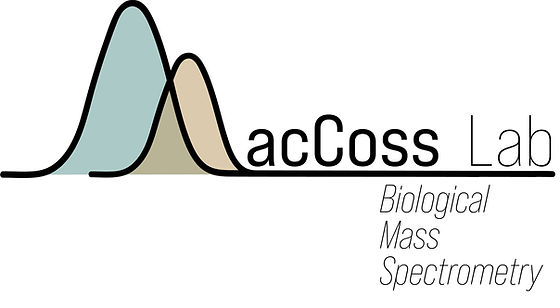

# Welcome to the MacCoss Lab

  
  
  
We are a protein mass spectrometry laboratory located in the <a href="http://www.gs.washington.edu/">Department of Genome Sciences</a> at the <a href="http://washington.edu/">University of Washington in Seattle</a>.

## Our Research Focus

The focus of our research is in the development of stable isotope and mass spectrometry-based approaches to improve our understanding of biology on a molecular, cellular, and whole organism level.

Current research areas include:

- **Automated Sample Preparation**: Automating biochemical sample preparation methods for the analysis of protein mixtures
- **Stable Isotope Methods**: Developing in vivo stable isotope methods for studying protein metabolism  
- **Dynamic Range Enhancement**: Increasing the dynamic range of liquid chromatography-mass spectrometry for peptide analysis
- **Computational Tools**: Developing computational tools for automated conversion of mass spectrometry data into biologically meaningful results

## Highlighted Publications
- **A transformer model for de novo sequencing of data-independent acquisition mass spectrometry data** - Nature Methods, July 2025
- **Enrichment of extracellular vesicles using Mag-Net for the analysis of the plasma proteome** - Nature Communications, July 2025
- **Assessment of false discovery rate control in tandem mass spectrometry analysis using entrapment** - Nature Methods, July 2025
- **Performance of novel tau antibodies across multiple modalities for Alzheimer's disease assessment** - Alzheimer's & Dementia, July 2025
- **Tissue-specific metabolomic signatures for a doublesex model of reduced sexual dimorphism** - Royal Society Open Science, July 2025

## Quantitative Proteomics Services
The MacCoss lab offers a number of mass spectrometry based proteomics services.  These range from biofluid proteomics, targeted assay development, etc... Some information about these services see [here](https://panoramaweb.org/Services/). Email at services@maccosslab.org for mroe information

## Nunn Lab
We share lab space and resources with [Brook Nunn's lab](https://www.environmentalproteomics.org/) here in the Department of Genome Sciences. The focus in the Nunn lab is to use mass spectrometry-based proteomics as a tool to understand a variety of environmental questions- from proteins preserved in sediments of the deep sea to the adaptation of bacteria cells to subzero temperatures.

## Support Our Research

The MacCoss lab has developed technologies and software tools that improve protein characterization in health and disease. If you've benefited from our tools and would like to see their continued development, consider making a [tax-deductible donation](http://www.washington.edu/giving/make-a-gift?source_typ=3&source=gengen).

  
  
<em>MacCoss Lab photo, July 2025</em>

