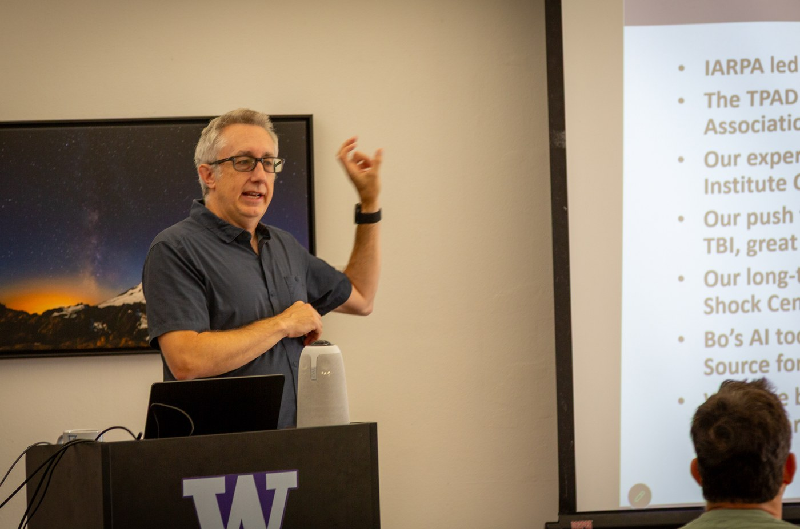

## About the Principal Investigator

- **Michael J. MacCoss, Ph.D.** - Professor, Department of Genome Sciences  
  Email: maccoss[at]uw[dot]edu  
  Mike leads the lab's research in quantitative proteomics and mass spectrometry method development. His work focuses on developing robust, quantitative protein assays for biological and clinical applications.  
  Links: [Google Scholar](https://scholar.google.com/citations?user=icweOB0AAAAJ&hl=en) | [LinkedIn](https://www.linkedin.com/in/maccoss/) | [UW Profile](https://www.gs.washington.edu/about/directory/faculty/michael-maccoss/)

[**NIH Biosketch**](../assets/Biosketch_MacCoss.docx)

**Brief Research Biography:** <lf/>
Michael MacCoss has worked in mass spectrometry and proteomics for more than three decades. He first developed an interest in biomedical mass spectrometry during undergraduate internships at Merck Research Laboratories under Dr. Patrick Griffin. In 2001, he completed his Ph.D. in Analytical Chemistry at the University of Vermont with Professor Dwight Matthews, developing stable isotope and mass spectrometric methodologies to measure human amino acid and protein metabolism. As a postdoctoral fellow with proteomics pioneer John R. Yates III at The Scripps Research Institute, Dr. MacCoss developed analytical methods and software for characterizing post-translational modifications and performing quantitative analysis of complex protein mixtures.

Dr. MacCoss joined the University of Washington faculty in 2004 as an Assistant Professor of Genome Sciences and was promoted to Professor in 2014. Recognizing early on that data handling and computational infrastructure were major bottlenecks limiting quantitative rigor and reproducibility, Dr. MacCoss established a dedicated software engineering effort within his academic group. In close collaboration with principal software engineer Brendan MacLean, this initiative developed Skyline, the widely adopted, open-source software ecosystem for targeted and data-independent acquisition (DIA) mass spectrometry, and Panorama, an expansive repository platform for targeted data management, quality control, and open collaboration. The laboratory also maintains and contributes to ProteoWizard, a foundational cross-platform software library that provides universal data access and conversion across vendor instrument formats. Beyond internal development, Dr. MacCoss has contributed to an extensive portfolio of community tools through close collaborations, including Percolator (with the Noble lab) for semi-supervised machine learning in peptide validation and Comet (with Jimmy Eng) for sequence database searching.

Throughout his career, Dr. MacCoss has been a leading champion of mass spectrometry–based quantitative proteomics, driving the development and community adoption of targeted assays (SRM/PRM) and data-independent acquisition (DIA) to improve the analytical rigor, reproducibility, and clinical translation of protein measurements. Beyond computation, the MacCoss laboratory makes fundamental methodological contributions spanning automated sample preparation, chromatographic separations, and novel mass spectrometry instrumentation and acquisition schemes. This research is broadly applied across biomedical consortia and collaborative initiatives investigating human aging, oncology, cardiovascular disease, metabolic disorders, and neurodegeneration.

Dr. MacCoss' contributions have been recognized with numerous honors, including the ASMS Research Award (2004), the Presidential Early Career Award for Scientists and Engineers (PECASE, 2007), the Biemann Medal from the American Society for Mass Spectrometry (2015), the HUPO Award for Discovery in Proteomic Sciences (2016), and the Donald F. Hunt Distinguished Contribution in Proteomics Award from US HUPO (2026). The MacCoss lab operates at the intersection of biochemistry, instrumentation, engineering, computer science, and statistics, with a sustained commitment to advancing the capabilities and accessibility of quantitative biological mass spectrometry.