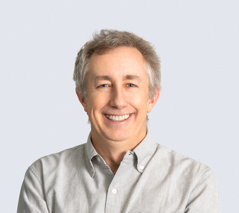

# Lab Members

## Principal Investigator

  
  

    <h3>Michael J. MacCoss</h3>
    
Professor, Department of Genome Sciences

    
maccoss@uw.edu

    
Mike leads the lab's research in quantitative proteomics and mass spectrometry method development. His work focuses on developing robust, quantitative protein assays for biological and clinical applications.

    

      <a href="https://scholar.google.com/citations?user=icweOB0AAAAJ&hl=en">Google Scholar</a> |
      <a href="https://www.linkedin.com/in/maccoss/">LinkedIn</a> |
      <a href="https://www.gs.washington.edu/faculty/maccoss.htm">UW Profile</a>
    

  

  

    <button class="tab-button active" onclick="openTab(event, 'current')">Current Lab Members</button>
    <button class="tab-button" onclick="openTab(event, 'alumni')">Lab Alumni</button>
  

  

    

## Current Lab Members
### Research Scientists
- Daniel Jaschob
- Rich Johnson
- Gennifer Merrihew
- Mike Riffle
- Christine Wu
- Alex Zelter

### Postdoctoral Fellows
- Aaron Maurais
- Doudou Yu

### Graduate Students
- Chris Hsu
- Bo Wen

### Visiting Scientists
- Jesse Canterbury
- Deanna Plubell

### Nunn Lab
- Brook Nunn
- Emma Timmins-Schiffman

### Skyline Team

  

    <h4><a href="https://www.linkedin.com/in/brmaclean/">Brendan MacLean</a></h4>
    
Principal Developer

    
Brendan worked at Microsoft for 8 years in the 1990s as a lead developer and development manager for Visual C++/Developer Studio. He was Vice President of Engineering for Westside Corporation, Director of Engineering for BEA Systems, and a founding partner of LabKey Software. Since August 2008, he has been responsible for all aspects of design, development and support in creating the Skyline Targeted Mass Spec Environment.

  

  

    <h4>Eduardo Armendariz</h4>
    
Developer

    
Eduardo began his software career in 2013 at Mirth, supporting the open-source clinical health data messaging engine. He worked at Amazon on Prime Now 3P services and AWS Lambda, and most recently at Microsoft designing services to advance Chaos engineering within Office infrastructure.

  

  

    <h4><a href="https://www.linkedin.com/in/matthew-chambers-1a749911/">Matthew Chambers</a></h4>
    
Developer (ProteoWizard)

    
Matt has worked in mass spectrometry informatics since 2005, first at Vanderbilt University Medical Center and since then as an independent consultant. Along with Darren Kessner, he developed ProteoWizard and has been its principal developer since 2009. For Skyline, he focuses on reading data directly from vendor proprietary data formats.

  

  

    <h4><a href="https://www.linkedin.com/in/rita-chupalov-3b93139/">Rita Chupalov</a></h4>
    
Developer

    
Rita's computing experience dates back to 1991. She has a degree in Organic Chemistry from Saint-Petersburg State University where she wrote her first mass-spectrometry software. She has worked for multiple software development companies specializing in database-centric applications, analytics and data warehousing, with her most recent position at Amazon working with big data and cloud technologies.

  

  

    <h4><a href="https://www.linkedin.com/in/connollyb/">Brian Connolly</a></h4>
    
Information Technology and DevOps

    
Brian has worked for companies including Microsoft, BEA Systems and Cray. He joined LabKey in 2007 where he helped customers design and operate LabKey Servers and pipelines, and became an expert in FISMA and HIPAA regulations. As part of the Skyline Team, he manages growth of PanoramaWeb.org and Skyline.ms servers and cloud infrastructure.

  

  

    <h4><a href="https://www.linkedin.com/in/ekoneil">Eddie O'Neil</a></h4>
    
Developer

    
Eddie started his career in the 90s working on software for teaching biochemistry at the University of Virginia. He has built products and cross-functional teams in engineering and product management roles at Meta, Salesforce, BEA Systems, and startups. He holds degrees in computer science from UVa.

  

  

    <h4><a href="https://www.linkedin.com/in/brian-pratt-90b468/">Brian Pratt</a></h4>
    
Developer, Support

    
Brian's computing career extends back to the Apple II and TRS-80 days. His proteomics work prior to joining Skyline included contributions to TPP, X!Tandem, LabKey's CPAS, and ProteoWizard. He values performance, reliability, and usability in the support of science.

  

  

    <h4><a href="https://www.linkedin.com/in/vagisha/">Vagisha Sharma</a></h4>
    
Developer, Support, Documentation (Panorama)

    
Vagisha got involved with proteomics at UC San Diego working with Prof. Vineet Bafna. She has worked on Mass Spectrometry pipelines for the Aebersold group at ISB and developed data management systems at UW Proteomics Resource. She joined the Skyline team in October 2011, focusing on tools that help researchers get work done.

  

  

    <h4>David Shteynberg</h4>
    
Developer

    
David spent over 20 years at the Institute for Systems Biology, starting with microarray robotics in Dr. Leroy Hood's lab and shifting to computational mass spectrometry by 2004. He has developed novel computational algorithms including iProphet and PTMProphet, and is currently advancing machine-learning AI for peptide spectrum prediction and PTM identification in DIA data.

  

  

    <h4><a href="https://www.linkedin.com/in/nicholas-shulman-19b7bb/">Nicholas Shulman</a></h4>
    
Developer

    
Nick worked at Microsoft on the Access team from 1995-2000, then joined Westside Corporation and later BEA Systems creating development environments. At LabKey Corporation, he created the flow cytometry module and graphical query designer. Since March 2009, he has worked in the MacCoss lab on Skyline and Topograph.

  

  

    <h4><a href="https://www.linkedin.com/in/markbelanger/">Mark Belanger</a></h4>
    
Project Manager - Outreach & User Education

    
Mark has had a full career in communications across travel, start-ups, games and other industries. He has implemented web solutions from first-generation presence to full ecommerce platforms, established communication programs, and managed outreach teams. He has an MBA in Information Systems from Seattle University and is responsible for webinars, courses, user meetings, and international outreach.

  

  
  
<em>MacCoss Lab photo, July 2025</em>

  

    

## Former Lab Members

### Former Postdocs

**Dr. [Name]** (20XX-20XX)  
*Current Position*: [Current role] at [Institution/Company]  
*Research Area*: [Previous research focus]

**Dr. [Name]** (20XX-20XX)  
*Current Position*: [Current role] at [Institution/Company]  
*Research Area*: [Previous research focus]

### Former Graduate Students

**Dr. [Name]** (Ph.D. 20XX)  
*Thesis*: "[Thesis title]"  
*Current Position*: [Current role] at [Institution/Company]

**Dr. [Name]** (Ph.D. 20XX)  
*Thesis*: "[Thesis title]"  
*Current Position*: [Current role] at [Institution/Company]

### Former Research Scientists & Staff

**[Name]** (20XX-20XX)  
*Role*: [Previous position]  
*Current Position*: [Current role] at [Institution/Company]

---

*Lab member information is updated regularly. For the most current lab roster, please contact us directly.*