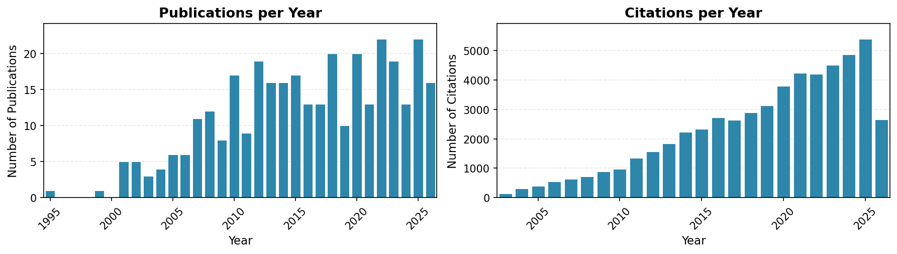

# Publications

View our complete publication list on [Google Scholar](https://scholar.google.com/citations?user=icweOB0AAAAJ&hl=en) or search [PubMed](https://pubmed.ncbi.nlm.nih.gov/?term=Maccoss%2C+Michael%5BFull+Author+Name%5D+OR+MacCoss+MJ%5BAuthor%5D&sort=date).

## Publication Metrics

- **Total Publications**: 340 (319 peer-reviewed + 21 preprints)
- **Total Citations**: 53,611 ([Google Scholar](https://scholar.google.com/citations?user=icweOB0AAAAJ&hl=en))
- **h-index**: 104
- **Most Cited Paper**: "Skyline: an open source document editor for creating and analyzing targeted proteomics experiments" (5,300 citations)

*Last updated: March 16, 2026 — 340 publications*

## Publications by Year

<button class="year-button active" onclick="showYear(event, '2026')">2026 (7)</button>
<button class="year-button" onclick="showYear(event, '2025')">2025 (25)</button>
<button class="year-button" onclick="showYear(event, '2024')">2024 (19)</button>
<button class="year-button" onclick="showYear(event, '2023')">2023 (22)</button>
<button class="year-button" onclick="showYear(event, '2022')">2022 (22)</button>
<button class="year-button" onclick="showYear(event, '2021')">2021 (13)</button>
<button class="year-button" onclick="showYear(event, '2020')">2020 (20)</button>
<button class="year-button" onclick="showYear(event, '2019')">2019 (10)</button>
<button class="year-button" onclick="showYear(event, '2018')">2018 (20)</button>
<button class="year-button" onclick="showYear(event, '2017')">2017 (13)</button>
<button class="year-button" onclick="showYear(event, '2016')">2016 (13)</button>
<button class="year-button" onclick="showYear(event, '2015')">2015 (17)</button>
<button class="year-button" onclick="showYear(event, '2014')">2014 (16)</button>
<button class="year-button" onclick="showYear(event, '2013')">2013 (16)</button>
<button class="year-button" onclick="showYear(event, '2012')">2012 (19)</button>
<button class="year-button" onclick="showYear(event, '2011')">2011 (9)</button>
<button class="year-button" onclick="showYear(event, '2010')">2010 (17)</button>
<button class="year-button" onclick="showYear(event, '2009')">2009 (8)</button>
<button class="year-button" onclick="showYear(event, '2008')">2008 (12)</button>
<button class="year-button" onclick="showYear(event, '2007')">2007 (11)</button>
<button class="year-button" onclick="showYear(event, '2006')">2006 (6)</button>
<button class="year-button" onclick="showYear(event, '2005')">2005 (6)</button>
<button class="year-button" onclick="showYear(event, '2004')">2004 (4)</button>
<button class="year-button" onclick="showYear(event, '2003')">2003 (3)</button>
<button class="year-button" onclick="showYear(event, '2002')">2002 (5)</button>
<button class="year-button" onclick="showYear(event, '2001')">2001 (5)</button>
<button class="year-button" onclick="showYear(event, '1999')">1999 (1)</button>
<button class="year-button" onclick="showYear(event, '1995')">1995 (1)</button>

### 2026

**Blood proteomics: insights from public data**
Larrea-Sebal A, Dai C, Brenes AJ, Korff K, Neely BA, Geyer PE, Dagley LF, Unwin RD, Naba A, MacCoss MJ, Guo T, Deutsch EW, Martin C, Schwenk JM, Perez-Riverol Y
*Genome biology* 2026 Mar;27(1)
<a href="https://pubmed.ncbi.nlm.nih.gov/41821120/">PubMed for &#8220;Blood proteomics: insights from public data&#8221;</a> | <a href="https://doi.org/10.1186/s13059-026-04027-9">DOI for &#8220;Blood proteomics: insights from public data&#8221;</a>

**Proteomic profiling of human omental and subcutaneous adipose tissue in individuals with a broad range of BMI**
Zelter A, Wen YW, Riffle M, Czuba LC, Yadav AS, Zhu J, Snyder JM, Maurais A, LaFrance J, Khandelwal S, Chen JY, Williams E, Parr Z, Kim D, Rubinow KB, MacCoss MJ, Isoherranen N
*Scientific data* 2026 Mar
<a href="https://pubmed.ncbi.nlm.nih.gov/41786761/">PubMed for &#8220;Proteomic profiling of human omental and subcutaneous adipose tissue in individuals with a broad range of BMI&#8221;</a> | <a href="https://doi.org/10.1038/s41597-026-06948-3">DOI for &#8220;Proteomic profiling of human omental and subcutaneous adipose tissue in individuals with a broad range of BMI&#8221;</a>

**Is Protein Quantification and Physical Normalization Always Necessary in Proteomics?**
Zelter A, Riffle M, Merrihew GE, Mutawe B, Maurais A, Yang HY, Inman JL, Celniker SE, Mao JH, Wan KH, Snijders AM, Wu CC, MacCoss MJ
*bioRxiv : the preprint server for biology* 2026 Feb
<a href="https://pubmed.ncbi.nlm.nih.gov/41727134/">PubMed for &#8220;Is Protein Quantification and Physical Normalization Always Necessary in Proteomics?&#8221;</a> | <a href="https://doi.org/10.64898/2026.02.13.705808">DOI for &#8220;Is Protein Quantification and Physical Normalization Always Necessary in Proteomics?&#8221;</a>

**Proteomic Profiling of Human Omental and Subcutaneous Adipose Tissue in Individuals with a Broad Range of BMI**
Zelter A, Wen YW, Riffle M, Czuba LC, Yadav AS, Zhu J, Snyder JM, Maurais A, LaFrance J, Khandelwal S, Chen JY, Williams E, Parr Z, Kim D, Rubinow KB, MacCoss MJ, Isoherranen N
*bioRxiv : the preprint server for biology* 2026 Jan
<a href="https://pubmed.ncbi.nlm.nih.gov/41648401/">PubMed for &#8220;Proteomic Profiling of Human Omental and Subcutaneous Adipose Tissue in Individuals with a Broad Range of BMI&#8221;</a> | <a href="https://doi.org/10.64898/2026.01.14.699533">DOI for &#8220;Proteomic Profiling of Human Omental and Subcutaneous Adipose Tissue in Individuals with a Broad Range of BMI&#8221;</a>

**Development of Highly Multiplex Targeted Proteomics Assays in Biofluids Using a Nominal Mass Ion Trap Mass Spectrometer**
Plubell DL, Remes PM, Wu CC, Jacob CC, Merrihew GE, Hsu C, Shulman N, MacLean BX, Heil L, Poston KL, Montine TJ, MacCoss MJ
*Molecular & cellular proteomics : MCP* 2026 Feb;25(2):101506
<a href="https://pubmed.ncbi.nlm.nih.gov/41512968/">PubMed for &#8220;Development of Highly Multiplex Targeted Proteomics Assays in Biofluids Using a Nominal Mass Ion Trap Mass Spectrometer&#8221;</a> | <a href="https://doi.org/10.1016/j.mcpro.2026.101506">DOI for &#8220;Development of Highly Multiplex Targeted Proteomics Assays in Biofluids Using a Nominal Mass Ion Trap Mass Spectrometer&#8221;</a>

**Improvements to Casanovo, a Deep Learning De Novo Peptide Sequencer**
Straub G, Ananth V, Fondrie WE, Hsu C, Klaproth-Andrade D, Pominova M, Riffle M, Sanders J, Wen B, Xu L, Yilmaz M, MacCoss MJ, Oh S, Bittremieux W, Noble WS
*Journal of proteome research* 2026 Feb;25(2):755-764
<a href="https://pubmed.ncbi.nlm.nih.gov/41468557/">PubMed for &#8220;Improvements to Casanovo, a Deep Learning De Novo Peptide Sequencer&#8221;</a> | <a href="https://doi.org/10.1021/acs.jproteome.5c00706">DOI for &#8220;Improvements to Casanovo, a Deep Learning De Novo Peptide Sequencer&#8221;</a>

**The ProteomeXchange consortium in 2026: making proteomics data FAIR**
Deutsch EW, Bandeira N, Perez-Riverol Y, Sharma V, Carver JJ, Mendoza L, Kundu DJ, Bandla C, Kamatchinathan S, Hewapathirana S, Sun Z, Kawano S, Okuda S, Connolly B, MacLean B, MacCoss MJ, Chen T, Zhu Y, Ishihama Y, Vizcaíno JA
*Nucleic acids research* 2026 Jan;54(D1):D459-D469
<a href="https://pubmed.ncbi.nlm.nih.gov/41206473/">PubMed for &#8220;The ProteomeXchange consortium in 2026: making proteomics data FAIR&#8221;</a> | <a href="https://doi.org/10.1093/nar/gkaf1146">DOI for &#8220;The ProteomeXchange consortium in 2026: making proteomics data FAIR&#8221;</a>

### 2025

**Genetic variation in the Nr1d1 transcription factor binding site shapes metabolism-related protein networks associated with cognitive resilience in an Alzheimer's disease mouse reference panel**
Chen Y, Stevenson TK, Cao Y, Fish LA, Robbins JE, Merrihew GE, Park J, Hohman TJ, MacCoss MJ, Kaczorowski CC
*Alzheimer's & dementia : the journal of the Alzheimer's Association* 2025 Nov;21(11):e70896
<a href="https://pubmed.ncbi.nlm.nih.gov/41225772/">PubMed for &#8220;Genetic variation in the Nr1d1 transcription factor binding site shapes metabolism-related protein networks associated with cognitive resilience in an Alzheimer&#x27;s disease mouse reference panel&#8221;</a> | <a href="https://doi.org/10.1002/alz.70896">DOI for &#8220;Genetic variation in the Nr1d1 transcription factor binding site shapes metabolism-related protein networks associated with cognitive resilience in an Alzheimer&#x27;s disease mouse reference panel&#8221;</a>

**Carafe enables high quality in silico spectral library generation for data-independent acquisition proteomics**
Wen B, Hsu C, Shteynberg D, Zeng WF, Riffle M, Chang A, Mudge MC, Nunn BL, MacLean BX, Berg MD, Villén J, MacCoss MJ, Noble WS
*Nature communications* 2025 Nov;16(1):9815
<a href="https://pubmed.ncbi.nlm.nih.gov/41198693/">PubMed for &#8220;Carafe enables high quality in silico spectral library generation for data-independent acquisition proteomics&#8221;</a> | <a href="https://doi.org/10.1038/s41467-025-64928-4">DOI for &#8220;Carafe enables high quality in silico spectral library generation for data-independent acquisition proteomics&#8221;</a>

**Evaluation of a Prototype Orbitrap Astral Zoom Mass Spectrometer for Quantitative Proteomics─Beyond Identification Lists**
Hsu C, Shulman N, Stewart HI, Petzoldt J, Pashkova A, Plubell DL, Denisov E, Hagedorn B, Damoc NE, MacLean BX, Remes PM, Canterbury JD, Makarov AA, Hock C, Zabrouskov V, Wu CC, MacCoss MJ
*Journal of proteome research* 2025 Nov;24(11):5742-5754
<a href="https://pubmed.ncbi.nlm.nih.gov/41122818/">PubMed for &#8220;Evaluation of a Prototype Orbitrap Astral Zoom Mass Spectrometer for Quantitative Proteomics─Beyond Identification Lists&#8221;</a> | <a href="https://doi.org/10.1021/acs.jproteome.5c00593">DOI for &#8220;Evaluation of a Prototype Orbitrap Astral Zoom Mass Spectrometer for Quantitative Proteomics─Beyond Identification Lists&#8221;</a>

**The companion dog as a translational model for Alzheimer's disease: Development of a longitudinal research platform and post mortem protocols**
McGrath S, Hull E, Dunbar MD, Prescott J, Keyser AJ, MacLean E, Darvas M, Latimer C, Moreno J, MacCoss MJ, Kauffman M, Litwin P, Castelhano M, Kaeberlein M, Keene CD
*Alzheimer's & dementia : the journal of the Alzheimer's Association* 2025 Sep;21(9):e70630
<a href="https://pubmed.ncbi.nlm.nih.gov/40995864/">PubMed for &#8220;The companion dog as a translational model for Alzheimer&#x27;s disease: Development of a longitudinal research platform and post mortem protocols&#8221;</a> | <a href="https://doi.org/10.1002/alz.70630">DOI for &#8220;The companion dog as a translational model for Alzheimer&#x27;s disease: Development of a longitudinal research platform and post mortem protocols&#8221;</a>

**The kinesin motor Kif9 regulates centriolar satellite positioning during interphase**
Vicente JJ, Wagenbach M, Decarreau J, Zelter A, MacCoss MJ, Davis TN, Wordeman L
*Current biology : CB* 2025 Nov;35(21):5119-5135.e4
<a href="https://pubmed.ncbi.nlm.nih.gov/40975050/">PubMed for &#8220;The kinesin motor Kif9 regulates centriolar satellite positioning during interphase&#8221;</a> | <a href="https://doi.org/10.1016/j.cub.2025.08.064">DOI for &#8220;The kinesin motor Kif9 regulates centriolar satellite positioning during interphase&#8221;</a>

**Corrigendum to "Comprehensive Proteomics Metadata and Integrative Web Portals Facilitate Sharing and Integration of LINCS Multiomics Data"**
Vidović D, Shamsaei B, Schürer SC, Kogan P, Chojnacki S, Kouril M, Medvedovic M, Niu W, Azeloglu EU, Birtwistle MR, Chen Y, Chen T, Hansen J, Hu B, Iyengar R, Jayaraman G, Li H, Liu T, Sobie EA, Xiong Y, Berberich MJ, Bradshaw G, Chung M, Everley RA, Gaudio B, Hafner M, Kalocsay M, Mills CE, Nariya MK, Sorger PK, Subramanian K, Victor C, Banuelos M, Dardov V, Holewinski R, Manalo DM, Mandefro B, Matlock AD, Ornelas L, Sareen D, Svendsen CN, Vaibhav V, Van Eyk JE, Venkatraman V, Finkbiener S, Fraenkel E, Rothstein J, Thompson L, Asiedu J, Carr SA, Christianson KE, Davison D, Dele-Oni DO, DeRuff KC, Egri SB, Vaca Jacome AS, Jaffe JD, Lam D, Litichevskiy L, Lu X, Mullahoo J, Officer A, Papanastasiou M, Peckner R, Toder C, Blanchard J, Bula M, Ko T, Tsai LH, Young JZ, Sharma V, Meller J, MacCoss MJ
*Molecular & cellular proteomics : MCP* 2025 Jul;24(7):100995
<a href="https://pubmed.ncbi.nlm.nih.gov/40783300/">PubMed for &#8220;Corrigendum to &quot;Comprehensive Proteomics Metadata and Integrative Web Portals Facilitate Sharing and Integration of LINCS Multiomics Data&quot;&#8221;</a> | <a href="https://doi.org/10.1016/j.mcpro.2025.100995">DOI for &#8220;Corrigendum to &quot;Comprehensive Proteomics Metadata and Integrative Web Portals Facilitate Sharing and Integration of LINCS Multiomics Data&quot;&#8221;</a>

**Tissue-specific metabolomic signatures for a doublesex model of reduced sexual dimorphism**
Coig R, Harrison B, Johnson R, MacCoss MJ, Promislow D
*Royal Society open science* 2025 Jul;12(7):250770
<a href="https://pubmed.ncbi.nlm.nih.gov/40740708/">PubMed for &#8220;Tissue-specific metabolomic signatures for a doublesex model of reduced sexual dimorphism&#8221;</a> | <a href="https://doi.org/10.1098/rsos.250770">DOI for &#8220;Tissue-specific metabolomic signatures for a doublesex model of reduced sexual dimorphism&#8221;</a>

**Performance of novel tau antibodies across multiple modalities for Alzheimer's disease assessment**
Trivedi P, Forrest K, Fisher DW, Winstone JK, McMillan PJ, Valentine M, Postupna N, Wilson A, Bajwa T, MacCoss MJ, Keene CD, Darvas M, Kraemer BC, Hoofnagle AN, Latimer CS
*Alzheimer's & dementia : the journal of the Alzheimer's Association* 2025 Jul;21(7):e70481
<a href="https://pubmed.ncbi.nlm.nih.gov/40684247/">PubMed for &#8220;Performance of novel tau antibodies across multiple modalities for Alzheimer&#x27;s disease assessment&#8221;</a> | <a href="https://doi.org/10.1002/alz.70481">DOI for &#8220;Performance of novel tau antibodies across multiple modalities for Alzheimer&#x27;s disease assessment&#8221;</a>

**A transformer model for de novo sequencing of data-independent acquisition mass spectrometry data**
Sanders J, Wen B, Rudnick PA, Johnson RS, Wu CC, Riffle M, Oh S, MacCoss MJ, Noble WS
*Nature methods* 2025 Jul;22(7):1447-1453
<a href="https://pubmed.ncbi.nlm.nih.gov/40596427/">PubMed for &#8220;A transformer model for de novo sequencing of data-independent acquisition mass spectrometry data&#8221;</a> | <a href="https://doi.org/10.1038/s41592-025-02718-y">DOI for &#8220;A transformer model for de novo sequencing of data-independent acquisition mass spectrometry data&#8221;</a>

**Enrichment of extracellular vesicles using Mag-Net for the analysis of the plasma proteome**
Wu CC, Tsantilas KA, Park J, Plubell D, Sanders JA, Naicker P, Govender I, Buthelezi S, Stoychev S, Jordaan J, Merrihew G, Huang E, Parker ED, Riffle M, Hoofnagle AN, Noble WS, Poston KL, Montine TJ, MacCoss MJ
*Nature communications* 2025 Jul;16(1):5447
<a href="https://pubmed.ncbi.nlm.nih.gov/40595564/">PubMed for &#8220;Enrichment of extracellular vesicles using Mag-Net for the analysis of the plasma proteome&#8221;</a> | <a href="https://doi.org/10.1038/s41467-025-60595-7">DOI for &#8220;Enrichment of extracellular vesicles using Mag-Net for the analysis of the plasma proteome&#8221;</a>

**Assessment of false discovery rate control in tandem mass spectrometry analysis using entrapment**
Wen B, Freestone J, Riffle M, MacCoss MJ, Noble WS, Keich U
*Nature methods* 2025 Jul;22(7):1454-1463
<a href="https://pubmed.ncbi.nlm.nih.gov/40524023/">PubMed for &#8220;Assessment of false discovery rate control in tandem mass spectrometry analysis using entrapment&#8221;</a> | <a href="https://doi.org/10.1038/s41592-025-02719-x">DOI for &#8220;Assessment of false discovery rate control in tandem mass spectrometry analysis using entrapment&#8221;</a>

**Improved quantitative accuracy in data-independent acquisition proteomics via retention time boundary imputation**
Harris L, Riffle M, Noble WS, MacCoss MJ
*bioRxiv : the preprint server for biology* 2025 May
<a href="https://pubmed.ncbi.nlm.nih.gov/40502008/">PubMed for &#8220;Improved quantitative accuracy in data-independent acquisition proteomics via retention time boundary imputation&#8221;</a> | <a href="https://doi.org/10.1101/2025.05.27.656394">DOI for &#8220;Improved quantitative accuracy in data-independent acquisition proteomics via retention time boundary imputation&#8221;</a>

**Evaluation of a prototype Orbitrap Astral Zoom mass spectrometer for quantitative proteomics - Beyond identification lists**
Hsu C, Shulman N, Stewart H, Petzoldt J, Pashkova A, Plubell DL, Denisov E, Hagedorn B, Damoc E, MacLean BX, Remes P, Canterbury JD, Makarov A, Hock C, Zabrouskov V, Wu CC, MacCoss MJ
*bioRxiv : the preprint server for biology* 2025 Jul
<a href="https://pubmed.ncbi.nlm.nih.gov/40501761/">PubMed for &#8220;Evaluation of a prototype Orbitrap Astral Zoom mass spectrometer for quantitative proteomics - Beyond identification lists&#8221;</a> | <a href="https://doi.org/10.1101/2025.05.30.657132">DOI for &#8220;Evaluation of a prototype Orbitrap Astral Zoom mass spectrometer for quantitative proteomics - Beyond identification lists&#8221;</a>

**Quantification of glucagon and oxyntomodulin by protein precipitation-immunoaffinity enrichment-LC-MS/MS**
Becker JO, Shijo SK, Huynh HH, Forrest KL, MacCoss MJ, Emrick MA, Goonatilleke E, Hoofnagle AN
*Journal of mass spectrometry and advances in the clinical lab* 2025 Apr;36:37-45
<a href="https://pubmed.ncbi.nlm.nih.gov/40385697/">PubMed for &#8220;Quantification of glucagon and oxyntomodulin by protein precipitation-immunoaffinity enrichment-LC-MS/MS&#8221;</a> | <a href="https://doi.org/10.1016/j.jmsacl.2025.04.002">DOI for &#8220;Quantification of glucagon and oxyntomodulin by protein precipitation-immunoaffinity enrichment-LC-MS/MS&#8221;</a>

**Data Independent Acquisition to Inform the Development of Targeted Proteomics Assays Using a Triple Quadrupole Mass Spectrometer**
Plubell DL, Huang E, Spencer SE, Poston KL, Montine TJ, MacCoss MJ
*Journal of proteome research* 2025 Jun;24(6):2885-2891
<a href="https://pubmed.ncbi.nlm.nih.gov/40328514/">PubMed for &#8220;Data Independent Acquisition to Inform the Development of Targeted Proteomics Assays Using a Triple Quadrupole Mass Spectrometer&#8221;</a> | <a href="https://doi.org/10.1021/acs.jproteome.5c00016">DOI for &#8220;Data Independent Acquisition to Inform the Development of Targeted Proteomics Assays Using a Triple Quadrupole Mass Spectrometer&#8221;</a>

**Molecular basis of SIFI activity in the integrated stress response**
Yang Z, Haakonsen DL, Heider M, Witus SR, Zelter A, Beschauner T, MacCoss MJ, Rapé M
*Nature* 2025 Jul;643(8073):1117-1126
<a href="https://pubmed.ncbi.nlm.nih.gov/40328314/">PubMed for &#8220;Molecular basis of SIFI activity in the integrated stress response&#8221;</a> | <a href="https://doi.org/10.1038/s41586-025-09074-z">DOI for &#8220;Molecular basis of SIFI activity in the integrated stress response&#8221;</a>

**The Need for Better Validation: Evaluating Aptamer and Proximity Extension Assays for Large-Scale Clinical Proteomics Studies**
Hoofnagle AN, MacCoss MJ
*Clinical chemistry* 2025 Jun;71(6):618-620
<a href="https://pubmed.ncbi.nlm.nih.gov/40272410/">PubMed for &#8220;The Need for Better Validation: Evaluating Aptamer and Proximity Extension Assays for Large-Scale Clinical Proteomics Studies&#8221;</a> | <a href="https://doi.org/10.1093/clinchem/hvaf046">DOI for &#8220;The Need for Better Validation: Evaluating Aptamer and Proximity Extension Assays for Large-Scale Clinical Proteomics Studies&#8221;</a>

**Open-Source and FAIR Research Software for Proteomics**
Perez-Riverol Y, Bittremieux W, Noble WS, Martens L, Bilbao A, Lazear MR, Grüning B, Katz DS, MacCoss MJ, Dai C, Eng JK, Bouwmeester R, Shortreed MR, Audain E, Sachsenberg T, Van Goey J, Wallmann G, Wen B, Käll L, Fondrie WE
*Journal of proteome research* 2025 May;24(5):2222-2234
<a href="https://pubmed.ncbi.nlm.nih.gov/40267229/">PubMed for &#8220;Open-Source and FAIR Research Software for Proteomics&#8221;</a> | <a href="https://doi.org/10.1021/acs.jproteome.4c01079">DOI for &#8220;Open-Source and FAIR Research Software for Proteomics&#8221;</a>

**Comprehensive Proteomics Metadata and Integrative Web Portals Facilitate Sharing and Integration of LINCS Multiomics Data**
Vidović D, Shamsaei B, Schürer SC, Kogan P, Chojnacki S, Kouril M, Medvedovic M, Niu W, Azeloglu EU, Birtwistle MR, Chen Y, Chen T, Hansen J, Hu B, Iyengar R, Jayaraman G, Li H, Liu T, Sobie EA, Xiong Y, Berberich MJ, Bradshaw G, Chung M, Everley RA, Gaudio B, Hafner M, Kalocsay M, Mills CE, Nariya MK, Sorger PK, Subramanian K, Victor C, Banuelos M, Dardov V, Holewinski R, Manalo DM, Mandefro B, Matlock AD, Ornelas L, Sareen D, Svendsen CN, Vaibhav V, Van Eyk JE, Venkatraman V, Finkbiener S, Fraenkel E, Rothstein J, Thompson L, Asiedu J, Carr SA, Christianson KE, Davison D, Dele-Oni DO, DeRuff KC, Egri SB, Jacome ASV, Jaffe JD, Lam D, Litichevskiy L, Lu X, Mullahoo J, Officer A, Papanastasiou M, Peckner R, Toder C, Blanchard J, Bula M, Ko T, Tsai LH, Young JZ, Sharma V, Pillai A, Meller J, MacCoss MJ
*Molecular & cellular proteomics : MCP* 2025 Jul;24(7):100947
<a href="https://pubmed.ncbi.nlm.nih.gov/40089066/">PubMed for &#8220;Comprehensive Proteomics Metadata and Integrative Web Portals Facilitate Sharing and Integration of LINCS Multiomics Data&#8221;</a> | <a href="https://doi.org/10.1016/j.mcpro.2025.100947">DOI for &#8220;Comprehensive Proteomics Metadata and Integrative Web Portals Facilitate Sharing and Integration of LINCS Multiomics Data&#8221;</a>

**Massively parallel assessment of designed protein solution properties using mass spectrometry and peptide barcoding**
Feldman D, Sims JN, Li X, Johnson R, Gerben S, Kim DE, Richardson C, Koepnick B, Eisenach H, Hicks DR, Yang EC, Wicky BIM, Milles LF, Bera AK, Kang A, Brackenbrough E, Joyce E, Sankaran B, Lubner JM, Goreshnik I, Vafeados D, Allen A, Stewart L, MacCoss MJ, Baker D
*bioRxiv : the preprint server for biology* 2025 Feb
<a href="https://pubmed.ncbi.nlm.nih.gov/40060547/">PubMed for &#8220;Massively parallel assessment of designed protein solution properties using mass spectrometry and peptide barcoding&#8221;</a> | <a href="https://doi.org/10.1101/2025.02.24.639402">DOI for &#8220;Massively parallel assessment of designed protein solution properties using mass spectrometry and peptide barcoding&#8221;</a>

**Biomarkers, Proteoforms, and Mass Spectrometry-Based Assays for Diabetes Clinical Research**
Nierves LA, Lin TT, Moradian A, Shen Q, Sechi S, MacCoss MJ, Qu J, van Eyk JE, Hoofnagle AN, Qian WJ
*The Journal of clinical endocrinology and metabolism* 2025 May;110(6):1514-1523
<a href="https://pubmed.ncbi.nlm.nih.gov/40056450/">PubMed for &#8220;Biomarkers, Proteoforms, and Mass Spectrometry-Based Assays for Diabetes Clinical Research&#8221;</a> | <a href="https://doi.org/10.1210/clinem/dgaf159">DOI for &#8220;Biomarkers, Proteoforms, and Mass Spectrometry-Based Assays for Diabetes Clinical Research&#8221;</a>

**Limelight: An Open, Web-Based Tool for Visualizing, Sharing, and Analyzing Mass Spectrometry Data from DDA Pipelines**
Riffle M, Zelter A, Jaschob D, Hoopmann MR, Faivre DA, Moritz RL, Davis TN, MacCoss MJ, Isoherranen N
*Journal of proteome research* 2025 Apr;24(4):1895-1906
<a href="https://pubmed.ncbi.nlm.nih.gov/40036265/">PubMed for &#8220;Limelight: An Open, Web-Based Tool for Visualizing, Sharing, and Analyzing Mass Spectrometry Data from DDA Pipelines&#8221;</a> | <a href="https://doi.org/10.1021/acs.jproteome.4c00968">DOI for &#8220;Limelight: An Open, Web-Based Tool for Visualizing, Sharing, and Analyzing Mass Spectrometry Data from DDA Pipelines&#8221;</a>

**Data from a multi-year targeted proteomics study of a longitudinal birth cohort of type 1 diabetes**
Bramer LM, Nakayasu ES, Flores JE, Van Eyk JE, MacCoss MJ, Parikh HM, Metz TO, Webb-Robertson BM
*Scientific data* 2025 Jan;12(1):112
<a href="https://pubmed.ncbi.nlm.nih.gov/39833216/">PubMed for &#8220;Data from a multi-year targeted proteomics study of a longitudinal birth cohort of type 1 diabetes&#8221;</a> | <a href="https://doi.org/10.1038/s41597-024-04249-1">DOI for &#8220;Data from a multi-year targeted proteomics study of a longitudinal birth cohort of type 1 diabetes&#8221;</a>

**Carafe enables high quality in silico spectral library generation for data-independent acquisition proteomics**
Wen B, Hsu C, Shteynberg D, Zeng WF, Riffle M, Chang A, Mudge M, Nunn BL, MacLean BX, Berg MD, Villén J, MacCoss MJ, Noble WS
*bioRxiv : the preprint server for biology* 2025 Aug
<a href="https://pubmed.ncbi.nlm.nih.gov/39463980/">PubMed for &#8220;Carafe enables high quality in silico spectral library generation for data-independent acquisition proteomics&#8221;</a> | <a href="https://doi.org/10.1101/2024.10.15.618504">DOI for &#8220;Carafe enables high quality in silico spectral library generation for data-independent acquisition proteomics&#8221;</a>

**Assessment of false discovery rate control in tandem mass spectrometry analysis using entrapment**
Wen B, Freestone J, Riffle M, MacCoss MJ, Noble WS, Keich U
*bioRxiv : the preprint server for biology* 2025 Jan
<a href="https://pubmed.ncbi.nlm.nih.gov/38895431/">PubMed for &#8220;Assessment of false discovery rate control in tandem mass spectrometry analysis using entrapment&#8221;</a> | <a href="https://doi.org/10.1101/2024.06.01.596967">DOI for &#8220;Assessment of false discovery rate control in tandem mass spectrometry analysis using entrapment&#8221;</a>

### 2024

**Hybrid Quadrupole Mass Filter-Radial Ejection Linear Ion Trap and Intelligent Data Acquisition Enable Highly Multiplex Targeted Proteomics**
Remes PM, Jacob CC, Heil LR, Shulman N, MacLean BX, MacCoss MJ
*Journal of proteome research* 2024 Dec;23(12):5476-5486
<a href="https://pubmed.ncbi.nlm.nih.gov/39475161/">PubMed for &#8220;Hybrid Quadrupole Mass Filter-Radial Ejection Linear Ion Trap and Intelligent Data Acquisition Enable Highly Multiplex Targeted Proteomics&#8221;</a> | <a href="https://doi.org/10.1021/acs.jproteome.4c00599">DOI for &#8220;Hybrid Quadrupole Mass Filter-Radial Ejection Linear Ion Trap and Intelligent Data Acquisition Enable Highly Multiplex Targeted Proteomics&#8221;</a>

**Detection and Quantification of Drug-Protein Adducts in Human Liver**
Zelter A, Riffle M, Shteynberg DD, Zhong G, Riddle EB, Hoopmann MR, Jaschob D, Moritz RL, Davis TN, MacCoss MJ, Isoherranen N
*Journal of proteome research* 2024 Nov;23(11):5143-5152
<a href="https://pubmed.ncbi.nlm.nih.gov/39442081/">PubMed for &#8220;Detection and Quantification of Drug-Protein Adducts in Human Liver&#8221;</a> | <a href="https://doi.org/10.1021/acs.jproteome.4c00663">DOI for &#8220;Detection and Quantification of Drug-Protein Adducts in Human Liver&#8221;</a>

**Data-independent acquisition proteomic analysis of the brain microvasculature in Alzheimer's disease identifies major pathways of dysfunction and upregulation of cytoprotective responses**
Erickson MA, Johnson RS, Damodarasamy M, MacCoss MJ, Keene CD, Banks WA, Reed MJ
*Fluids and barriers of the CNS* 2024 Oct;21(1):84
<a href="https://pubmed.ncbi.nlm.nih.gov/39434151/">PubMed for &#8220;Data-independent acquisition proteomic analysis of the brain microvasculature in Alzheimer&#x27;s disease identifies major pathways of dysfunction and upregulation of cytoprotective responses&#8221;</a> | <a href="https://doi.org/10.1186/s12987-024-00581-1">DOI for &#8220;Data-independent acquisition proteomic analysis of the brain microvasculature in Alzheimer&#x27;s disease identifies major pathways of dysfunction and upregulation of cytoprotective responses&#8221;</a>

**Tissue-specific metabolomic signatures for a doublesex model of reduced sexual dimorphism**
Coig R, Harrison BR, Johnson RS, MacCoss MJ, Promislow DEL
*bioRxiv : the preprint server for biology* 2024 Sep
<a href="https://pubmed.ncbi.nlm.nih.gov/39345368/">PubMed for &#8220;Tissue-specific metabolomic signatures for a doublesex model of reduced sexual dimorphism&#8221;</a> | <a href="https://doi.org/10.1101/2024.09.11.612537">DOI for &#8220;Tissue-specific metabolomic signatures for a doublesex model of reduced sexual dimorphism&#8221;</a>

**A Framework for Quality Control in Quantitative Proteomics**
Tsantilas KA, Merrihew GE, Robbins JE, Johnson RS, Park J, Plubell DL, Canterbury JD, Huang E, Riffle M, Sharma V, MacLean BX, Eckels J, Wu CC, Bereman MS, Spencer SE, Hoofnagle AN, MacCoss MJ
*Journal of proteome research* 2024 Oct;23(10):4392-4408
<a href="https://pubmed.ncbi.nlm.nih.gov/39248652/">PubMed for &#8220;A Framework for Quality Control in Quantitative Proteomics&#8221;</a> | <a href="https://doi.org/10.1021/acs.jproteome.4c00363">DOI for &#8220;A Framework for Quality Control in Quantitative Proteomics&#8221;</a>

**NCI's Proteomic Data Commons: A Cloud-Based Proteomics Repository Empowering Comprehensive Cancer Analysis through Cross-Referencing with Genomic and Imaging Data**
Thangudu RR, Holck M, Singhal D, Pilozzi A, Edwards N, Rudnick PA, Domagalski MJ, Chilappagari P, Ma L, Xin Y, Le T, Nyce K, Chaudhary R, Ketchum KA, Maurais A, Connolly B, Riffle M, Chambers MC, MacLean B, MacCoss MJ, McGarvey PB, Basu A, Otridge J, Casas-Silva E, Venkatachari S, Rodriguez H, Zhang X
*Cancer research communications* 2024 Sep;4(9):2480-2488
<a href="https://pubmed.ncbi.nlm.nih.gov/39225545/">PubMed for &#8220;NCI&#x27;s Proteomic Data Commons: A Cloud-Based Proteomics Repository Empowering Comprehensive Cancer Analysis through Cross-Referencing with Genomic and Imaging Data&#8221;</a> | <a href="https://doi.org/10.1158/2767-9764.CRC-24-0243">DOI for &#8220;NCI&#x27;s Proteomic Data Commons: A Cloud-Based Proteomics Repository Empowering Comprehensive Cancer Analysis through Cross-Referencing with Genomic and Imaging Data&#8221;</a>

**Mouse sarcopenia model reveals sex- and age-specific differences in phenotypic and molecular characteristics**
Kerr HL, Krumm K, Anderson B, Christiani A, Strait L, Li T, Irwin B, Jiang S, Rybachok A, Chen A, Dacek E, Caeiro L, Merrihew GE, MacDonald JW, Bammler TK, MacCoss MJ, Garcia JM
*The Journal of clinical investigation* 2024 Jun;134(16)
<a href="https://pubmed.ncbi.nlm.nih.gov/39145448/">PubMed for &#8220;Mouse sarcopenia model reveals sex- and age-specific differences in phenotypic and molecular characteristics&#8221;</a> | <a href="https://doi.org/10.1172/JCI172890">DOI for &#8220;Mouse sarcopenia model reveals sex- and age-specific differences in phenotypic and molecular characteristics&#8221;</a>

**A second X chromosome improves cognition in aging male and female mice**
Marino F, Wang D, Merrihew GE, MacCoss MJ, Dubal DB
*bioRxiv : the preprint server for biology* 2024 Jul
<a href="https://pubmed.ncbi.nlm.nih.gov/39091744/">PubMed for &#8220;A second X chromosome improves cognition in aging male and female mice&#8221;</a> | <a href="https://doi.org/10.1101/2024.07.26.605328">DOI for &#8220;A second X chromosome improves cognition in aging male and female mice&#8221;</a>

**Development of highly multiplex targeted proteomics assays in biofluids using the Stellar mass spectrometer**
Plubell DL, Remes PM, Wu CC, Jacob CC, Merrihew GE, Hsu C, Shulman N, MacLean BX, Heil L, Poston K, Montine T, MacCoss MJ
*bioRxiv : the preprint server for biology* 2024 Jun
<a href="https://pubmed.ncbi.nlm.nih.gov/38895256/">PubMed for &#8220;Development of highly multiplex targeted proteomics assays in biofluids using the Stellar mass spectrometer&#8221;</a> | <a href="https://doi.org/10.1101/2024.06.04.597431">DOI for &#8220;Development of highly multiplex targeted proteomics assays in biofluids using the Stellar mass spectrometer&#8221;</a>

**Hybrid Quadrupole Mass Filter - Radial Ejection Linear Ion Trap and Intelligent Data Acquisition Enable Highly Multiplex Targeted Proteomics**
Remes PM, Jacob CC, Heil LR, Shulman N, MacLean BX, MacCoss MJ
*bioRxiv : the preprint server for biology* 2024 Jun
<a href="https://pubmed.ncbi.nlm.nih.gov/38854069/">PubMed for &#8220;Hybrid Quadrupole Mass Filter - Radial Ejection Linear Ion Trap and Intelligent Data Acquisition Enable Highly Multiplex Targeted Proteomics&#8221;</a> | <a href="https://doi.org/10.1101/2024.05.31.596848">DOI for &#8220;Hybrid Quadrupole Mass Filter - Radial Ejection Linear Ion Trap and Intelligent Data Acquisition Enable Highly Multiplex Targeted Proteomics&#8221;</a>

**Data Independent Acquisition to Inform the Development of Targeted Proteomics Assays Using a Triple Quadrupole Mass Spectrometer**
Plubell DL, Huang E, Spencer SE, Poston K, Montine TJ, MacCoss MJ
*bioRxiv : the preprint server for biology* 2024 May
<a href="https://pubmed.ncbi.nlm.nih.gov/38853953/">PubMed for &#8220;Data Independent Acquisition to Inform the Development of Targeted Proteomics Assays Using a Triple Quadrupole Mass Spectrometer&#8221;</a> | <a href="https://doi.org/10.1101/2024.05.29.596554">DOI for &#8220;Data Independent Acquisition to Inform the Development of Targeted Proteomics Assays Using a Triple Quadrupole Mass Spectrometer&#8221;</a>

**A framework for quality control in quantitative proteomics**
Tsantilas KA, Merrihew GE, Robbins JE, Johnson RS, Park J, Plubell DL, Canterbury JD, Huang E, Riffle M, Sharma V, MacLean BX, Eckels J, Wu CC, Bereman MS, Spencer SE, Hoofnagle AN, MacCoss MJ
*bioRxiv : the preprint server for biology* 2024 Aug
<a href="https://pubmed.ncbi.nlm.nih.gov/38645098/">PubMed for &#8220;A framework for quality control in quantitative proteomics&#8221;</a> | <a href="https://doi.org/10.1101/2024.04.12.589318">DOI for &#8220;A framework for quality control in quantitative proteomics&#8221;</a>

**The kinesin motor Kif9 regulates centriolar satellite positioning and mitotic progression**
Vicente JJ, Wagenbach M, Decarreau J, Zelter A, MacCoss MJ, Davis TN, Wordeman L
*bioRxiv : the preprint server for biology* 2024 Apr
<a href="https://pubmed.ncbi.nlm.nih.gov/38617353/">PubMed for &#8220;The kinesin motor Kif9 regulates centriolar satellite positioning and mitotic progression&#8221;</a> | <a href="https://doi.org/10.1101/2024.04.03.587821">DOI for &#8220;The kinesin motor Kif9 regulates centriolar satellite positioning and mitotic progression&#8221;</a>

**Mag-Net: Rapid enrichment of membrane-bound particles enables high coverage quantitative analysis of the plasma proteome**
Wu CC, Tsantilas KA, Park J, Plubell D, Sanders JA, Naicker P, Govender I, Buthelezi S, Stoychev S, Jordaan J, Merrihew G, Huang E, Parker ED, Riffle M, Hoofnagle AN, Noble WS, Poston KL, Montine TJ, MacCoss MJ
*bioRxiv : the preprint server for biology* 2024 Apr
<a href="https://pubmed.ncbi.nlm.nih.gov/38617345/">PubMed for &#8220;Mag-Net: Rapid enrichment of membrane-bound particles enables high coverage quantitative analysis of the plasma proteome&#8221;</a> | <a href="https://doi.org/10.1101/2023.06.10.544439">DOI for &#8220;Mag-Net: Rapid enrichment of membrane-bound particles enables high coverage quantitative analysis of the plasma proteome&#8221;</a>

**Interlaboratory Comparison of Antibody-Free LC-MS/MS Measurements of C-peptide and Insulin**
Moradian A, Goonatilleke E, Lin TT, Hatten-Beck M, Emrick M, Schepmoes AA, Fillmore TL, MacCoss MJ, Sechi S, Sobhani K, Little R, Kabytaev K, van Eyk JE, Qian WJ, Hoofnagle AN
*Clinical chemistry* 2024 Jun;70(6):855-864
<a href="https://pubmed.ncbi.nlm.nih.gov/38549041/">PubMed for &#8220;Interlaboratory Comparison of Antibody-Free LC-MS/MS Measurements of C-peptide and Insulin&#8221;</a> | <a href="https://doi.org/10.1093/clinchem/hvae034">DOI for &#8220;Interlaboratory Comparison of Antibody-Free LC-MS/MS Measurements of C-peptide and Insulin&#8221;</a>

**MBNL1 Regulates Programmed Postnatal Switching Between Regenerative and Differentiated Cardiac States**
Bailey LRJ, Bugg D, Reichardt IM, Ortaç CD, Nagle A, Gunaje J, Martinson A, Johnson R, MacCoss MJ, Sakamoto T, Kelly DP, Regnier M, Davis J
*Circulation* 2024 Jun;149(23):1812-1829
<a href="https://pubmed.ncbi.nlm.nih.gov/38426339/">PubMed for &#8220;MBNL1 Regulates Programmed Postnatal Switching Between Regenerative and Differentiated Cardiac States&#8221;</a> | <a href="https://doi.org/10.1161/CIRCULATIONAHA.123.066860">DOI for &#8220;MBNL1 Regulates Programmed Postnatal Switching Between Regenerative and Differentiated Cardiac States&#8221;</a>

**Longitudinal Transcriptomic, Proteomic, and Metabolomic Response of Citrus sinensis to Diaphorina citri Inoculation of Candidatus Liberibacter asiaticus**
Lombardi RL, Ramsey JS, Mahoney JE, MacCoss MJ, Heck ML, Slupsky CM
*Journal of proteome research* 2024 Aug;23(8):2857-2869
<a href="https://pubmed.ncbi.nlm.nih.gov/38373055/">PubMed for &#8220;Longitudinal Transcriptomic, Proteomic, and Metabolomic Response of Citrus sinensis to Diaphorina citri Inoculation of Candidatus Liberibacter asiaticus&#8221;</a> | <a href="https://doi.org/10.1021/acs.jproteome.3c00485">DOI for &#8220;Longitudinal Transcriptomic, Proteomic, and Metabolomic Response of Citrus sinensis to Diaphorina citri Inoculation of Candidatus Liberibacter asiaticus&#8221;</a>

**Hippocampus Glutathione S Reductase Potentially Confers Genetic Resilience to Cognitive Decline in the AD-BXD Mouse Population**
Saul MC, Litkowski EM, Hadad N, Dunn AR, Boas SM, Wilcox JAL, Robbins JE, Wu Y, Philip VM, Merrihew GE, Park J, De Jager PL, Bridges DE, Menon V, Bennett DA, Hohman TJ, MacCoss MJ, Kaczorowski CC
*bioRxiv : the preprint server for biology* 2024 Jan
<a href="https://pubmed.ncbi.nlm.nih.gov/38260300/">PubMed for &#8220;Hippocampus Glutathione S Reductase Potentially Confers Genetic Resilience to Cognitive Decline in the AD-BXD Mouse Population&#8221;</a> | <a href="https://doi.org/10.1101/2024.01.09.574219">DOI for &#8220;Hippocampus Glutathione S Reductase Potentially Confers Genetic Resilience to Cognitive Decline in the AD-BXD Mouse Population&#8221;</a>

**De novo design of high-affinity binders of bioactive helical peptides**
Vázquez Torres S, Leung PJY, Venkatesh P, Lutz ID, Hink F, Huynh HH, Becker J, Yeh AH, Juergens D, Bennett NR, Hoofnagle AN, Huang E, MacCoss MJ, Expòsit M, Lee GR, Bera AK, Kang A, De La Cruz J, Levine PM, Li X, Lamb M, Gerben SR, Murray A, Heine P, Korkmaz EN, Nivala J, Stewart L, Watson JL, Rogers JM, Baker D
*Nature* 2024 Feb;626(7998):435-442
<a href="https://pubmed.ncbi.nlm.nih.gov/38109936/">PubMed for &#8220;De novo design of high-affinity binders of bioactive helical peptides&#8221;</a> | <a href="https://doi.org/10.1038/s41586-023-06953-1">DOI for &#8220;De novo design of high-affinity binders of bioactive helical peptides&#8221;</a>

### 2023

**Understanding the molecular basis of resilience to Alzheimer's disease**
Montine KS, Berson E, Phongpreecha T, Huang Z, Aghaeepour N, Zou JY, MacCoss MJ, Montine TJ
*Frontiers in neuroscience* 2023;17:1311157
<a href="https://pubmed.ncbi.nlm.nih.gov/38192507/">PubMed for &#8220;Understanding the molecular basis of resilience to Alzheimer&#x27;s disease&#8221;</a> | <a href="https://doi.org/10.3389/fnins.2023.1311157">DOI for &#8220;Understanding the molecular basis of resilience to Alzheimer&#x27;s disease&#8221;</a>

**Human cerebrospinal fluid single exosomes in Parkinson's and Alzheimer's diseases**
Yakabi K, Berson E, Montine KS, Bendall SC, MacCoss MJ, Poston KL, Montine TJ
*bioRxiv : the preprint server for biology* 2023 Dec
<a href="https://pubmed.ncbi.nlm.nih.gov/38187636/">PubMed for &#8220;Human cerebrospinal fluid single exosomes in Parkinson&#x27;s and Alzheimer&#x27;s diseases&#8221;</a> | <a href="https://doi.org/10.1101/2023.12.22.573124">DOI for &#8220;Human cerebrospinal fluid single exosomes in Parkinson&#x27;s and Alzheimer&#x27;s diseases&#8221;</a>

**Skeletal muscle TFEB signaling promotes central nervous system function and reduces neuroinflammation during aging and neurodegenerative disease**
Matthews I, Birnbaum A, Gromova A, Huang AW, Liu K, Liu EA, Coutinho K, McGraw M, Patterson DC, Banks MT, Nobles AC, Nguyen N, Merrihew GE, Wang L, Baeuerle E, Fernandez E, Musi N, MacCoss MJ, Miranda HC, La Spada AR, Cortes CJ
*Cell reports* 2023 Nov;42(11):113436
<a href="https://pubmed.ncbi.nlm.nih.gov/37952157/">PubMed for &#8220;Skeletal muscle TFEB signaling promotes central nervous system function and reduces neuroinflammation during aging and neurodegenerative disease&#8221;</a> | <a href="https://doi.org/10.1016/j.celrep.2023.113436">DOI for &#8220;Skeletal muscle TFEB signaling promotes central nervous system function and reduces neuroinflammation during aging and neurodegenerative disease&#8221;</a>

**METLIN-CCS: an ion mobility spectrometry collision cross section database**
Baker ES, Hoang C, Uritboonthai W, Heyman HM, Pratt B, MacCoss M, MacLean B, Plumb R, Aisporna A, Siuzdak G
*Nature methods* 2023 Dec;20(12):1836-1837
<a href="https://pubmed.ncbi.nlm.nih.gov/37932399/">PubMed for &#8220;METLIN-CCS: an ion mobility spectrometry collision cross section database&#8221;</a> | <a href="https://doi.org/10.1038/s41592-023-02078-5">DOI for &#8220;METLIN-CCS: an ion mobility spectrometry collision cross section database&#8221;</a>

**Unveiling Resilience to Alzheimer's Disease: Insights From Brain Regional Proteomic Markers**
Huang Z, Merrihew GE, Larson EB, Park J, Plubell D, Fox EJ, Montine KS, Keene CD, Latimer CS, Zou JY, MacCoss MJ, Montine TJ
*Neuroscience insights* 2023;18:26331055231201600
<a href="https://pubmed.ncbi.nlm.nih.gov/37810186/">PubMed for &#8220;Unveiling Resilience to Alzheimer&#x27;s Disease: Insights From Brain Regional Proteomic Markers&#8221;</a> | <a href="https://doi.org/10.1177/26331055231201600">DOI for &#8220;Unveiling Resilience to Alzheimer&#x27;s Disease: Insights From Brain Regional Proteomic Markers&#8221;</a>

**Evaluating the Performance of the Astral Mass Analyzer for Quantitative Proteomics Using Data-Independent Acquisition**
Heil LR, Damoc E, Arrey TN, Pashkova A, Denisov E, Petzoldt J, Peterson AC, Hsu C, Searle BC, Shulman N, Riffle M, Connolly B, MacLean BX, Remes PM, Senko MW, Stewart HI, Hock C, Makarov AA, Hermanson D, Zabrouskov V, Wu CC, MacCoss MJ
*Journal of proteome research* 2023 Oct;22(10):3290-3300
<a href="https://pubmed.ncbi.nlm.nih.gov/37683181/">PubMed for &#8220;Evaluating the Performance of the Astral Mass Analyzer for Quantitative Proteomics Using Data-Independent Acquisition&#8221;</a> | <a href="https://doi.org/10.1021/acs.jproteome.3c00357">DOI for &#8220;Evaluating the Performance of the Astral Mass Analyzer for Quantitative Proteomics Using Data-Independent Acquisition&#8221;</a>

**Proteogenomic data and resources for pan-cancer analysis**
Li Y, Dou Y, Da Veiga Leprevost F, Geffen Y, Calinawan AP, Aguet F, Akiyama Y, Anand S, Birger C, Cao S, Chaudhary R, Chilappagari P, Cieslik M, Colaprico A, Zhou DC, Day C, Domagalski MJ, Esai Selvan M, Fenyö D, Foltz SM, Francis A, Gonzalez-Robles T, Gümüş ZH, Heiman D, Holck M, Hong R, Hu Y, Jaehnig EJ, Ji J, Jiang W, Katsnelson L, Ketchum KA, Klein RJ, Lei JT, Liang WW, Liao Y, Lindgren CM, Ma W, Ma L, MacCoss MJ, Martins Rodrigues F, McKerrow W, Nguyen N, Oldroyd R, Pilozzi A, Pugliese P, Reva B, Rudnick P, Ruggles KV, Rykunov D, Savage SR, Schnaubelt M, Schraink T, Shi Z, Singhal D, Song X, Storrs E, Terekhanova NV, Thangudu RR, Thiagarajan M, Wang LB, Wang JM, Wang Y, Wen B, Wu Y, Wyczalkowski MA, Xin Y, Yao L, Yi X, Zhang H, Zhang Q, Zuhl M, Getz G, Ding L, Nesvizhskii AI, Wang P, Robles AI, Zhang B, Payne SH
*Cancer cell* 2023 Aug;41(8):1397-1406
<a href="https://pubmed.ncbi.nlm.nih.gov/37582339/">PubMed for &#8220;Proteogenomic data and resources for pan-cancer analysis&#8221;</a> | <a href="https://doi.org/10.1016/j.ccell.2023.06.009">DOI for &#8220;Proteogenomic data and resources for pan-cancer analysis&#8221;</a>

**Dynamic Data-Independent Acquisition Mass Spectrometry with Real-Time Retrospective Alignment**
Heil LR, Remes PM, Canterbury JD, Yip P, Barshop WD, Wu CC, MacCoss MJ
*Analytical chemistry* 2023 Aug;95(32):11854-11858
<a href="https://pubmed.ncbi.nlm.nih.gov/37527417/">PubMed for &#8220;Dynamic Data-Independent Acquisition Mass Spectrometry with Real-Time Retrospective Alignment&#8221;</a> | <a href="https://doi.org/10.1021/acs.analchem.3c00903">DOI for &#8220;Dynamic Data-Independent Acquisition Mass Spectrometry with Real-Time Retrospective Alignment&#8221;</a>

**The mitochondrially targeted peptide elamipretide (SS-31) improves ADP sensitivity in aged mitochondria by increasing uptake through the adenine nucleotide translocator (ANT)**
Pharaoh G, Kamat V, Kannan S, Stuppard RS, Whitson J, Martín-Pérez M, Qian WJ, MacCoss MJ, Villén J, Rabinovitch P, Campbell MD, Sweet IR, Marcinek DJ
*GeroScience* 2023 Dec;45(6):3529-3548
<a href="https://pubmed.ncbi.nlm.nih.gov/37462785/">PubMed for &#8220;The mitochondrially targeted peptide elamipretide (SS-31) improves ADP sensitivity in aged mitochondria by increasing uptake through the adenine nucleotide translocator (ANT)&#8221;</a> | <a href="https://doi.org/10.1007/s11357-023-00861-y">DOI for &#8220;The mitochondrially targeted peptide elamipretide (SS-31) improves ADP sensitivity in aged mitochondria by increasing uptake through the adenine nucleotide translocator (ANT)&#8221;</a>

**Evaluating the Performance of the Astral Mass Analyzer for Quantitative Proteomics Using Data Independent Acquisition**
Heil LR, Damoc E, Arrey TN, Pashkova A, Denisov E, Petzoldt J, Peterson AC, Hsu C, Searle BC, Shulman N, Riffle M, Connolly B, MacLean BX, Remes PM, Senko MW, Stewart HI, Hock C, Makarov AA, Hermanson D, Zabrouskov V, Wu CC, MacCoss MJ
*bioRxiv : the preprint server for biology* 2023 Aug
<a href="https://pubmed.ncbi.nlm.nih.gov/37398334/">PubMed for &#8220;Evaluating the Performance of the Astral Mass Analyzer for Quantitative Proteomics Using Data Independent Acquisition&#8221;</a> | <a href="https://doi.org/10.1101/2023.06.03.543570">DOI for &#8220;Evaluating the Performance of the Astral Mass Analyzer for Quantitative Proteomics Using Data Independent Acquisition&#8221;</a>

**Metrologically Traceable Quantification of 3 Apolipoprotein E Isoforms in Cerebrospinal Fluid**
Huynh HH, Kuch K, Orquillas A, Forrest K, Barahona-Carrillo L, Keene D, Henderson VW, Wagner AD, Poston KL, Montine TJ, Lin A, Tian L, MacCoss MJ, Emrick MA, Hoofnagle AN
*Clinical chemistry* 2023 Jul;69(7):734-745
<a href="https://pubmed.ncbi.nlm.nih.gov/37279935/">PubMed for &#8220;Metrologically Traceable Quantification of 3 Apolipoprotein E Isoforms in Cerebrospinal Fluid&#8221;</a> | <a href="https://doi.org/10.1093/clinchem/hvad056">DOI for &#8220;Metrologically Traceable Quantification of 3 Apolipoprotein E Isoforms in Cerebrospinal Fluid&#8221;</a>

**Brain proteomic analysis implicates actin filament processes and injury response in resilience to Alzheimer's disease**
Huang Z, Merrihew GE, Larson EB, Park J, Plubell D, Fox EJ, Montine KS, Latimer CS, Dirk Keene C, Zou JY, MacCoss MJ, Montine TJ
*Nature communications* 2023 May;14(1):2747
<a href="https://pubmed.ncbi.nlm.nih.gov/37173305/">PubMed for &#8220;Brain proteomic analysis implicates actin filament processes and injury response in resilience to Alzheimer&#x27;s disease&#8221;</a> | <a href="https://doi.org/10.1038/s41467-023-38376-x">DOI for &#8220;Brain proteomic analysis implicates actin filament processes and injury response in resilience to Alzheimer&#x27;s disease&#8221;</a>

**A peptide-centric quantitative proteomics dataset for the phenotypic assessment of Alzheimer's disease**
Merrihew GE, Park J, Plubell D, Searle BC, Keene CD, Larson EB, Bateman R, Perrin RJ, Chhatwal JP, Farlow MR, McLean CA, Ghetti B, Newell KL, Frosch MP, Montine TJ, MacCoss MJ
*Scientific data* 2023 Apr;10(1):206
<a href="https://pubmed.ncbi.nlm.nih.gov/37059743/">PubMed for &#8220;A peptide-centric quantitative proteomics dataset for the phenotypic assessment of Alzheimer&#x27;s disease&#8221;</a> | <a href="https://doi.org/10.1038/s41597-023-02057-7">DOI for &#8220;A peptide-centric quantitative proteomics dataset for the phenotypic assessment of Alzheimer&#x27;s disease&#8221;</a>

**MBNL1 regulates programmed postnatal switching between regenerative and differentiated cardiac states**
Bailey LRJ, Bugg D, Reichardt IM, Ortaç CD, Gunaje J, Johnson R, MacCoss MJ, Sakamoto T, Kelly DP, Regnier M, Davis JM
*bioRxiv : the preprint server for biology* 2023 Mar
<a href="https://pubmed.ncbi.nlm.nih.gov/36993225/">PubMed for &#8220;MBNL1 regulates programmed postnatal switching between regenerative and differentiated cardiac states&#8221;</a> | <a href="https://doi.org/10.1101/2023.03.16.532974">DOI for &#8220;MBNL1 regulates programmed postnatal switching between regenerative and differentiated cardiac states&#8221;</a>

**Sampling the proteome by emerging single-molecule and mass spectrometry methods**
MacCoss MJ, Alfaro JA, Faivre DA, Wu CC, Wanunu M, Slavov N
*Nature methods* 2023 Mar;20(3):339-346
<a href="https://pubmed.ncbi.nlm.nih.gov/36899164/">PubMed for &#8220;Sampling the proteome by emerging single-molecule and mass spectrometry methods&#8221;</a> | <a href="https://doi.org/10.1038/s41592-023-01802-5">DOI for &#8220;Sampling the proteome by emerging single-molecule and mass spectrometry methods&#8221;</a>

**Initial recommendations for performing, benchmarking and reporting single-cell proteomics experiments**
Gatto L, Aebersold R, Cox J, Demichev V, Derks J, Emmott E, Franks AM, Ivanov AR, Kelly RT, Khoury L, Leduc A, MacCoss MJ, Nemes P, Perlman DH, Petelski AA, Rose CM, Schoof EM, Van Eyk J, Vanderaa C, Yates JR, Slavov N
*Nature methods* 2023 Mar;20(3):375-386
<a href="https://pubmed.ncbi.nlm.nih.gov/36864200/">PubMed for &#8220;Initial recommendations for performing, benchmarking and reporting single-cell proteomics experiments&#8221;</a> | <a href="https://doi.org/10.1038/s41592-023-01785-3">DOI for &#8220;Initial recommendations for performing, benchmarking and reporting single-cell proteomics experiments&#8221;</a>

**Elamipretide Improves ADP Sensitivity in Aged Mitochondria by Increasing Uptake through the Adenine Nucleotide Translocator (ANT)**
Pharaoh G, Kamat V, Kannan S, Stuppard RS, Whitson J, Martin-Perez M, Qian WJ, MacCoss MJ, Villen J, Rabinovitch P, Campbell MD, Sweet IR, Marcinek DJ
*bioRxiv : the preprint server for biology* 2023 Feb
<a href="https://pubmed.ncbi.nlm.nih.gov/36778398/">PubMed for &#8220;Elamipretide Improves ADP Sensitivity in Aged Mitochondria by Increasing Uptake through the Adenine Nucleotide Translocator (ANT)&#8221;</a> | <a href="https://doi.org/10.1101/2023.02.01.525989">DOI for &#8220;Elamipretide Improves ADP Sensitivity in Aged Mitochondria by Increasing Uptake through the Adenine Nucleotide Translocator (ANT)&#8221;</a>

**Improved Analysis of Cross-Linking Mass Spectrometry Data with Kojak 2.0, Advanced by Integration into the Trans-Proteomic Pipeline**
Hoopmann MR, Shteynberg DD, Zelter A, Riffle M, Lyon AS, Agard DA, Luan Q, Nolen BJ, MacCoss MJ, Davis TN, Moritz RL
*Journal of proteome research* 2023 Feb;22(2):647-655
<a href="https://pubmed.ncbi.nlm.nih.gov/36629399/">PubMed for &#8220;Improved Analysis of Cross-Linking Mass Spectrometry Data with Kojak 2.0, Advanced by Integration into the Trans-Proteomic Pipeline&#8221;</a> | <a href="https://doi.org/10.1021/acs.jproteome.2c00670">DOI for &#8220;Improved Analysis of Cross-Linking Mass Spectrometry Data with Kojak 2.0, Advanced by Integration into the Trans-Proteomic Pipeline&#8221;</a>

**Profiling mouse brown and white adipocytes to identify metabolically relevant small ORFs and functional microproteins**
Martinez TF, Lyons-Abbott S, Bookout AL, De Souza EV, Donaldson C, Vaughan JM, Lau C, Abramov A, Baquero AF, Baquero K, Friedrich D, Huard J, Davis R, Kim B, Koch T, Mercer AJ, Misquith A, Murray SA, Perry S, Pino LK, Sanford C, Simon A, Zhang Y, Zipp G, Bizarro CV, Shokhirev MN, Whittle AJ, Searle BC, MacCoss MJ, Saghatelian A, Barnes CA
*Cell metabolism* 2023 Jan;35(1):166-183.e11
<a href="https://pubmed.ncbi.nlm.nih.gov/36599300/">PubMed for &#8220;Profiling mouse brown and white adipocytes to identify metabolically relevant small ORFs and functional microproteins&#8221;</a> | <a href="https://doi.org/10.1016/j.cmet.2022.12.004">DOI for &#8220;Profiling mouse brown and white adipocytes to identify metabolically relevant small ORFs and functional microproteins&#8221;</a>

**The Crux Toolkit for Analysis of Bottom-Up Tandem Mass Spectrometry Proteomics Data**
Kertesz-Farkas A, Nii Adoquaye Acquaye FL, Bhimani K, Eng JK, Fondrie WE, Grant C, Hoopmann MR, Lin A, Lu YY, Moritz RL, MacCoss MJ, Noble WS
*Journal of proteome research* 2023 Feb;22(2):561-569
<a href="https://pubmed.ncbi.nlm.nih.gov/36598107/">PubMed for &#8220;The Crux Toolkit for Analysis of Bottom-Up Tandem Mass Spectrometry Proteomics Data&#8221;</a> | <a href="https://doi.org/10.1021/acs.jproteome.2c00615">DOI for &#8220;The Crux Toolkit for Analysis of Bottom-Up Tandem Mass Spectrometry Proteomics Data&#8221;</a>

**The ProteomeXchange consortium at 10 years: 2023 update**
Deutsch EW, Bandeira N, Perez-Riverol Y, Sharma V, Carver JJ, Mendoza L, Kundu DJ, Wang S, Bandla C, Kamatchinathan S, Hewapathirana S, Pullman BS, Wertz J, Sun Z, Kawano S, Okuda S, Watanabe Y, MacLean B, MacCoss MJ, Zhu Y, Ishihama Y, Vizcaíno JA
*Nucleic acids research* 2023 Jan;51(D1):D1539-D1548
<a href="https://pubmed.ncbi.nlm.nih.gov/36370099/">PubMed for &#8220;The ProteomeXchange consortium at 10 years: 2023 update&#8221;</a> | <a href="https://doi.org/10.1093/nar/gkac1040">DOI for &#8220;The ProteomeXchange consortium at 10 years: 2023 update&#8221;</a>

**TurnoveR: A Skyline External Tool for Analysis of Protein Turnover in Metabolic Labeling Studies**
Basisty N, Shulman N, Wehrfritz C, Marsh AN, Shah S, Rose J, Ebert S, Miller M, Dai DF, Rabinovitch PS, Adams CM, MacCoss MJ, MacLean B, Schilling B
*Journal of proteome research* 2023 Feb;22(2):311-322
<a href="https://pubmed.ncbi.nlm.nih.gov/36165806/">PubMed for &#8220;TurnoveR: A Skyline External Tool for Analysis of Protein Turnover in Metabolic Labeling Studies&#8221;</a> | <a href="https://doi.org/10.1021/acs.jproteome.2c00173">DOI for &#8220;TurnoveR: A Skyline External Tool for Analysis of Protein Turnover in Metabolic Labeling Studies&#8221;</a>

### 2022

**Elamipretide effects on the skeletal muscle phosphoproteome in aged female mice**
Campbell MD, Martín-Pérez M, Egertson JD, Gaffrey MJ, Wang L, Bammler T, Rabinovitch PS, MacCoss M, Qian WJ, Villen J, Marcinek D
*GeroScience* 2022 Dec;44(6):2913-2924
<a href="https://pubmed.ncbi.nlm.nih.gov/36322234/">PubMed for &#8220;Elamipretide effects on the skeletal muscle phosphoproteome in aged female mice&#8221;</a> | <a href="https://doi.org/10.1007/s11357-022-00679-0">DOI for &#8220;Elamipretide effects on the skeletal muscle phosphoproteome in aged female mice&#8221;</a>

**Serum plays an important role in reprogramming the seasonal transcriptional profile of brown bear adipocytes**
Saxton MW, Perry BW, Evans Hutzenbiler BD, Trojahn S, Gee A, Brown AP, Merrihew GE, Park J, Cornejo OE, MacCoss MJ, Robbins CT, Jansen HT, Kelley JL
*iScience* 2022 Oct;25(10):105084
<a href="https://pubmed.ncbi.nlm.nih.gov/36317158/">PubMed for &#8220;Serum plays an important role in reprogramming the seasonal transcriptional profile of brown bear adipocytes&#8221;</a> | <a href="https://doi.org/10.1016/j.isci.2022.105084">DOI for &#8220;Serum plays an important role in reprogramming the seasonal transcriptional profile of brown bear adipocytes&#8221;</a>

**A Targeted Liquid Chromatography-Tandem Mass Spectrometry Method for Simultaneous Quantification of Peptides from the Carboxyl-terminal Region of Type III Procollagen, Biomarkers of Collagen Turnover**
Huynh HH, Forrest K, Becker JO, Emrick MA, Miller GD, Moncrieffe D, Cowan DA, Thomas A, Thevis M, MacCoss MJ, Hoffstrom B, Byers PH, Eichner D, Hoofnagle AN
*Clinical chemistry* 2022 Oct;68(10):1281-1291
<a href="https://pubmed.ncbi.nlm.nih.gov/35906802/">PubMed for &#8220;A Targeted Liquid Chromatography-Tandem Mass Spectrometry Method for Simultaneous Quantification of Peptides from the Carboxyl-terminal Region of Type III Procollagen, Biomarkers of Collagen Turnover&#8221;</a> | <a href="https://doi.org/10.1093/clinchem/hvac119">DOI for &#8220;A Targeted Liquid Chromatography-Tandem Mass Spectrometry Method for Simultaneous Quantification of Peptides from the Carboxyl-terminal Region of Type III Procollagen, Biomarkers of Collagen Turnover&#8221;</a>

**Utilizing Skyline to analyze lipidomics data containing liquid chromatography, ion mobility spectrometry and mass spectrometry dimensions**
Kirkwood KI, Pratt BS, Shulman N, Tamura K, MacCoss MJ, MacLean BX, Baker ES
*Nature protocols* 2022 Nov;17(11):2415-2430
<a href="https://pubmed.ncbi.nlm.nih.gov/35831612/">PubMed for &#8220;Utilizing Skyline to analyze lipidomics data containing liquid chromatography, ion mobility spectrometry and mass spectrometry dimensions&#8221;</a> | <a href="https://doi.org/10.1038/s41596-022-00714-6">DOI for &#8220;Utilizing Skyline to analyze lipidomics data containing liquid chromatography, ion mobility spectrometry and mass spectrometry dimensions&#8221;</a>

**A male steroid controls female sexual behaviour in the malaria mosquito**
Peng D, Kakani EG, Mameli E, Vidoudez C, Mitchell SN, Merrihew GE, MacCoss MJ, Adams K, Rinvee TA, Shaw WR, Catteruccia F
*Nature* 2022 Aug;608(7921):93-97
<a href="https://pubmed.ncbi.nlm.nih.gov/35794471/">PubMed for &#8220;A male steroid controls female sexual behaviour in the malaria mosquito&#8221;</a> | <a href="https://doi.org/10.1038/s41586-022-04908-6">DOI for &#8220;A male steroid controls female sexual behaviour in the malaria mosquito&#8221;</a>

**Multiplexed quantification of insulin and C-peptide by LC-MS/MS without the use of antibodies**
Foulon N, Goonatilleke E, MacCoss MJ, Emrick MA, Hoofnagle AN
*Journal of mass spectrometry and advances in the clinical lab* 2022 Aug;25:19-26
<a href="https://pubmed.ncbi.nlm.nih.gov/35734440/">PubMed for &#8220;Multiplexed quantification of insulin and C-peptide by LC-MS/MS without the use of antibodies&#8221;</a> | <a href="https://doi.org/10.1016/j.jmsacl.2022.06.003">DOI for &#8220;Multiplexed quantification of insulin and C-peptide by LC-MS/MS without the use of antibodies&#8221;</a>

**Cullin-independent recognition of HHARI substrates by a dynamic RBR catalytic domain**
Reiter KH, Zelter A, Janowska MK, Riffle M, Shulman N, MacLean BX, Tamura K, Chambers MC, MacCoss MJ, Davis TN, Guttman M, Brzovic PS, Klevit RE
*Structure (London, England : 1993)* 2022 Sep;30(9):1269-1284.e6
<a href="https://pubmed.ncbi.nlm.nih.gov/35716664/">PubMed for &#8220;Cullin-independent recognition of HHARI substrates by a dynamic RBR catalytic domain&#8221;</a> | <a href="https://doi.org/10.1016/j.str.2022.05.017">DOI for &#8220;Cullin-independent recognition of HHARI substrates by a dynamic RBR catalytic domain&#8221;</a>

**New Views of Old Proteins: Clarifying the Enigmatic Proteome**
Burnum-Johnson KE, Conrads TP, Drake RR, Herr AE, Iyengar R, Kelly RT, Lundberg E, MacCoss MJ, Naba A, Nolan GP, Pevzner PA, Rodland KD, Sechi S, Slavov N, Spraggins JM, Van Eyk JE, Vidal M, Vogel C, Walt DR, Kelleher NL
*Molecular & cellular proteomics : MCP* 2022 Jul;21(7):100254
<a href="https://pubmed.ncbi.nlm.nih.gov/35654359/">PubMed for &#8220;New Views of Old Proteins: Clarifying the Enigmatic Proteome&#8221;</a> | <a href="https://doi.org/10.1016/j.mcpro.2022.100254">DOI for &#8220;New Views of Old Proteins: Clarifying the Enigmatic Proteome&#8221;</a>

**Building Spectral Libraries from Narrow-Window Data-Independent Acquisition Mass Spectrometry Data**
Heil LR, Fondrie WE, McGann CD, Federation AJ, Noble WS, MacCoss MJ, Keich U
*Journal of proteome research* 2022 Jun;21(6):1382-1391
<a href="https://pubmed.ncbi.nlm.nih.gov/35549345/">PubMed for &#8220;Building Spectral Libraries from Narrow-Window Data-Independent Acquisition Mass Spectrometry Data&#8221;</a> | <a href="https://doi.org/10.1021/acs.jproteome.1c00895">DOI for &#8220;Building Spectral Libraries from Narrow-Window Data-Independent Acquisition Mass Spectrometry Data&#8221;</a>

**Tandem Mass Spectrometry-Based Amyloid Typing Using Manual Microdissection and Open-Source Data Processing**
Phipps WS, Smith KD, Yang HY, Henderson CM, Pflaum H, Lerch ML, Fondrie WE, Emrick MA, Wu CC, MacCoss MJ, Noble WS, Hoofnagle AN
*American journal of clinical pathology* 2022 May;157(5):748-757
<a href="https://pubmed.ncbi.nlm.nih.gov/35512256/">PubMed for &#8220;Tandem Mass Spectrometry-Based Amyloid Typing Using Manual Microdissection and Open-Source Data Processing&#8221;</a> | <a href="https://doi.org/10.1093/ajcp/aqab185">DOI for &#8220;Tandem Mass Spectrometry-Based Amyloid Typing Using Manual Microdissection and Open-Source Data Processing&#8221;</a>

**Age-related disruption of the proteome and acetylome in mouse hearts is associated with loss of function and attenuated by elamipretide (SS-31) and nicotinamide mononucleotide (NMN) treatment**
Whitson JA, Johnson R, Wang L, Bammler TK, Imai SI, Zhang H, Fredrickson J, Latorre-Esteves E, Bitto A, MacCoss MJ, Rabinovitch PS
*GeroScience* 2022 Jun;44(3):1621-1639
<a href="https://pubmed.ncbi.nlm.nih.gov/35416576/">PubMed for &#8220;Age-related disruption of the proteome and acetylome in mouse hearts is associated with loss of function and attenuated by elamipretide (SS-31) and nicotinamide mononucleotide (NMN) treatment&#8221;</a> | <a href="https://doi.org/10.1007/s11357-022-00564-w">DOI for &#8220;Age-related disruption of the proteome and acetylome in mouse hearts is associated with loss of function and attenuated by elamipretide (SS-31) and nicotinamide mononucleotide (NMN) treatment&#8221;</a>

**Mitochondrial Inorganic Polyphosphate (polyP) Is a Potent Regulator of Mammalian Bioenergetics in SH-SY5Y Cells: A Proteomics and Metabolomics Study**
Guitart-Mampel M, Urquiza P, Carnevale Neto F, Anderson JR, Hambardikar V, Scoma ER, Merrihew GE, Wang L, MacCoss MJ, Raftery D, Peffers MJ, Solesio ME
*Frontiers in cell and developmental biology* 2022;10:833127
<a href="https://pubmed.ncbi.nlm.nih.gov/35252194/">PubMed for &#8220;Mitochondrial Inorganic Polyphosphate (polyP) Is a Potent Regulator of Mammalian Bioenergetics in SH-SY5Y Cells: A Proteomics and Metabolomics Study&#8221;</a> | <a href="https://doi.org/10.3389/fcell.2022.833127">DOI for &#8220;Mitochondrial Inorganic Polyphosphate (polyP) Is a Potent Regulator of Mammalian Bioenergetics in SH-SY5Y Cells: A Proteomics and Metabolomics Study&#8221;</a>

**Putting Humpty Dumpty Back Together Again: What Does Protein Quantification Mean in Bottom-Up Proteomics?**
Plubell DL, Käll L, Webb-Robertson BJ, Bramer LM, Ives A, Kelleher NL, Smith LM, Montine TJ, Wu CC, MacCoss MJ
*Journal of proteome research* 2022 Apr;21(4):891-898
<a href="https://pubmed.ncbi.nlm.nih.gov/35220718/">PubMed for &#8220;Putting Humpty Dumpty Back Together Again: What Does Protein Quantification Mean in Bottom-Up Proteomics?&#8221;</a> | <a href="https://doi.org/10.1021/acs.jproteome.1c00894">DOI for &#8220;Putting Humpty Dumpty Back Together Again: What Does Protein Quantification Mean in Bottom-Up Proteomics?&#8221;</a>

**Activity dependent dissociation of the Homer1 interactome**
Stillman M, Lautz JD, Johnson RS, MacCoss MJ, Smith SEP
*Scientific reports* 2022 Feb;12(1):3207
<a href="https://pubmed.ncbi.nlm.nih.gov/35217690/">PubMed for &#8220;Activity dependent dissociation of the Homer1 interactome&#8221;</a> | <a href="https://doi.org/10.1038/s41598-022-07179-3">DOI for &#8220;Activity dependent dissociation of the Homer1 interactome&#8221;</a>

**Discovery and Visualization of Uncharacterized Drug-Protein Adducts Using Mass Spectrometry**
Riffle M, Hoopmann MR, Jaschob D, Zhong G, Moritz RL, MacCoss MJ, Davis TN, Isoherranen N, Zelter A
*Analytical chemistry* 2022 Mar;94(8):3501-3509
<a href="https://pubmed.ncbi.nlm.nih.gov/35184559/">PubMed for &#8220;Discovery and Visualization of Uncharacterized Drug-Protein Adducts Using Mass Spectrometry&#8221;</a> | <a href="https://doi.org/10.1021/acs.analchem.1c04101">DOI for &#8220;Discovery and Visualization of Uncharacterized Drug-Protein Adducts Using Mass Spectrometry&#8221;</a>

**The metabolome as a biomarker of aging in Drosophila melanogaster**
Zhao X, Golic FT, Harrison BR, Manoj M, Hoffman EV, Simon N, Johnson R, MacCoss MJ, McIntyre LM, Promislow DEL
*Aging cell* 2022 Feb;21(2):e13548
<a href="https://pubmed.ncbi.nlm.nih.gov/35019203/">PubMed for &#8220;The metabolome as a biomarker of aging in Drosophila melanogaster&#8221;</a> | <a href="https://doi.org/10.1111/acel.13548">DOI for &#8220;The metabolome as a biomarker of aging in Drosophila melanogaster&#8221;</a>

**Skyline Batch: An Intuitive User Interface for Batch Processing with Skyline**
Marsh AN, Sharma V, Mani SK, Vitek O, MacCoss MJ, MacLean BX
*Journal of proteome research* 2022 Jan;21(1):289-294
<a href="https://pubmed.ncbi.nlm.nih.gov/34919405/">PubMed for &#8220;Skyline Batch: An Intuitive User Interface for Batch Processing with Skyline&#8221;</a> | <a href="https://doi.org/10.1021/acs.jproteome.1c00749">DOI for &#8220;Skyline Batch: An Intuitive User Interface for Batch Processing with Skyline&#8221;</a>

**Prebiotic Membranes and Micelles Do Not Inhibit Peptide Formation During Dehydration**
Cohen ZR, Kessenich BL, Hazra A, Nguyen J, Johnson RS, MacCoss MJ, Lalic G, Black RA, Keller SL
*Chembiochem : a European journal of chemical biology* 2022 Feb;23(3):e202100614
<a href="https://pubmed.ncbi.nlm.nih.gov/34881485/">PubMed for &#8220;Prebiotic Membranes and Micelles Do Not Inhibit Peptide Formation During Dehydration&#8221;</a> | <a href="https://doi.org/10.1002/cbic.202100614">DOI for &#8220;Prebiotic Membranes and Micelles Do Not Inhibit Peptide Formation During Dehydration&#8221;</a>

**Development and Application of Multidimensional Lipid Libraries to Investigate Lipidomic Dysregulation Related to Smoke Inhalation Injury Severity**
Kirkwood KI, Christopher MW, Burgess JL, Littau SR, Foster K, Richey K, Pratt BS, Shulman N, Tamura K, MacCoss MJ, MacLean BX, Baker ES
*Journal of proteome research* 2022 Jan;21(1):232-242
<a href="https://pubmed.ncbi.nlm.nih.gov/34874736/">PubMed for &#8220;Development and Application of Multidimensional Lipid Libraries to Investigate Lipidomic Dysregulation Related to Smoke Inhalation Injury Severity&#8221;</a> | <a href="https://doi.org/10.1021/acs.jproteome.1c00820">DOI for &#8220;Development and Application of Multidimensional Lipid Libraries to Investigate Lipidomic Dysregulation Related to Smoke Inhalation Injury Severity&#8221;</a>

**Does Data-Independent Acquisition Data Contain Hidden Gems? A Case Study Related to Alzheimer's Disease**
Hubbard EE, Heil LR, Merrihew GE, Chhatwal JP, Farlow MR, McLean CA, Ghetti B, Newell KL, Frosch MP, Bateman RJ, Larson EB, Keene CD, Perrin RJ, Montine TJ, MacCoss MJ, Julian RR
*Journal of proteome research* 2022 Jan;21(1):118-131
<a href="https://pubmed.ncbi.nlm.nih.gov/34818016/">PubMed for &#8220;Does Data-Independent Acquisition Data Contain Hidden Gems? A Case Study Related to Alzheimer&#x27;s Disease&#8221;</a> | <a href="https://doi.org/10.1021/acs.jproteome.1c00558">DOI for &#8220;Does Data-Independent Acquisition Data Contain Hidden Gems? A Case Study Related to Alzheimer&#x27;s Disease&#8221;</a>

**Host Plant Adaptation Drives Changes in Diaphorina citri Proteome Regulation, Proteoform Expression, and Transmission of 'Candidatus Liberibacter asiaticus', the Citrus Greening Pathogen**
Ramsey JS, Ammar ED, Mahoney JE, Rivera K, Johnson R, Igwe DO, Thannhauser TW, MacCoss MJ, Hall DG, Heck M
*Phytopathology* 2022 Jan;112(1):101-115
<a href="https://pubmed.ncbi.nlm.nih.gov/34738832/">PubMed for &#8220;Host Plant Adaptation Drives Changes in Diaphorina citri Proteome Regulation, Proteoform Expression, and Transmission of &#x27;Candidatus Liberibacter asiaticus&#x27;, the Citrus Greening Pathogen&#8221;</a> | <a href="https://doi.org/10.1094/PHYTO-06-21-0275-R">DOI for &#8220;Host Plant Adaptation Drives Changes in Diaphorina citri Proteome Regulation, Proteoform Expression, and Transmission of &#x27;Candidatus Liberibacter asiaticus&#x27;, the Citrus Greening Pathogen&#8221;</a>

**Lysosomal targetomics of ghr KO mice shows chaperone-mediated autophagy degrades nucleocytosolic acetyl-coA enzymes**
Endicott SJ, Monovich AC, Huang EL, Henry EI, Boynton DN, Beckmann LJ, MacCoss MJ, Miller RA
*Autophagy* 2022 Jul;18(7):1551-1571
<a href="https://pubmed.ncbi.nlm.nih.gov/34704522/">PubMed for &#8220;Lysosomal targetomics of ghr KO mice shows chaperone-mediated autophagy degrades nucleocytosolic acetyl-coA enzymes&#8221;</a> | <a href="https://doi.org/10.1080/15548627.2021.1990670">DOI for &#8220;Lysosomal targetomics of ghr KO mice shows chaperone-mediated autophagy degrades nucleocytosolic acetyl-coA enzymes&#8221;</a>

### 2021

**Mass spectrometric identification of immunogenic SARS-CoV-2 epitopes and cognate TCRs**
Pan K, Chiu Y, Huang E, Chen M, Wang J, Lai I, Singh S, Shaw RM, MacCoss MJ, Yee C
*Proceedings of the National Academy of Sciences of the United States of America* 2021 Nov;118(46)
<a href="https://pubmed.ncbi.nlm.nih.gov/34725257/">PubMed for &#8220;Mass spectrometric identification of immunogenic SARS-CoV-2 epitopes and cognate TCRs&#8221;</a> | <a href="https://doi.org/10.1073/pnas.2111815118">DOI for &#8220;Mass spectrometric identification of immunogenic SARS-CoV-2 epitopes and cognate TCRs&#8221;</a>

**De novo design of tyrosine and serine kinase-driven protein switches**
Woodall NB, Weinberg Z, Park J, Busch F, Johnson RS, Feldbauer MJ, Murphy M, Ahlrichs M, Yousif I, MacCoss MJ, Wysocki VH, El-Samad H, Baker D
*Nature structural & molecular biology* 2021 Sep;28(9):762-770
<a href="https://pubmed.ncbi.nlm.nih.gov/34518698/">PubMed for &#8220;De novo design of tyrosine and serine kinase-driven protein switches&#8221;</a> | <a href="https://doi.org/10.1038/s41594-021-00649-8">DOI for &#8220;De novo design of tyrosine and serine kinase-driven protein switches&#8221;</a>

**Elamipretide (SS-31) treatment attenuates age-associated post-translational modifications of heart proteins**
Whitson JA, Martín-Pérez M, Zhang T, Gaffrey MJ, Merrihew GE, Huang E, White CC, Kavanagh TJ, Qian WJ, Campbell MD, MacCoss MJ, Marcinek DJ, Villén J, Rabinovitch PS
*GeroScience* 2021 Oct;43(5):2395-2412
<a href="https://pubmed.ncbi.nlm.nih.gov/34480713/">PubMed for &#8220;Elamipretide (SS-31) treatment attenuates age-associated post-translational modifications of heart proteins&#8221;</a> | <a href="https://doi.org/10.1007/s11357-021-00447-6">DOI for &#8220;Elamipretide (SS-31) treatment attenuates age-associated post-translational modifications of heart proteins&#8221;</a>

**Proteomic profiling dataset of chemical perturbations in multiple biological backgrounds**
Dele-Oni DO, Christianson KE, Egri SB, Vaca Jacome AS, DeRuff KC, Mullahoo J, Sharma V, Davison D, Ko T, Bula M, Blanchard J, Young JZ, Litichevskiy L, Lu X, Lam D, Asiedu JK, Toder C, Officer A, Peckner R, MacCoss MJ, Tsai LH, Carr SA, Papanastasiou M, Jaffe JD
*Scientific data* 2021 Aug;8(1):226
<a href="https://pubmed.ncbi.nlm.nih.gov/34433823/">PubMed for &#8220;Proteomic profiling dataset of chemical perturbations in multiple biological backgrounds&#8221;</a> | <a href="https://doi.org/10.1038/s41597-021-01008-4">DOI for &#8220;Proteomic profiling dataset of chemical perturbations in multiple biological backgrounds&#8221;</a>

**Comparison of Unit Resolution Versus High-Resolution Accurate Mass for Parallel Reaction Monitoring**
Heil LR, Remes PM, MacCoss MJ
*Journal of proteome research* 2021 Sep;20(9):4435-4442
<a href="https://pubmed.ncbi.nlm.nih.gov/34319745/">PubMed for &#8220;Comparison of Unit Resolution Versus High-Resolution Accurate Mass for Parallel Reaction Monitoring&#8221;</a> | <a href="https://doi.org/10.1021/acs.jproteome.1c00377">DOI for &#8220;Comparison of Unit Resolution Versus High-Resolution Accurate Mass for Parallel Reaction Monitoring&#8221;</a>

**Immunogenic SARS-CoV2 Epitopes Defined by Mass Spectrometry**
Pan K, Chiu Y, Huang E, Chen M, Wang J, Lai I, Singh S, Shaw R, MacCoss M, Yee C
*bioRxiv : the preprint server for biology* 2021 Jul
<a href="https://pubmed.ncbi.nlm.nih.gov/34312620/">PubMed for &#8220;Immunogenic SARS-CoV2 Epitopes Defined by Mass Spectrometry&#8221;</a> | <a href="https://doi.org/10.1101/2021.07.20.453160">DOI for &#8220;Immunogenic SARS-CoV2 Epitopes Defined by Mass Spectrometry&#8221;</a>

**Identification of Actin Filament-Associated Proteins in Giardia lamblia**
Steele-Ogus MC, Johnson RS, MacCoss MJ, Paredez AR
*Microbiology spectrum* 2021 Sep;9(1):e0055821
<a href="https://pubmed.ncbi.nlm.nih.gov/34287056/">PubMed for &#8220;Identification of Actin Filament-Associated Proteins in Giardia lamblia&#8221;</a> | <a href="https://doi.org/10.1128/Spectrum.00558-21">DOI for &#8220;Identification of Actin Filament-Associated Proteins in Giardia lamblia&#8221;</a>

**University of Washington Nathan Shock Center: innovation to advance aging research**
Kaeberlein M, Bitto A, Dunham MJ, Ladiges W, Lee SI, MacCoss MJ, Mendenhall A, Promislow DEL, Rabinovitch PS, Villén J, Wang L, Wang Y, Young JE
*GeroScience* 2021 Oct;43(5):2161-2165
<a href="https://pubmed.ncbi.nlm.nih.gov/34232461/">PubMed for &#8220;University of Washington Nathan Shock Center: innovation to advance aging research&#8221;</a> | <a href="https://doi.org/10.1007/s11357-021-00413-2">DOI for &#8220;University of Washington Nathan Shock Center: innovation to advance aging research&#8221;</a>

**Proteomics support the threespine stickleback egg coat as a protective oocyte envelope**
Killingbeck EE, Wilburn DB, Merrihew GE, MacCoss MJ, Swanson WJ
*Molecular reproduction and development* 2021 Jul;88(7):500-515
<a href="https://pubmed.ncbi.nlm.nih.gov/34148267/">PubMed for &#8220;Proteomics support the threespine stickleback egg coat as a protective oocyte envelope&#8221;</a> | <a href="https://doi.org/10.1002/mrd.23517">DOI for &#8220;Proteomics support the threespine stickleback egg coat as a protective oocyte envelope&#8221;</a>

**Affinity Purification-Mass Spectrometry Identifies a Novel Interaction between a Polerovirus and a Conserved Innate Immunity Aphid Protein that Regulates Transmission Efficiency**
DeBlasio SL, Wilson JR, Tamborindeguy C, Johnson RS, Pinheiro PV, MacCoss MJ, Gray SM, Heck M
*Journal of proteome research* 2021 Jun;20(6):3365-3387
<a href="https://pubmed.ncbi.nlm.nih.gov/34019426/">PubMed for &#8220;Affinity Purification-Mass Spectrometry Identifies a Novel Interaction between a Polerovirus and a Conserved Innate Immunity Aphid Protein that Regulates Transmission Efficiency&#8221;</a> | <a href="https://doi.org/10.1021/acs.jproteome.1c00313">DOI for &#8220;Affinity Purification-Mass Spectrometry Identifies a Novel Interaction between a Polerovirus and a Conserved Innate Immunity Aphid Protein that Regulates Transmission Efficiency&#8221;</a>

**Staging Encystation Progression in Giardia lamblia Using Encystation-Specific Vesicle Morphology and Associating Molecular Markers**
Thomas EB, Sutanto R, Johnson RS, Shih HW, Alas GCM, Krtková J, MacCoss MJ, Paredez AR
*Frontiers in cell and developmental biology* 2021;9:662945
<a href="https://pubmed.ncbi.nlm.nih.gov/33987184/">PubMed for &#8220;Staging Encystation Progression in Giardia lamblia Using Encystation-Specific Vesicle Morphology and Associating Molecular Markers&#8221;</a> | <a href="https://doi.org/10.3389/fcell.2021.662945">DOI for &#8220;Staging Encystation Progression in Giardia lamblia Using Encystation-Specific Vesicle Morphology and Associating Molecular Markers&#8221;</a>

**CM1-driven assembly and activation of yeast γ-tubulin small complex underlies microtubule nucleation**
Brilot AF, Lyon AS, Zelter A, Viswanath S, Maxwell A, MacCoss MJ, Muller EG, Sali A, Davis TN, Agard DA
*eLife* 2021 May;10
<a href="https://pubmed.ncbi.nlm.nih.gov/33949948/">PubMed for &#8220;CM1-driven assembly and activation of yeast γ-tubulin small complex underlies microtubule nucleation&#8221;</a> | <a href="https://doi.org/10.7554/eLife.65168">DOI for &#8220;CM1-driven assembly and activation of yeast γ-tubulin small complex underlies microtubule nucleation&#8221;</a>

**Slowed Protein Turnover in Aging Drosophila Reflects a Shift in Cellular Priorities**
Vincow ES, Thomas RE, Merrihew GE, MacCoss MJ, Pallanck LJ
*The journals of gerontology. Series A, Biological sciences and medical sciences* 2021 Sep;76(10):1734-1739
<a href="https://pubmed.ncbi.nlm.nih.gov/33453098/">PubMed for &#8220;Slowed Protein Turnover in Aging Drosophila Reflects a Shift in Cellular Priorities&#8221;</a> | <a href="https://doi.org/10.1093/gerona/glab015">DOI for &#8220;Slowed Protein Turnover in Aging Drosophila Reflects a Shift in Cellular Priorities&#8221;</a>

### 2020

**Avant-garde: an automated data-driven DIA data curation tool**
Vaca Jacome AS, Peckner R, Shulman N, Krug K, DeRuff KC, Officer A, Christianson KE, MacLean B, MacCoss MJ, Carr SA, Jaffe JD
*Nature methods* 2020 Dec;17(12):1237-1244
<a href="https://pubmed.ncbi.nlm.nih.gov/33199889/">PubMed for &#8220;Avant-garde: an automated data-driven DIA data curation tool&#8221;</a> | <a href="https://doi.org/10.1038/s41592-020-00986-4">DOI for &#8220;Avant-garde: an automated data-driven DIA data curation tool&#8221;</a>

**A proteomic approach reveals possible molecular mechanisms and roles for endosymbiotic bacteria in begomovirus transmission by whiteflies**
Kliot A, Johnson RS, MacCoss MJ, Kontsedalov S, Lebedev G, Czosnek H, Heck M, Ghanim M
*GigaScience* 2020 Nov;9(11)
<a href="https://pubmed.ncbi.nlm.nih.gov/33185242/">PubMed for &#8220;A proteomic approach reveals possible molecular mechanisms and roles for endosymbiotic bacteria in begomovirus transmission by whiteflies&#8221;</a> | <a href="https://doi.org/10.1093/gigascience/giaa124">DOI for &#8220;A proteomic approach reveals possible molecular mechanisms and roles for endosymbiotic bacteria in begomovirus transmission by whiteflies&#8221;</a>

**Development on Citrus medica infected with 'Candidatus Liberibacter asiaticus' has sex-specific and -nonspecific impacts on adult Diaphorina citri and its endosymbionts**
Coates LC, Mahoney J, Ramsey JS, Warwick E, Johnson R, MacCoss MJ, Krasnoff SB, Howe KJ, Moulton K, Saha S, Mueller LA, Hall DG, Shatters RG, Heck ML, Slupsky CM
*PloS one* 2020;15(10):e0239771
<a href="https://pubmed.ncbi.nlm.nih.gov/33022020/">PubMed for &#8220;Development on Citrus medica infected with &#x27;Candidatus Liberibacter asiaticus&#x27; has sex-specific and -nonspecific impacts on adult Diaphorina citri and its endosymbionts&#8221;</a> | <a href="https://doi.org/10.1371/journal.pone.0239771">DOI for &#8220;Development on Citrus medica infected with &#x27;Candidatus Liberibacter asiaticus&#x27; has sex-specific and -nonspecific impacts on adult Diaphorina citri and its endosymbionts&#8221;</a>

**Acarbose has sex-dependent and -independent effects on age-related physical function, cardiac health, and lipid biology**
Herrera JJ, Louzon S, Pifer K, Leander D, Merrihew GE, Park JH, Szczesniak K, Whitson J, Wilkinson JE, Fiehn O, MacCoss MJ, Day SM, Miller RA, Garratt M
*JCI insight* 2020 Nov;5(21)
<a href="https://pubmed.ncbi.nlm.nih.gov/32990683/">PubMed for &#8220;Acarbose has sex-dependent and -independent effects on age-related physical function, cardiac health, and lipid biology&#8221;</a> | <a href="https://doi.org/10.1172/jci.insight.137474">DOI for &#8220;Acarbose has sex-dependent and -independent effects on age-related physical function, cardiac health, and lipid biology&#8221;</a>

**Highly Multiplex Targeted Proteomics Enabled by Real-Time Chromatographic Alignment**
Remes PM, Yip P, MacCoss MJ
*Analytical chemistry* 2020 Sep;92(17):11809-11817
<a href="https://pubmed.ncbi.nlm.nih.gov/32867497/">PubMed for &#8220;Highly Multiplex Targeted Proteomics Enabled by Real-Time Chromatographic Alignment&#8221;</a> | <a href="https://doi.org/10.1021/acs.analchem.0c02075">DOI for &#8220;Highly Multiplex Targeted Proteomics Enabled by Real-Time Chromatographic Alignment&#8221;</a>

**Late-life restoration of mitochondrial function reverses cardiac dysfunction in old mice**
Chiao YA, Zhang H, Sweetwyne M, Whitson J, Ting YS, Basisty N, Pino LK, Quarles E, Nguyen NH, Campbell MD, Zhang T, Gaffrey MJ, Merrihew G, Wang L, Yue Y, Duan D, Granzier HL, Szeto HH, Qian WJ, Marcinek D, MacCoss MJ, Rabinovitch P
*eLife* 2020 Jul;9
<a href="https://pubmed.ncbi.nlm.nih.gov/32648542/">PubMed for &#8220;Late-life restoration of mitochondrial function reverses cardiac dysfunction in old mice&#8221;</a> | <a href="https://doi.org/10.7554/eLife.55513">DOI for &#8220;Late-life restoration of mitochondrial function reverses cardiac dysfunction in old mice&#8221;</a>

**RNA aptamer capture of macromolecular complexes for mass spectrometry analysis**
Ray J, Kruse A, Ozer A, Kajitani T, Johnson R, MacCoss M, Heck M, Lis JT
*Nucleic acids research* 2020 Sep;48(15):e90
<a href="https://pubmed.ncbi.nlm.nih.gov/32609809/">PubMed for &#8220;RNA aptamer capture of macromolecular complexes for mass spectrometry analysis&#8221;</a> | <a href="https://doi.org/10.1093/nar/gkaa542">DOI for &#8220;RNA aptamer capture of macromolecular complexes for mass spectrometry analysis&#8221;</a>

**Composition of Caenorhabditis elegans extracellular vesicles suggests roles in metabolism, immunity, and aging**
Russell JC, Kim TK, Noori A, Merrihew GE, Robbins JE, Golubeva A, Wang K, MacCoss MJ, Kaeberlein M
*GeroScience* 2020 Aug;42(4):1133-1145
<a href="https://pubmed.ncbi.nlm.nih.gov/32578074/">PubMed for &#8220;Composition of Caenorhabditis elegans extracellular vesicles suggests roles in metabolism, immunity, and aging&#8221;</a> | <a href="https://doi.org/10.1007/s11357-020-00204-1">DOI for &#8220;Composition of Caenorhabditis elegans extracellular vesicles suggests roles in metabolism, immunity, and aging&#8221;</a>

**piNET: a versatile web platform for downstream analysis and visualization of proteomics data**
Shamsaei B, Chojnacki S, Pilarczyk M, Najafabadi M, Niu W, Chen C, Ross K, Matlock A, Muhlich J, Chutipongtanate S, Zheng J, Turner J, Vidović D, Jaffe J, MacCoss M, Wu C, Pillai A, Ma'ayan A, Schürer S, Kouril M, Medvedovic M, Meller J
*Nucleic acids research* 2020 Jul;48(W1):W85-W93
<a href="https://pubmed.ncbi.nlm.nih.gov/32469073/">PubMed for &#8220;piNET: a versatile web platform for downstream analysis and visualization of proteomics data&#8221;</a> | <a href="https://doi.org/10.1093/nar/gkaa436">DOI for &#8220;piNET: a versatile web platform for downstream analysis and visualization of proteomics data&#8221;</a>

**Audit logs to enforce document integrity in Skyline and Panorama**
Rohde T, Chupalov R, Shulman N, Sharma V, Eckels J, Pratt BS, MacCoss MJ, MacLean BX
*Bioinformatics (Oxford, England)* 2020 Aug;36(15):4366-4368
<a href="https://pubmed.ncbi.nlm.nih.gov/32467974/">PubMed for &#8220;Audit logs to enforce document integrity in Skyline and Panorama&#8221;</a> | <a href="https://doi.org/10.1093/bioinformatics/btaa547">DOI for &#8220;Audit logs to enforce document integrity in Skyline and Panorama&#8221;</a>

**Acquiring and Analyzing Data Independent Acquisition Proteomics Experiments without Spectrum Libraries**
Pino LK, Just SC, MacCoss MJ, Searle BC
*Molecular & cellular proteomics : MCP* 2020 Jul;19(7):1088-1103
<a href="https://pubmed.ncbi.nlm.nih.gov/32312845/">PubMed for &#8220;Acquiring and Analyzing Data Independent Acquisition Proteomics Experiments without Spectrum Libraries&#8221;</a> | <a href="https://doi.org/10.1074/mcp.P119.001913">DOI for &#8220;Acquiring and Analyzing Data Independent Acquisition Proteomics Experiments without Spectrum Libraries&#8221;</a>

**Highly Parallel Quantification and Compartment Localization of Transcription Factors and Nuclear Proteins**
Federation AJ, Nandakumar V, Searle BC, Stergachis A, Wang H, Pino LK, Merrihew G, Ting YS, Howard N, Kutyavin T, MacCoss MJ, Stamatoyannopoulos JA
*Cell reports* 2020 Feb;30(8):2463-2471.e5
<a href="https://pubmed.ncbi.nlm.nih.gov/32101728/">PubMed for &#8220;Highly Parallel Quantification and Compartment Localization of Transcription Factors and Nuclear Proteins&#8221;</a> | <a href="https://doi.org/10.1016/j.celrep.2020.01.096">DOI for &#8220;Highly Parallel Quantification and Compartment Localization of Transcription Factors and Nuclear Proteins&#8221;</a>

**Matrix-Matched Calibration Curves for Assessing Analytical Figures of Merit in Quantitative Proteomics**
Pino LK, Searle BC, Yang HY, Hoofnagle AN, Noble WS, MacCoss MJ
*Journal of proteome research* 2020 Mar;19(3):1147-1153
<a href="https://pubmed.ncbi.nlm.nih.gov/32037841/">PubMed for &#8220;Matrix-Matched Calibration Curves for Assessing Analytical Figures of Merit in Quantitative Proteomics&#8221;</a> | <a href="https://doi.org/10.1021/acs.jproteome.9b00666">DOI for &#8220;Matrix-Matched Calibration Curves for Assessing Analytical Figures of Merit in Quantitative Proteomics&#8221;</a>

**Peptidomics Approaches for the Identification of Bioactive Molecules from Diaphorina citri**
Fleites LA, Johnson R, Kruse AR, Nachman RJ, Hall DG, MacCoss M, Heck ML
*Journal of proteome research* 2020 Apr;19(4):1392-1408
<a href="https://pubmed.ncbi.nlm.nih.gov/32037832/">PubMed for &#8220;Peptidomics Approaches for the Identification of Bioactive Molecules from Diaphorina citri&#8221;</a> | <a href="https://doi.org/10.1021/acs.jproteome.9b00509">DOI for &#8220;Peptidomics Approaches for the Identification of Bioactive Molecules from Diaphorina citri&#8221;</a>

**Mutual Balance of Histone Deacetylases 1 and 2 and the Acetyl Reader ATAD2 Regulates the Level of Acetylation of Histone H4 on Nascent Chromatin of Human Cells**
Lazarchuk P, Hernandez-Villanueva J, Pavlova MN, Federation A, MacCoss M, Sidorova JM
*Molecular and cellular biology* 2020 Apr;40(9)
<a href="https://pubmed.ncbi.nlm.nih.gov/32015101/">PubMed for &#8220;Mutual Balance of Histone Deacetylases 1 and 2 and the Acetyl Reader ATAD2 Regulates the Level of Acetylation of Histone H4 on Nascent Chromatin of Human Cells&#8221;</a> | <a href="https://doi.org/10.1128/MCB.00421-19">DOI for &#8220;Mutual Balance of Histone Deacetylases 1 and 2 and the Acetyl Reader ATAD2 Regulates the Level of Acetylation of Histone H4 on Nascent Chromatin of Human Cells&#8221;</a>

**Skyline for Small Molecules: A Unifying Software Package for Quantitative Metabolomics**
Adams KJ, Pratt B, Bose N, Dubois LG, St John-Williams L, Perrott KM, Ky K, Kapahi P, Sharma V, MacCoss MJ, Moseley MA, Colton CA, MacLean BX, Schilling B, Thompson JW
*Journal of proteome research* 2020 Apr;19(4):1447-1458
<a href="https://pubmed.ncbi.nlm.nih.gov/31984744/">PubMed for &#8220;Skyline for Small Molecules: A Unifying Software Package for Quantitative Metabolomics&#8221;</a> | <a href="https://doi.org/10.1021/acs.jproteome.9b00640">DOI for &#8220;Skyline for Small Molecules: A Unifying Software Package for Quantitative Metabolomics&#8221;</a>

**Rapamycin persistently improves cardiac function in aged, male and female mice, even following cessation of treatment**
Quarles E, Basisty N, Chiao YA, Merrihew G, Gu H, Sweetwyne MT, Fredrickson J, Nguyen NH, Razumova M, Kooiker K, Moussavi-Harami F, Regnier M, Quarles C, MacCoss M, Rabinovitch PS
*Aging cell* 2020 Feb;19(2):e13086
<a href="https://pubmed.ncbi.nlm.nih.gov/31823466/">PubMed for &#8220;Rapamycin persistently improves cardiac function in aged, male and female mice, even following cessation of treatment&#8221;</a> | <a href="https://doi.org/10.1111/acel.13086">DOI for &#8220;Rapamycin persistently improves cardiac function in aged, male and female mice, even following cessation of treatment&#8221;</a>

**Assessing Protein Sequence Database Suitability Using De Novo Sequencing**
Johnson RS, Searle BC, Nunn BL, Gilmore JM, Phillips M, Amemiya CT, Heck M, MacCoss MJ
*Molecular & cellular proteomics : MCP* 2020 Jan;19(1):198-208
<a href="https://pubmed.ncbi.nlm.nih.gov/31732549/">PubMed for &#8220;Assessing Protein Sequence Database Suitability Using De Novo Sequencing&#8221;</a> | <a href="https://doi.org/10.1074/mcp.TIR119.001752">DOI for &#8220;Assessing Protein Sequence Database Suitability Using De Novo Sequencing&#8221;</a>

**The ProteomeXchange consortium in 2020: enabling 'big data' approaches in proteomics**
Deutsch EW, Bandeira N, Sharma V, Perez-Riverol Y, Carver JJ, Kundu DJ, García-Seisdedos D, Jarnuczak AF, Hewapathirana S, Pullman BS, Wertz J, Sun Z, Kawano S, Okuda S, Watanabe Y, Hermjakob H, MacLean B, MacCoss MJ, Zhu Y, Ishihama Y, Vizcaíno JA
*Nucleic acids research* 2020 Jan;48(D1):D1145-D1152
<a href="https://pubmed.ncbi.nlm.nih.gov/31686107/">PubMed for &#8220;The ProteomeXchange consortium in 2020: enabling &#x27;big data&#x27; approaches in proteomics&#8221;</a> | <a href="https://doi.org/10.1093/nar/gkz984">DOI for &#8220;The ProteomeXchange consortium in 2020: enabling &#x27;big data&#x27; approaches in proteomics&#8221;</a>

**The Skyline ecosystem: Informatics for quantitative mass spectrometry proteomics**
Pino LK, Searle BC, Bollinger JG, Nunn B, MacLean B, MacCoss MJ
*Mass spectrometry reviews* 2020 May;39(3):229-244
<a href="https://pubmed.ncbi.nlm.nih.gov/28691345/">PubMed for &#8220;The Skyline ecosystem: Informatics for quantitative mass spectrometry proteomics&#8221;</a> | <a href="https://doi.org/10.1002/mas.21540">DOI for &#8220;The Skyline ecosystem: Informatics for quantitative mass spectrometry proteomics&#8221;</a>

### 2019

**Differential effects of various genetic mouse models of the mechanistic target of rapamycin complex I inhibition on heart failure**
Dai DF, Liu Y, Basisty N, Karunadharma P, Dastidar SG, Chiao YA, Chen T, Beyer RP, Chin MT, Maccoss M, La Spada AR, Rabinovitch PS
*GeroScience* 2019 Dec;41(6):847-860
<a href="https://pubmed.ncbi.nlm.nih.gov/31650481/">PubMed for &#8220;Differential effects of various genetic mouse models of the mechanistic target of rapamycin complex I inhibition on heart failure&#8221;</a> | <a href="https://doi.org/10.1007/s11357-019-00119-6">DOI for &#8220;Differential effects of various genetic mouse models of the mechanistic target of rapamycin complex I inhibition on heart failure&#8221;</a>

**Kinetochore-associated Stu2 promotes chromosome biorientation in vivo**
Miller MP, Evans RK, Zelter A, Geyer EA, MacCoss MJ, Rice LM, Davis TN, Asbury CL, Biggins S
*PLoS genetics* 2019 Oct;15(10):e1008423
<a href="https://pubmed.ncbi.nlm.nih.gov/31584935/">PubMed for &#8220;Kinetochore-associated Stu2 promotes chromosome biorientation in vivo&#8221;</a> | <a href="https://doi.org/10.1371/journal.pgen.1008423">DOI for &#8220;Kinetochore-associated Stu2 promotes chromosome biorientation in vivo&#8221;</a>

**Thesaurus: quantifying phosphopeptide positional isomers**
Searle BC, Lawrence RT, MacCoss MJ, Villén J
*Nature methods* 2019 Aug;16(8):703-706
<a href="https://pubmed.ncbi.nlm.nih.gov/31363206/">PubMed for &#8220;Thesaurus: quantifying phosphopeptide positional isomers&#8221;</a> | <a href="https://doi.org/10.1038/s41592-019-0498-4">DOI for &#8220;Thesaurus: quantifying phosphopeptide positional isomers&#8221;</a>

**First Community-Wide, Comparative Cross-Linking Mass Spectrometry Study**
Iacobucci C, Piotrowski C, Aebersold R, Amaral BC, Andrews P, Bernfur K, Borchers C, Brodie NI, Bruce JE, Cao Y, Chaignepain S, Chavez JD, Claverol S, Cox J, Davis T, Degliesposti G, Dong MQ, Edinger N, Emanuelsson C, Gay M, Götze M, Gomes-Neto F, Gozzo FC, Gutierrez C, Haupt C, Heck AJR, Herzog F, Huang L, Hoopmann MR, Kalisman N, Klykov O, Kukačka Z, Liu F, MacCoss MJ, Mechtler K, Mesika R, Moritz RL, Nagaraj N, Nesati V, Neves-Ferreira AGC, Ninnis R, Novák P, O'Reilly FJ, Pelzing M, Petrotchenko E, Piersimoni L, Plasencia M, Pukala T, Rand KD, Rappsilber J, Reichmann D, Sailer C, Sarnowski CP, Scheltema RA, Schmidt C, Schriemer DC, Shi Y, Skehel JM, Slavin M, Sobott F, Solis-Mezarino V, Stephanowitz H, Stengel F, Stieger CE, Trabjerg E, Trnka M, Vilaseca M, Viner R, Xiang Y, Yilmaz S, Zelter A, Ziemianowicz D, Leitner A, Sinz A
*Analytical chemistry* 2019 Jun;91(11):6953-6961
<a href="https://pubmed.ncbi.nlm.nih.gov/31045356/">PubMed for &#8220;First Community-Wide, Comparative Cross-Linking Mass Spectrometry Study&#8221;</a> | <a href="https://doi.org/10.1021/acs.analchem.9b00658">DOI for &#8220;First Community-Wide, Comparative Cross-Linking Mass Spectrometry Study&#8221;</a>

**Autophagy accounts for approximately one-third of mitochondrial protein turnover and is protein selective**
Vincow ES, Thomas RE, Merrihew GE, Shulman NJ, Bammler TK, MacDonald JW, MacCoss MJ, Pallanck LJ
*Autophagy* 2019 Sep;15(9):1592-1605
<a href="https://pubmed.ncbi.nlm.nih.gov/30865561/">PubMed for &#8220;Autophagy accounts for approximately one-third of mitochondrial protein turnover and is protein selective&#8221;</a> | <a href="https://doi.org/10.1080/15548627.2019.1586258">DOI for &#8220;Autophagy accounts for approximately one-third of mitochondrial protein turnover and is protein selective&#8221;</a>

**Improving Precursor Selectivity in Data-Independent Acquisition Using Overlapping Windows**
Amodei D, Egertson J, MacLean BX, Johnson R, Merrihew GE, Keller A, Marsh D, Vitek O, Mallick P, MacCoss MJ
*Journal of the American Society for Mass Spectrometry* 2019 Apr;30(4):669-684
<a href="https://pubmed.ncbi.nlm.nih.gov/30671891/">PubMed for &#8220;Improving Precursor Selectivity in Data-Independent Acquisition Using Overlapping Windows&#8221;</a> | <a href="https://doi.org/10.1007/s13361-018-2122-8">DOI for &#8220;Improving Precursor Selectivity in Data-Independent Acquisition Using Overlapping Windows&#8221;</a>

**Initial Guidelines for Manuscripts Employing Data-independent Acquisition Mass Spectrometry for Proteomic Analysis**
Chalkley RJ, MacCoss MJ, Jaffe JD, Röst HL
*Molecular & cellular proteomics : MCP* 2019 Jan;18(1):1-2
<a href="https://pubmed.ncbi.nlm.nih.gov/30602589/">PubMed for &#8220;Initial Guidelines for Manuscripts Employing Data-independent Acquisition Mass Spectrometry for Proteomic Analysis&#8221;</a> | <a href="https://doi.org/10.1074/mcp.E118.001286">DOI for &#8220;Initial Guidelines for Manuscripts Employing Data-independent Acquisition Mass Spectrometry for Proteomic Analysis&#8221;</a>

**Improving mitochondrial function with SS-31 reverses age-related redox stress and improves exercise tolerance in aged mice**
Campbell MD, Duan J, Samuelson AT, Gaffrey MJ, Merrihew GE, Egertson JD, Wang L, Bammler TK, Moore RJ, White CC, Kavanagh TJ, Voss JG, Szeto HH, Rabinovitch PS, MacCoss MJ, Qian WJ, Marcinek DJ
*Free radical biology & medicine* 2019 Apr;134:268-281
<a href="https://pubmed.ncbi.nlm.nih.gov/30597195/">PubMed for &#8220;Improving mitochondrial function with SS-31 reverses age-related redox stress and improves exercise tolerance in aged mice&#8221;</a> | <a href="https://doi.org/10.1016/j.freeradbiomed.2018.12.031">DOI for &#8220;Improving mitochondrial function with SS-31 reverses age-related redox stress and improves exercise tolerance in aged mice&#8221;</a>

**Time-resolved interaction proteomics of the GIGANTEA protein under diurnal cycles in Arabidopsis**
Krahmer J, Goralogia GS, Kubota A, Zardilis A, Johnson RS, Song YH, MacCoss MJ, Le Bihan T, Halliday KJ, Imaizumi T, Millar AJ
*FEBS letters* 2019 Feb;593(3):319-338
<a href="https://pubmed.ncbi.nlm.nih.gov/30536871/">PubMed for &#8220;Time-resolved interaction proteomics of the GIGANTEA protein under diurnal cycles in Arabidopsis&#8221;</a> | <a href="https://doi.org/10.1002/1873-3468.13311">DOI for &#8220;Time-resolved interaction proteomics of the GIGANTEA protein under diurnal cycles in Arabidopsis&#8221;</a>

**Data-Independent Acquisition Mass Spectrometry To Quantify Protein Levels in FFPE Tumor Biopsies for Molecular Diagnostics**
Kim YJ, Sweet SMM, Egertson JD, Sedgewick AJ, Woo S, Liao WL, Merrihew GE, Searle BC, Vaske C, Heaton R, MacCoss MJ, Hembrough T
*Journal of proteome research* 2019 Jan;18(1):426-435
<a href="https://pubmed.ncbi.nlm.nih.gov/30481034/">PubMed for &#8220;Data-Independent Acquisition Mass Spectrometry To Quantify Protein Levels in FFPE Tumor Biopsies for Molecular Diagnostics&#8221;</a> | <a href="https://doi.org/10.1021/acs.jproteome.8b00699">DOI for &#8220;Data-Independent Acquisition Mass Spectrometry To Quantify Protein Levels in FFPE Tumor Biopsies for Molecular Diagnostics&#8221;</a>

### 2018

**Chromatogram libraries improve peptide detection and quantification by data independent acquisition mass spectrometry**
Searle BC, Pino LK, Egertson JD, Ting YS, Lawrence RT, MacLean BX, Villén J, MacCoss MJ
*Nature communications* 2018 Dec;9(1):5128
<a href="https://pubmed.ncbi.nlm.nih.gov/30510204/">PubMed for &#8220;Chromatogram libraries improve peptide detection and quantification by data independent acquisition mass spectrometry&#8221;</a> | <a href="https://doi.org/10.1038/s41467-018-07454-w">DOI for &#8220;Chromatogram libraries improve peptide detection and quantification by data independent acquisition mass spectrometry&#8221;</a>

**The Interaction Dynamics of Two Potato Leafroll Virus Movement Proteins Affects Their Localization to the Outer Membranes of Mitochondria and Plastids**
DeBlasio SL, Xu Y, Johnson RS, Rebelo AR, MacCoss MJ, Gray SM, Heck M
*Viruses* 2018 Oct;10(11)
<a href="https://pubmed.ncbi.nlm.nih.gov/30373157/">PubMed for &#8220;The Interaction Dynamics of Two Potato Leafroll Virus Movement Proteins Affects Their Localization to the Outer Membranes of Mitochondria and Plastids&#8221;</a> | <a href="https://doi.org/10.3390/v10110585">DOI for &#8220;The Interaction Dynamics of Two Potato Leafroll Virus Movement Proteins Affects Their Localization to the Outer Membranes of Mitochondria and Plastids&#8221;</a>

**Calibration Using a Single-Point External Reference Material Harmonizes Quantitative Mass Spectrometry Proteomics Data between Platforms and Laboratories**
Pino LK, Searle BC, Huang EL, Noble WS, Hoofnagle AN, MacCoss MJ
*Analytical chemistry* 2018 Nov;90(21):13112-13117
<a href="https://pubmed.ncbi.nlm.nih.gov/30350613/">PubMed for &#8220;Calibration Using a Single-Point External Reference Material Harmonizes Quantitative Mass Spectrometry Proteomics Data between Platforms and Laboratories&#8221;</a> | <a href="https://doi.org/10.1021/acs.analchem.8b04581">DOI for &#8220;Calibration Using a Single-Point External Reference Material Harmonizes Quantitative Mass Spectrometry Proteomics Data between Platforms and Laboratories&#8221;</a>

**Glucocerebrosidase deficiency promotes protein aggregation through dysregulation of extracellular vesicles**
Thomas RE, Vincow ES, Merrihew GE, MacCoss MJ, Davis MY, Pallanck LJ
*PLoS genetics* 2018 Sep;14(9):e1007694
<a href="https://pubmed.ncbi.nlm.nih.gov/30256786/">PubMed for &#8220;Glucocerebrosidase deficiency promotes protein aggregation through dysregulation of extracellular vesicles&#8221;</a> | <a href="https://doi.org/10.1371/journal.pgen.1007694">DOI for &#8220;Glucocerebrosidase deficiency promotes protein aggregation through dysregulation of extracellular vesicles&#8221;</a>

**Candidatus Liberibacter asiaticus Minimally Alters Expression of Immunity and Metabolism Proteins in Hemolymph of Diaphorina citri, the Insect Vector of Huanglongbing**
Kruse A, Ramsey JS, Johnson R, Hall DG, MacCoss MJ, Heck M
*Journal of proteome research* 2018 Sep;17(9):2995-3011
<a href="https://pubmed.ncbi.nlm.nih.gov/30106293/">PubMed for &#8220;Candidatus Liberibacter asiaticus Minimally Alters Expression of Immunity and Metabolism Proteins in Hemolymph of Diaphorina citri, the Insect Vector of Huanglongbing&#8221;</a> | <a href="https://doi.org/10.1021/acs.jproteome.8b00183">DOI for &#8220;Candidatus Liberibacter asiaticus Minimally Alters Expression of Immunity and Metabolism Proteins in Hemolymph of Diaphorina citri, the Insect Vector of Huanglongbing&#8221;</a>

**Using Skyline to Analyze Data-Containing Liquid Chromatography, Ion Mobility Spectrometry, and Mass Spectrometry Dimensions**
MacLean BX, Pratt BS, Egertson JD, MacCoss MJ, Smith RD, Baker ES
*Journal of the American Society for Mass Spectrometry* 2018 Nov;29(11):2182-2188
<a href="https://pubmed.ncbi.nlm.nih.gov/30047074/">PubMed for &#8220;Using Skyline to Analyze Data-Containing Liquid Chromatography, Ion Mobility Spectrometry, and Mass Spectrometry Dimensions&#8221;</a> | <a href="https://doi.org/10.1007/s13361-018-2028-5">DOI for &#8220;Using Skyline to Analyze Data-Containing Liquid Chromatography, Ion Mobility Spectrometry, and Mass Spectrometry Dimensions&#8221;</a>

**Quantitative evolutionary proteomics of seminal fluid from primates with different mating systems**
Claw KG, George RD, MacCoss MJ, Swanson WJ
*BMC genomics* 2018 Jun;19(1):488
<a href="https://pubmed.ncbi.nlm.nih.gov/29929489/">PubMed for &#8220;Quantitative evolutionary proteomics of seminal fluid from primates with different mating systems&#8221;</a> | <a href="https://doi.org/10.1186/s12864-018-4872-x">DOI for &#8220;Quantitative evolutionary proteomics of seminal fluid from primates with different mating systems&#8221;</a>

**Novel phosphorylation states of the yeast spindle pole body**
Fong KK, Zelter A, Graczyk B, Hoyt JM, Riffle M, Johnson R, MacCoss MJ, Davis TN
*Biology open* 2018 Oct;7(10)
<a href="https://pubmed.ncbi.nlm.nih.gov/29903865/">PubMed for &#8220;Novel phosphorylation states of the yeast spindle pole body&#8221;</a> | <a href="https://doi.org/10.1242/bio.033647">DOI for &#8220;Novel phosphorylation states of the yeast spindle pole body&#8221;</a>

**A Library of Phosphoproteomic and Chromatin Signatures for Characterizing Cellular Responses to Drug Perturbations**
Litichevskiy L, Peckner R, Abelin JG, Asiedu JK, Creech AL, Davis JF, Davison D, Dunning CM, Egertson JD, Egri S, Gould J, Ko T, Johnson SA, Lahr DL, Lam D, Liu Z, Lyons NJ, Lu X, MacLean BX, Mungenast AE, Officer A, Natoli TE, Papanastasiou M, Patel J, Sharma V, Toder C, Tubelli AA, Young JZ, Carr SA, Golub TR, Subramanian A, MacCoss MJ, Tsai LH, Jaffe JD
*Cell systems* 2018 Apr;6(4):424-443.e7
<a href="https://pubmed.ncbi.nlm.nih.gov/29655704/">PubMed for &#8220;A Library of Phosphoproteomic and Chromatin Signatures for Characterizing Cellular Responses to Drug Perturbations&#8221;</a> | <a href="https://doi.org/10.1016/j.cels.2018.03.012">DOI for &#8220;A Library of Phosphoproteomic and Chromatin Signatures for Characterizing Cellular Responses to Drug Perturbations&#8221;</a>

**A Biofilm Matrix-Associated Protease Inhibitor Protects Pseudomonas aeruginosa from Proteolytic Attack**
Tseng BS, Reichhardt C, Merrihew GE, Araujo-Hernandez SA, Harrison JJ, MacCoss MJ, Parsek MR
*mBio* 2018 Apr;9(2)
<a href="https://pubmed.ncbi.nlm.nih.gov/29636440/">PubMed for &#8220;A Biofilm Matrix-Associated Protease Inhibitor Protects Pseudomonas aeruginosa from Proteolytic Attack&#8221;</a> | <a href="https://doi.org/10.1128/mBio.00543-18">DOI for &#8220;A Biofilm Matrix-Associated Protease Inhibitor Protects Pseudomonas aeruginosa from Proteolytic Attack&#8221;</a>

**Specter: linear deconvolution for targeted analysis of data-independent acquisition mass spectrometry proteomics**
Peckner R, Myers SA, Jacome ASV, Egertson JD, Abelin JG, MacCoss MJ, Carr SA, Jaffe JD
*Nature methods* 2018 May;15(5):371-378
<a href="https://pubmed.ncbi.nlm.nih.gov/29608554/">PubMed for &#8220;Specter: linear deconvolution for targeted analysis of data-independent acquisition mass spectrometry proteomics&#8221;</a> | <a href="https://doi.org/10.1038/nmeth.4643">DOI for &#8220;Specter: linear deconvolution for targeted analysis of data-independent acquisition mass spectrometry proteomics&#8221;</a>

**A Stem-Loop Structure in Potato Leafroll Virus Open Reading Frame 5 (ORF5) Is Essential for Readthrough Translation of the Coat Protein ORF Stop Codon 700 Bases Upstream**
Xu Y, Ju HJ, DeBlasio S, Carino EJ, Johnson R, MacCoss MJ, Heck M, Miller WA, Gray SM
*Journal of virology* 2018 Jun;92(11)
<a href="https://pubmed.ncbi.nlm.nih.gov/29514911/">PubMed for &#8220;A Stem-Loop Structure in Potato Leafroll Virus Open Reading Frame 5 (ORF5) Is Essential for Readthrough Translation of the Coat Protein ORF Stop Codon 700 Bases Upstream&#8221;</a> | <a href="https://doi.org/10.1128/JVI.01544-17">DOI for &#8220;A Stem-Loop Structure in Potato Leafroll Virus Open Reading Frame 5 (ORF5) Is Essential for Readthrough Translation of the Coat Protein ORF Stop Codon 700 Bases Upstream&#8221;</a>

**Human Ska complex and Ndc80 complex interact to form a load-bearing assembly that strengthens kinetochore-microtubule attachments**
Helgeson LA, Zelter A, Riffle M, MacCoss MJ, Asbury CL, Davis TN
*Proceedings of the National Academy of Sciences of the United States of America* 2018 Mar;115(11):2740-2745
<a href="https://pubmed.ncbi.nlm.nih.gov/29487209/">PubMed for &#8220;Human Ska complex and Ndc80 complex interact to form a load-bearing assembly that strengthens kinetochore-microtubule attachments&#8221;</a> | <a href="https://doi.org/10.1073/pnas.1718553115">DOI for &#8220;Human Ska complex and Ndc80 complex interact to form a load-bearing assembly that strengthens kinetochore-microtubule attachments&#8221;</a>

**Panorama Public: A Public Repository for Quantitative Data Sets Processed in Skyline**
Sharma V, Eckels J, Schilling B, Ludwig C, Jaffe JD, MacCoss MJ, MacLean B
*Molecular & cellular proteomics : MCP* 2018 Jun;17(6):1239-1244
<a href="https://pubmed.ncbi.nlm.nih.gov/29487113/">PubMed for &#8220;Panorama Public: A Public Repository for Quantitative Data Sets Processed in Skyline&#8221;</a> | <a href="https://doi.org/10.1074/mcp.RA117.000543">DOI for &#8220;Panorama Public: A Public Repository for Quantitative Data Sets Processed in Skyline&#8221;</a>

**How many human proteoforms are there?**
Aebersold R, Agar JN, Amster IJ, Baker MS, Bertozzi CR, Boja ES, Costello CE, Cravatt BF, Fenselau C, Garcia BA, Ge Y, Gunawardena J, Hendrickson RC, Hergenrother PJ, Huber CG, Ivanov AR, Jensen ON, Jewett MC, Kelleher NL, Kiessling LL, Krogan NJ, Larsen MR, Loo JA, Ogorzalek Loo RR, Lundberg E, MacCoss MJ, Mallick P, Mootha VK, Mrksich M, Muir TW, Patrie SM, Pesavento JJ, Pitteri SJ, Rodriguez H, Saghatelian A, Sandoval W, Schlüter H, Sechi S, Slavoff SA, Smith LM, Snyder MP, Thomas PM, Uhlén M, Van Eyk JE, Vidal M, Walt DR, White FM, Williams ER, Wohlschlager T, Wysocki VH, Yates NA, Young NL, Zhang B
*Nature chemical biology* 2018 Feb;14(3):206-214
<a href="https://pubmed.ncbi.nlm.nih.gov/29443976/">PubMed for &#8220;How many human proteoforms are there?&#8221;</a> | <a href="https://doi.org/10.1038/nchembio.2576">DOI for &#8220;How many human proteoforms are there?&#8221;</a>

**Nonlinear Regression Improves Accuracy of Characterization of Multiplexed Mass Spectrometric Assays**
Galitzine C, Egertson JD, Abbatiello S, Henderson CM, Pino LK, MacCoss M, Hoofnagle AN, Vitek O
*Molecular & cellular proteomics : MCP* 2018 May;17(5):913-924
<a href="https://pubmed.ncbi.nlm.nih.gov/29438992/">PubMed for &#8220;Nonlinear Regression Improves Accuracy of Characterization of Multiplexed Mass Spectrometric Assays&#8221;</a> | <a href="https://doi.org/10.1074/mcp.RA117.000322">DOI for &#8220;Nonlinear Regression Improves Accuracy of Characterization of Multiplexed Mass Spectrometric Assays&#8221;</a>

**Identification of Wiskott-Aldrich syndrome protein (WASP) binding sites on the branched actin filament nucleator Arp2/3 complex**
Luan Q, Zelter A, MacCoss MJ, Davis TN, Nolen BJ
*Proceedings of the National Academy of Sciences of the United States of America* 2018 Feb;115(7):E1409-E1418
<a href="https://pubmed.ncbi.nlm.nih.gov/29386393/">PubMed for &#8220;Identification of Wiskott-Aldrich syndrome protein (WASP) binding sites on the branched actin filament nucleator Arp2/3 complex&#8221;</a> | <a href="https://doi.org/10.1073/pnas.1716622115">DOI for &#8220;Identification of Wiskott-Aldrich syndrome protein (WASP) binding sites on the branched actin filament nucleator Arp2/3 complex&#8221;</a>

**Skyline Performs as Well as Vendor Software in the Quantitative Analysis of Serum 25-Hydroxy Vitamin D and Vitamin D Binding Globulin**
Henderson CM, Shulman NJ, MacLean B, MacCoss MJ, Hoofnagle AN
*Clinical chemistry* 2018 Feb;64(2):408-410
<a href="https://pubmed.ncbi.nlm.nih.gov/29203474/">PubMed for &#8220;Skyline Performs as Well as Vendor Software in the Quantitative Analysis of Serum 25-Hydroxy Vitamin D and Vitamin D Binding Globulin&#8221;</a> | <a href="https://doi.org/10.1373/clinchem.2017.282293">DOI for &#8220;Skyline Performs as Well as Vendor Software in the Quantitative Analysis of Serum 25-Hydroxy Vitamin D and Vitamin D Binding Globulin&#8221;</a>

**DnaJ Homolog Subfamily B Member 9 Is a Putative Autoantigen in Fibrillary GN**
Andeen NK, Yang HY, Dai DF, MacCoss MJ, Smith KD
*Journal of the American Society of Nephrology : JASN* 2018 Jan;29(1):231-239
<a href="https://pubmed.ncbi.nlm.nih.gov/29097624/">PubMed for &#8220;DnaJ Homolog Subfamily B Member 9 Is a Putative Autoantigen in Fibrillary GN&#8221;</a> | <a href="https://doi.org/10.1681/ASN.2017050566">DOI for &#8220;DnaJ Homolog Subfamily B Member 9 Is a Putative Autoantigen in Fibrillary GN&#8221;</a>

**Stable Isotope Labeling Reveals Novel Insights Into Ubiquitin-Mediated Protein Aggregation With Age, Calorie Restriction, and Rapamycin Treatment**
Basisty NB, Liu Y, Reynolds J, Karunadharma PP, Dai DF, Fredrickson J, Beyer RP, MacCoss MJ, Rabinovitch PS
*The journals of gerontology. Series A, Biological sciences and medical sciences* 2018 Apr;73(5):561-570
<a href="https://pubmed.ncbi.nlm.nih.gov/28958078/">PubMed for &#8220;Stable Isotope Labeling Reveals Novel Insights Into Ubiquitin-Mediated Protein Aggregation With Age, Calorie Restriction, and Rapamycin Treatment&#8221;</a> | <a href="https://doi.org/10.1093/gerona/glx047">DOI for &#8220;Stable Isotope Labeling Reveals Novel Insights Into Ubiquitin-Mediated Protein Aggregation With Age, Calorie Restriction, and Rapamycin Treatment&#8221;</a>

### 2017

**Statistical control of peptide and protein error rates in large-scale targeted data-independent acquisition analyses**
Rosenberger G, Bludau I, Schmitt U, Heusel M, Hunter CL, Liu Y, MacCoss MJ, MacLean BX, Nesvizhskii AI, Pedrioli PGA, Reiter L, Röst HL, Tate S, Ting YS, Collins BC, Aebersold R
*Nature methods* 2017 Sep;14(9):921-927
<a href="https://pubmed.ncbi.nlm.nih.gov/28825704/">PubMed for &#8220;Statistical control of peptide and protein error rates in large-scale targeted data-independent acquisition analyses&#8221;</a> | <a href="https://doi.org/10.1038/nmeth.4398">DOI for &#8220;Statistical control of peptide and protein error rates in large-scale targeted data-independent acquisition analyses&#8221;</a>

**Evaluation of a Bead-Free Coimmunoprecipitation Technique for Identification of Virus-Host Protein Interactions Using High-Resolution Mass Spectrometry**
DeBlasio SL, Bereman MS, Mahoney J, Thannhauser TW, Gray SM, MacCoss MJ, Cilia Heck M
*Journal of biomolecular techniques : JBT* 2017 Sep;28(3):111-121
<a href="https://pubmed.ncbi.nlm.nih.gov/28785175/">PubMed for &#8220;Evaluation of a Bead-Free Coimmunoprecipitation Technique for Identification of Virus-Host Protein Interactions Using High-Resolution Mass Spectrometry&#8221;</a> | <a href="https://doi.org/10.7171/jbt.17-2803-002">DOI for &#8220;Evaluation of a Bead-Free Coimmunoprecipitation Technique for Identification of Virus-Host Protein Interactions Using High-Resolution Mass Spectrometry&#8221;</a>

**PECAN: library-free peptide detection for data-independent acquisition tandem mass spectrometry data**
Ting YS, Egertson JD, Bollinger JG, Searle BC, Payne SH, Noble WS, MacCoss MJ
*Nature methods* 2017 Sep;14(9):903-908
<a href="https://pubmed.ncbi.nlm.nih.gov/28783153/">PubMed for &#8220;PECAN: library-free peptide detection for data-independent acquisition tandem mass spectrometry data&#8221;</a> | <a href="https://doi.org/10.1038/nmeth.4390">DOI for &#8220;PECAN: library-free peptide detection for data-independent acquisition tandem mass spectrometry data&#8221;</a>

**Development of Selected Reaction Monitoring Methods to Systematically Quantify Kinase Abundance and Phosphorylation Stoichiometry in Human Samples**
Beck K, Camp N, Bereman M, Bollinger J, Egertson J, MacCoss M, Wolf-Yadlin A
*Methods in molecular biology (Clifton, N.J.)* 2017;1636:353-369
<a href="https://pubmed.ncbi.nlm.nih.gov/28730491/">PubMed for &#8220;Development of Selected Reaction Monitoring Methods to Systematically Quantify Kinase Abundance and Phosphorylation Stoichiometry in Human Samples&#8221;</a> | <a href="https://doi.org/10.1007/978-1-4939-7154-1_23">DOI for &#8220;Development of Selected Reaction Monitoring Methods to Systematically Quantify Kinase Abundance and Phosphorylation Stoichiometry in Human Samples&#8221;</a>

**A mass spectrometry-based proteomic analysis of Homer2-interacting proteins in the mouse brain**
Goulding SP, Szumlinski KK, Contet C, MacCoss MJ, Wu CC
*Journal of proteomics* 2017 Aug;166:127-137
<a href="https://pubmed.ncbi.nlm.nih.gov/28728878/">PubMed for &#8220;A mass spectrometry-based proteomic analysis of Homer2-interacting proteins in the mouse brain&#8221;</a> | <a href="https://doi.org/10.1016/j.jprot.2017.07.008">DOI for &#8220;A mass spectrometry-based proteomic analysis of Homer2-interacting proteins in the mouse brain&#8221;</a>

**Proteomic analyses of nucleus laminaris identified candidate targets of the fragile X mental retardation protein**
Sakano H, Zorio DAR, Wang X, Ting YS, Noble WS, MacCoss MJ, Rubel EW, Wang Y
*The Journal of comparative neurology* 2017 Oct;525(15):3341-3359
<a href="https://pubmed.ncbi.nlm.nih.gov/28685837/">PubMed for &#8220;Proteomic analyses of nucleus laminaris identified candidate targets of the fragile X mental retardation protein&#8221;</a> | <a href="https://doi.org/10.1002/cne.24281">DOI for &#8220;Proteomic analyses of nucleus laminaris identified candidate targets of the fragile X mental retardation protein&#8221;</a>

**Combining 'omics and microscopy to visualize interactions between the Asian citrus psyllid vector and the Huanglongbing pathogen Candidatus Liberibacter asiaticus in the insect gut**
Kruse A, Fattah-Hosseini S, Saha S, Johnson R, Warwick E, Sturgeon K, Mueller L, MacCoss MJ, Shatters RG, Cilia Heck M
*PloS one* 2017;12(6):e0179531
<a href="https://pubmed.ncbi.nlm.nih.gov/28632769/">PubMed for &#8220;Combining &#x27;omics and microscopy to visualize interactions between the Asian citrus psyllid vector and the Huanglongbing pathogen Candidatus Liberibacter asiaticus in the insect gut&#8221;</a> | <a href="https://doi.org/10.1371/journal.pone.0179531">DOI for &#8220;Combining &#x27;omics and microscopy to visualize interactions between the Asian citrus psyllid vector and the Huanglongbing pathogen Candidatus Liberibacter asiaticus in the insect gut&#8221;</a>

**TCP4-dependent induction of CONSTANS transcription requires GIGANTEA in photoperiodic flowering in Arabidopsis**
Kubota A, Ito S, Shim JS, Johnson RS, Song YH, Breton G, Goralogia GS, Kwon MS, Laboy Cintrón D, Koyama T, Ohme-Takagi M, Pruneda-Paz JL, Kay SA, MacCoss MJ, Imaizumi T
*PLoS genetics* 2017 Jun;13(6):e1006856
<a href="https://pubmed.ncbi.nlm.nih.gov/28628608/">PubMed for &#8220;TCP4-dependent induction of CONSTANS transcription requires GIGANTEA in photoperiodic flowering in Arabidopsis&#8221;</a> | <a href="https://doi.org/10.1371/journal.pgen.1006856">DOI for &#8220;TCP4-dependent induction of CONSTANS transcription requires GIGANTEA in photoperiodic flowering in Arabidopsis&#8221;</a>

**Proteomics Analysis Identifies Orthologs of Human Chitinase-Like Proteins as Inducers of Tube Morphogenesis Defects in Drosophila melanogaster**
Zimmerman SG, Merrihew GE, MacCoss MJ, Berg CA
*Genetics* 2017 Jun;206(2):973-984
<a href="https://pubmed.ncbi.nlm.nih.gov/28404605/">PubMed for &#8220;Proteomics Analysis Identifies Orthologs of Human Chitinase-Like Proteins as Inducers of Tube Morphogenesis Defects in Drosophila melanogaster&#8221;</a> | <a href="https://doi.org/10.1534/genetics.116.199323">DOI for &#8220;Proteomics Analysis Identifies Orthologs of Human Chitinase-Like Proteins as Inducers of Tube Morphogenesis Defects in Drosophila melanogaster&#8221;</a>

**Automated Trapping Column Exchanger for High-Throughput Nanoflow Liquid Chromatography**
Spencer SE, Corso TN, Bollinger JG, Henderson CM, Hoofnagle AN, MacCoss MJ
*Analytical chemistry* 2017 Feb;89(4):2383-2389
<a href="https://pubmed.ncbi.nlm.nih.gov/28192907/">PubMed for &#8220;Automated Trapping Column Exchanger for High-Throughput Nanoflow Liquid Chromatography&#8221;</a> | <a href="https://doi.org/10.1021/acs.analchem.6b04227">DOI for &#8220;Automated Trapping Column Exchanger for High-Throughput Nanoflow Liquid Chromatography&#8221;</a>

**The Ndc80 complex bridges two Dam1 complex rings**
Kim JO, Zelter A, Umbreit NT, Bollozos A, Riffle M, Johnson R, MacCoss MJ, Asbury CL, Davis TN
*eLife* 2017 Feb;6
<a href="https://pubmed.ncbi.nlm.nih.gov/28191870/">PubMed for &#8220;The Ndc80 complex bridges two Dam1 complex rings&#8221;</a> | <a href="https://doi.org/10.7554/eLife.21069">DOI for &#8220;The Ndc80 complex bridges two Dam1 complex rings&#8221;</a>

**New Guidelines for Publication of Manuscripts Describing Development and Application of Targeted Mass Spectrometry Measurements of Peptides and Proteins**
Abbatiello S, Ackermann BL, Borchers C, Bradshaw RA, Carr SA, Chalkley R, Choi M, Deutsch E, Domon B, Hoofnagle AN, Keshishian H, Kuhn E, Liebler DC, MacCoss M, MacLean B, Mani DR, Neubert H, Smith D, Vitek O, Zimmerman L
*Molecular & cellular proteomics : MCP* 2017 Mar;16(3):327-328
<a href="https://pubmed.ncbi.nlm.nih.gov/28183812/">PubMed for &#8220;New Guidelines for Publication of Manuscripts Describing Development and Application of Targeted Mass Spectrometry Measurements of Peptides and Proteins&#8221;</a> | <a href="https://doi.org/10.1074/mcp.E117.067801">DOI for &#8220;New Guidelines for Publication of Manuscripts Describing Development and Application of Targeted Mass Spectrometry Measurements of Peptides and Proteins&#8221;</a>

**Quantification by nano liquid chromatography parallel reaction monitoring mass spectrometry of human apolipoprotein A-I, apolipoprotein B, and hemoglobin A1c in dried blood spots**
Henderson CM, Bollinger JG, Becker JO, Wallace JM, Laha TJ, MacCoss MJ, Hoofnagle AN
*Proteomics. Clinical applications* 2017 Jul;11(7-8)
<a href="https://pubmed.ncbi.nlm.nih.gov/28112871/">PubMed for &#8220;Quantification by nano liquid chromatography parallel reaction monitoring mass spectrometry of human apolipoprotein A-I, apolipoprotein B, and hemoglobin A1c in dried blood spots&#8221;</a> | <a href="https://doi.org/10.1002/prca.201600103">DOI for &#8220;Quantification by nano liquid chromatography parallel reaction monitoring mass spectrometry of human apolipoprotein A-I, apolipoprotein B, and hemoglobin A1c in dried blood spots&#8221;</a>

### 2016

**Computationally designed high specificity inhibitors delineate the roles of BCL2 family proteins in cancer**
Berger S, Procko E, Margineantu D, Lee EF, Shen BW, Zelter A, Silva DA, Chawla K, Herold MJ, Garnier JM, Johnson R, MacCoss MJ, Lessene G, Davis TN, Stayton PS, Stoddard BL, Fairlie WD, Hockenbery DM, Baker D
*eLife* 2016 Nov;5
<a href="https://pubmed.ncbi.nlm.nih.gov/27805565/">PubMed for &#8220;Computationally designed high specificity inhibitors delineate the roles of BCL2 family proteins in cancer&#8221;</a> | <a href="https://doi.org/10.7554/eLife.20352">DOI for &#8220;Computationally designed high specificity inhibitors delineate the roles of BCL2 family proteins in cancer&#8221;</a>

**Model System-Guided Protein Interaction Mapping for Virus Isolated from Phloem Tissue**
DeBlasio SL, Johnson RS, MacCoss MJ, Gray SM, Cilia M
*Journal of proteome research* 2016 Dec;15(12):4601-4611
<a href="https://pubmed.ncbi.nlm.nih.gov/27762138/">PubMed for &#8220;Model System-Guided Protein Interaction Mapping for Virus Isolated from Phloem Tissue&#8221;</a> | <a href="https://doi.org/10.1021/acs.jproteome.6b00715">DOI for &#8220;Model System-Guided Protein Interaction Mapping for Virus Isolated from Phloem Tissue&#8221;</a>

**An Automated Pipeline to Monitor System Performance in Liquid Chromatography-Tandem Mass Spectrometry Proteomic Experiments**
Bereman MS, Beri J, Sharma V, Nathe C, Eckels J, MacLean B, MacCoss MJ
*Journal of proteome research* 2016 Dec;15(12):4763-4769
<a href="https://pubmed.ncbi.nlm.nih.gov/27700092/">PubMed for &#8220;An Automated Pipeline to Monitor System Performance in Liquid Chromatography-Tandem Mass Spectrometry Proteomic Experiments&#8221;</a> | <a href="https://doi.org/10.1021/acs.jproteome.6b00744">DOI for &#8220;An Automated Pipeline to Monitor System Performance in Liquid Chromatography-Tandem Mass Spectrometry Proteomic Experiments&#8221;</a>

**Fast and Accurate Protein False Discovery Rates on Large-Scale Proteomics Data Sets with Percolator 3.0**
The M, MacCoss MJ, Noble WS, Käll L
*Journal of the American Society for Mass Spectrometry* 2016 Nov;27(11):1719-1727
<a href="https://pubmed.ncbi.nlm.nih.gov/27572102/">PubMed for &#8220;Fast and Accurate Protein False Discovery Rates on Large-Scale Proteomics Data Sets with Percolator 3.0&#8221;</a> | <a href="https://doi.org/10.1007/s13361-016-1460-7">DOI for &#8220;Fast and Accurate Protein False Discovery Rates on Large-Scale Proteomics Data Sets with Percolator 3.0&#8221;</a>

**Staphylococcus aureus Protein A Mediates Interspecies Interactions at the Cell Surface of Pseudomonas aeruginosa**
Armbruster CR, Wolter DJ, Mishra M, Hayden HS, Radey MC, Merrihew G, MacCoss MJ, Burns J, Wozniak DJ, Parsek MR, Hoffman LR
*mBio* 2016 May;7(3)
<a href="https://pubmed.ncbi.nlm.nih.gov/27222468/">PubMed for &#8220;Staphylococcus aureus Protein A Mediates Interspecies Interactions at the Cell Surface of Pseudomonas aeruginosa&#8221;</a> | <a href="https://doi.org/10.1128/mBio.00538-16">DOI for &#8220;Staphylococcus aureus Protein A Mediates Interspecies Interactions at the Cell Surface of Pseudomonas aeruginosa&#8221;</a>

**The EARP Complex and Its Interactor EIPR-1 Are Required for Cargo Sorting to Dense-Core Vesicles**
Topalidou I, Cattin-Ortolá J, Pappas AL, Cooper K, Merrihew GE, MacCoss MJ, Ailion M
*PLoS genetics* 2016 May;12(5):e1006074
<a href="https://pubmed.ncbi.nlm.nih.gov/27191843/">PubMed for &#8220;The EARP Complex and Its Interactor EIPR-1 Are Required for Cargo Sorting to Dense-Core Vesicles&#8221;</a> | <a href="https://doi.org/10.1371/journal.pgen.1006074">DOI for &#8220;The EARP Complex and Its Interactor EIPR-1 Are Required for Cargo Sorting to Dense-Core Vesicles&#8221;</a>

**Mitochondrial-targeted catalase is good for the old mouse proteome, but not for the young: 'reverse' antagonistic pleiotropy?**
Basisty N, Dai DF, Gagnidze A, Gitari L, Fredrickson J, Maina Y, Beyer RP, Emond MJ, Hsieh EJ, MacCoss MJ, Martin GM, Rabinovitch PS
*Aging cell* 2016 Aug;15(4):634-45
<a href="https://pubmed.ncbi.nlm.nih.gov/27061426/">PubMed for &#8220;Mitochondrial-targeted catalase is good for the old mouse proteome, but not for the young: &#x27;reverse&#x27; antagonistic pleiotropy?&#8221;</a> | <a href="https://doi.org/10.1111/acel.12472">DOI for &#8220;Mitochondrial-targeted catalase is good for the old mouse proteome, but not for the young: &#x27;reverse&#x27; antagonistic pleiotropy?&#8221;</a>

**Structure of γ-tubulin small complex based on a cryo-EM map, chemical cross-links, and a remotely related structure**
Greenberg CH, Kollman J, Zelter A, Johnson R, MacCoss MJ, Davis TN, Agard DA, Sali A
*Journal of structural biology* 2016 Jun;194(3):303-10
<a href="https://pubmed.ncbi.nlm.nih.gov/26968363/">PubMed for &#8220;Structure of γ-tubulin small complex based on a cryo-EM map, chemical cross-links, and a remotely related structure&#8221;</a> | <a href="https://doi.org/10.1016/j.jsb.2016.03.006">DOI for &#8220;Structure of γ-tubulin small complex based on a cryo-EM map, chemical cross-links, and a remotely related structure&#8221;</a>

**Rapamycin transiently induces mitochondrial remodeling to reprogram energy metabolism in old hearts**
Chiao YA, Kolwicz SC, Basisty N, Gagnidze A, Zhang J, Gu H, Djukovic D, Beyer RP, Raftery D, MacCoss M, Tian R, Rabinovitch PS
*Aging* 2016 Feb;8(2):314-27
<a href="https://pubmed.ncbi.nlm.nih.gov/26872208/">PubMed for &#8220;Rapamycin transiently induces mitochondrial remodeling to reprogram energy metabolism in old hearts&#8221;</a> | <a href="https://doi.org/10.18632/aging.100881">DOI for &#8220;Rapamycin transiently induces mitochondrial remodeling to reprogram energy metabolism in old hearts&#8221;</a>

**Using the CPTAC Assay Portal to Identify and Implement Highly Characterized Targeted Proteomics Assays**
Whiteaker JR, Halusa GN, Hoofnagle AN, Sharma V, MacLean B, Yan P, Wrobel JA, Kennedy J, Mani DR, Zimmerman LJ, Meyer MR, Mesri M, Boja E, Carr SA, Chan DW, Chen X, Chen J, Davies SR, Ellis MJ, Fenyö D, Hiltke T, Ketchum KA, Kinsinger C, Kuhn E, Liebler DC, Liu T, Loss M, MacCoss MJ, Qian WJ, Rivers R, Rodland KD, Ruggles KV, Scott MG, Smith RD, Thomas S, Townsend RR, Whiteley G, Wu C, Zhang H, Zhang Z, Rodriguez H, Paulovich AG
*Methods in molecular biology (Clifton, N.J.)* 2016;1410:223-36
<a href="https://pubmed.ncbi.nlm.nih.gov/26867747/">PubMed for &#8220;Using the CPTAC Assay Portal to Identify and Implement Highly Characterized Targeted Proteomics Assays&#8221;</a> | <a href="https://doi.org/10.1007/978-1-4939-3524-6_13">DOI for &#8220;Using the CPTAC Assay Portal to Identify and Implement Highly Characterized Targeted Proteomics Assays&#8221;</a>

**Selecting Optimal Peptides for Targeted Proteomic Experiments in Human Plasma Using In Vitro Synthesized Proteins as Analytical Standards**
Bollinger JG, Stergachis AB, Johnson RS, Egertson JD, MacCoss MJ
*Methods in molecular biology (Clifton, N.J.)* 2016;1410:207-21
<a href="https://pubmed.ncbi.nlm.nih.gov/26867746/">PubMed for &#8220;Selecting Optimal Peptides for Targeted Proteomic Experiments in Human Plasma Using In Vitro Synthesized Proteins as Analytical Standards&#8221;</a> | <a href="https://doi.org/10.1007/978-1-4939-3524-6_12">DOI for &#8220;Selecting Optimal Peptides for Targeted Proteomic Experiments in Human Plasma Using In Vitro Synthesized Proteins as Analytical Standards&#8221;</a>

**A targeted proteomic strategy for the measurement of oral cancer candidate biomarkers in human saliva**
Kawahara R, Bollinger JG, Rivera C, Ribeiro AC, Brandão TB, Paes Leme AF, MacCoss MJ
*Proteomics* 2016 Jan;16(1):159-73
<a href="https://pubmed.ncbi.nlm.nih.gov/26552850/">PubMed for &#8220;A targeted proteomic strategy for the measurement of oral cancer candidate biomarkers in human saliva&#8221;</a> | <a href="https://doi.org/10.1002/pmic.201500224">DOI for &#8220;A targeted proteomic strategy for the measurement of oral cancer candidate biomarkers in human saliva&#8221;</a>

**Age modifies respiratory complex I and protein homeostasis in a muscle type-specific manner**
Kruse SE, Karunadharma PP, Basisty N, Johnson R, Beyer RP, MacCoss MJ, Rabinovitch PS, Marcinek DJ
*Aging cell* 2016 Feb;15(1):89-99
<a href="https://pubmed.ncbi.nlm.nih.gov/26498839/">PubMed for &#8220;Age modifies respiratory complex I and protein homeostasis in a muscle type-specific manner&#8221;</a> | <a href="https://doi.org/10.1111/acel.12412">DOI for &#8220;Age modifies respiratory complex I and protein homeostasis in a muscle type-specific manner&#8221;</a>

### 2015

**Metabolic Interplay between the Asian Citrus Psyllid and Its Profftella Symbiont: An Achilles' Heel of the Citrus Greening Insect Vector**
Ramsey JS, Johnson RS, Hoki JS, Kruse A, Mahoney J, Hilf ME, Hunter WB, Hall DG, Schroeder FC, MacCoss MJ, Cilia M
*PloS one* 2015;10(11):e0140826
<a href="https://pubmed.ncbi.nlm.nih.gov/26580079/">PubMed for &#8220;Metabolic Interplay between the Asian Citrus Psyllid and Its Profftella Symbiont: An Achilles&#x27; Heel of the Citrus Greening Insect Vector&#8221;</a> | <a href="https://doi.org/10.1371/journal.pone.0140826">DOI for &#8220;Metabolic Interplay between the Asian Citrus Psyllid and Its Profftella Symbiont: An Achilles&#x27; Heel of the Citrus Greening Insect Vector&#8221;</a>

**The molecular architecture of the Dam1 kinetochore complex is defined by cross-linking based structural modelling**
Zelter A, Bonomi M, Kim JO, Umbreit NT, Hoopmann MR, Johnson R, Riffle M, Jaschob D, MacCoss MJ, Moritz RL, Davis TN
*Nature communications* 2015 Nov;6:8673
<a href="https://pubmed.ncbi.nlm.nih.gov/26560693/">PubMed for &#8220;The molecular architecture of the Dam1 kinetochore complex is defined by cross-linking based structural modelling&#8221;</a> | <a href="https://doi.org/10.1038/ncomms9673">DOI for &#8220;The molecular architecture of the Dam1 kinetochore complex is defined by cross-linking based structural modelling&#8221;</a>

**Regulation of outer kinetochore Ndc80 complex-based microtubule attachments by the central kinetochore Mis12/MIND complex**
Kudalkar EM, Scarborough EA, Umbreit NT, Zelter A, Gestaut DR, Riffle M, Johnson RS, MacCoss MJ, Asbury CL, Davis TN
*Proceedings of the National Academy of Sciences of the United States of America* 2015 Oct;112(41):E5583-9
<a href="https://pubmed.ncbi.nlm.nih.gov/26430240/">PubMed for &#8220;Regulation of outer kinetochore Ndc80 complex-based microtubule attachments by the central kinetochore Mis12/MIND complex&#8221;</a> | <a href="https://doi.org/10.1073/pnas.1513882112">DOI for &#8220;Regulation of outer kinetochore Ndc80 complex-based microtubule attachments by the central kinetochore Mis12/MIND complex&#8221;</a>

**Multiplexed, Scheduled, High-Resolution Parallel Reaction Monitoring on a Full Scan QqTOF Instrument with Integrated Data-Dependent and Targeted Mass Spectrometric Workflows**
Schilling B, MacLean B, Held JM, Sahu AK, Rardin MJ, Sorensen DJ, Peters T, Wolfe AJ, Hunter CL, MacCoss MJ, Gibson BW
*Analytical chemistry* 2015 Oct;87(20):10222-9
<a href="https://pubmed.ncbi.nlm.nih.gov/26398777/">PubMed for &#8220;Multiplexed, Scheduled, High-Resolution Parallel Reaction Monitoring on a Full Scan QqTOF Instrument with Integrated Data-Dependent and Targeted Mass Spectrometric Workflows&#8221;</a> | <a href="https://doi.org/10.1021/acs.analchem.5b02983">DOI for &#8220;Multiplexed, Scheduled, High-Resolution Parallel Reaction Monitoring on a Full Scan QqTOF Instrument with Integrated Data-Dependent and Targeted Mass Spectrometric Workflows&#8221;</a>

**Peptide-Centric Proteome Analysis: An Alternative Strategy for the Analysis of Tandem Mass Spectrometry Data**
Ting YS, Egertson JD, Payne SH, Kim S, MacLean B, Käll L, Aebersold R, Smith RD, Noble WS, MacCoss MJ
*Molecular & cellular proteomics : MCP* 2015 Sep;14(9):2301-7
<a href="https://pubmed.ncbi.nlm.nih.gov/26217018/">PubMed for &#8220;Peptide-Centric Proteome Analysis: An Alternative Strategy for the Analysis of Tandem Mass Spectrometry Data&#8221;</a> | <a href="https://doi.org/10.1074/mcp.O114.047035">DOI for &#8220;Peptide-Centric Proteome Analysis: An Alternative Strategy for the Analysis of Tandem Mass Spectrometry Data&#8221;</a>

**Visualization and dissemination of multidimensional proteomics data comparing protein abundance during Caenorhabditis elegans development**
Riffle M, Merrihew GE, Jaschob D, Sharma V, Davis TN, Noble WS, MacCoss MJ
*Journal of the American Society for Mass Spectrometry* 2015 Nov;26(11):1827-36
<a href="https://pubmed.ncbi.nlm.nih.gov/26133526/">PubMed for &#8220;Visualization and dissemination of multidimensional proteomics data comparing protein abundance during Caenorhabditis elegans development&#8221;</a> | <a href="https://doi.org/10.1007/s13361-015-1193-z">DOI for &#8220;Visualization and dissemination of multidimensional proteomics data comparing protein abundance during Caenorhabditis elegans development&#8221;</a>

**A deeper look into Comet--implementation and features**
Eng JK, Hoopmann MR, Jahan TA, Egertson JD, Noble WS, MacCoss MJ
*Journal of the American Society for Mass Spectrometry* 2015 Nov;26(11):1865-74
<a href="https://pubmed.ncbi.nlm.nih.gov/26115965/">PubMed for &#8220;A deeper look into Comet--implementation and features&#8221;</a> | <a href="https://doi.org/10.1007/s13361-015-1179-x">DOI for &#8220;A deeper look into Comet--implementation and features&#8221;</a>

**Using Data Independent Acquisition (DIA) to Model High-responding Peptides for Targeted Proteomics Experiments**
Searle BC, Egertson JD, Bollinger JG, Stergachis AB, MacCoss MJ
*Molecular & cellular proteomics : MCP* 2015 Sep;14(9):2331-40
<a href="https://pubmed.ncbi.nlm.nih.gov/26100116/">PubMed for &#8220;Using Data Independent Acquisition (DIA) to Model High-responding Peptides for Targeted Proteomics Experiments&#8221;</a> | <a href="https://doi.org/10.1074/mcp.M115.051300">DOI for &#8220;Using Data Independent Acquisition (DIA) to Model High-responding Peptides for Targeted Proteomics Experiments&#8221;</a>

**Multiplexed peptide analysis using data-independent acquisition and Skyline**
Egertson JD, MacLean B, Johnson R, Xuan Y, MacCoss MJ
*Nature protocols* 2015 Jun;10(6):887-903
<a href="https://pubmed.ncbi.nlm.nih.gov/25996789/">PubMed for &#8220;Multiplexed peptide analysis using data-independent acquisition and Skyline&#8221;</a> | <a href="https://doi.org/10.1038/nprot.2015.055">DOI for &#8220;Multiplexed peptide analysis using data-independent acquisition and Skyline&#8221;</a>

**MS1 Peptide Ion Intensity Chromatograms in MS2 (SWATH) Data Independent Acquisitions. Improving Post Acquisition Analysis of Proteomic Experiments**
Rardin MJ, Schilling B, Cheng LY, MacLean BX, Sorensen DJ, Sahu AK, MacCoss MJ, Vitek O, Gibson BW
*Molecular & cellular proteomics : MCP* 2015 Sep;14(9):2405-19
<a href="https://pubmed.ncbi.nlm.nih.gov/25987414/">PubMed for &#8220;MS1 Peptide Ion Intensity Chromatograms in MS2 (SWATH) Data Independent Acquisitions. Improving Post Acquisition Analysis of Proteomic Experiments&#8221;</a> | <a href="https://doi.org/10.1074/mcp.O115.048181">DOI for &#8220;MS1 Peptide Ion Intensity Chromatograms in MS2 (SWATH) Data Independent Acquisitions. Improving Post Acquisition Analysis of Proteomic Experiments&#8221;</a>

**Respiratory chain protein turnover rates in mice are highly heterogeneous but strikingly conserved across tissues, ages, and treatments**
Karunadharma PP, Basisty N, Chiao YA, Dai DF, Drake R, Levy N, Koh WJ, Emond MJ, Kruse S, Marcinek D, Maccoss MJ, Rabinovitch PS
*FASEB journal : official publication of the Federation of American Societies for Experimental Biology* 2015 Aug;29(8):3582-92
<a href="https://pubmed.ncbi.nlm.nih.gov/25977255/">PubMed for &#8220;Respiratory chain protein turnover rates in mice are highly heterogeneous but strikingly conserved across tissues, ages, and treatments&#8221;</a> | <a href="https://doi.org/10.1096/fj.15-272666">DOI for &#8220;Respiratory chain protein turnover rates in mice are highly heterogeneous but strikingly conserved across tissues, ages, and treatments&#8221;</a>

**Kojak: efficient analysis of chemically cross-linked protein complexes**
Hoopmann MR, Zelter A, Johnson RS, Riffle M, MacCoss MJ, Davis TN, Moritz RL
*Journal of proteome research* 2015 May;14(5):2190-8
<a href="https://pubmed.ncbi.nlm.nih.gov/25812159/">PubMed for &#8220;Kojak: efficient analysis of chemically cross-linked protein complexes&#8221;</a> | <a href="https://doi.org/10.1021/pr501321h">DOI for &#8220;Kojak: efficient analysis of chemically cross-linked protein complexes&#8221;</a>

**Subacute calorie restriction and rapamycin discordantly alter mouse liver proteome homeostasis and reverse aging effects**
Karunadharma PP, Basisty N, Dai DF, Chiao YA, Quarles EK, Hsieh EJ, Crispin D, Bielas JH, Ericson NG, Beyer RP, MacKay VL, MacCoss MJ, Rabinovitch PS
*Aging cell* 2015 Aug;14(4):547-57
<a href="https://pubmed.ncbi.nlm.nih.gov/25807975/">PubMed for &#8220;Subacute calorie restriction and rapamycin discordantly alter mouse liver proteome homeostasis and reverse aging effects&#8221;</a> | <a href="https://doi.org/10.1111/acel.12317">DOI for &#8220;Subacute calorie restriction and rapamycin discordantly alter mouse liver proteome homeostasis and reverse aging effects&#8221;</a>

**Potato leafroll virus structural proteins manipulate overlapping, yet distinct protein interaction networks during infection**
DeBlasio SL, Johnson R, Sweeney MM, Karasev A, Gray SM, MacCoss MJ, Cilia M
*Proteomics* 2015 Jun;15(12):2098-112
<a href="https://pubmed.ncbi.nlm.nih.gov/25787689/">PubMed for &#8220;Potato leafroll virus structural proteins manipulate overlapping, yet distinct protein interaction networks during infection&#8221;</a> | <a href="https://doi.org/10.1002/pmic.201400594">DOI for &#8220;Potato leafroll virus structural proteins manipulate overlapping, yet distinct protein interaction networks during infection&#8221;</a>

**Large-Scale Interlaboratory Study to Develop, Analytically Validate and Apply Highly Multiplexed, Quantitative Peptide Assays to Measure Cancer-Relevant Proteins in Plasma**
Abbatiello SE, Schilling B, Mani DR, Zimmerman LJ, Hall SC, MacLean B, Albertolle M, Allen S, Burgess M, Cusack MP, Gosh M, Hedrick V, Held JM, Inerowicz HD, Jackson A, Keshishian H, Kinsinger CR, Lyssand J, Makowski L, Mesri M, Rodriguez H, Rudnick P, Sadowski P, Sedransk N, Shaddox K, Skates SJ, Kuhn E, Smith D, Whiteaker JR, Whitwell C, Zhang S, Borchers CH, Fisher SJ, Gibson BW, Liebler DC, MacCoss MJ, Neubert TA, Paulovich AG, Regnier FE, Tempst P, Carr SA
*Molecular & cellular proteomics : MCP* 2015 Sep;14(9):2357-74
<a href="https://pubmed.ncbi.nlm.nih.gov/25693799/">PubMed for &#8220;Large-Scale Interlaboratory Study to Develop, Analytically Validate and Apply Highly Multiplexed, Quantitative Peptide Assays to Measure Cancer-Relevant Proteins in Plasma&#8221;</a> | <a href="https://doi.org/10.1074/mcp.M114.047050">DOI for &#8220;Large-Scale Interlaboratory Study to Develop, Analytically Validate and Apply Highly Multiplexed, Quantitative Peptide Assays to Measure Cancer-Relevant Proteins in Plasma&#8221;</a>

**Insights into the polerovirus-plant interactome revealed by coimmunoprecipitation and mass spectrometry**
DeBlasio SL, Johnson R, Mahoney J, Karasev A, Gray SM, MacCoss MJ, Cilia M
*Molecular plant-microbe interactions : MPMI* 2015 Apr;28(4):467-81
<a href="https://pubmed.ncbi.nlm.nih.gov/25496593/">PubMed for &#8220;Insights into the polerovirus-plant interactome revealed by coimmunoprecipitation and mass spectrometry&#8221;</a> | <a href="https://doi.org/10.1094/MPMI-11-14-0363-R">DOI for &#8220;Insights into the polerovirus-plant interactome revealed by coimmunoprecipitation and mass spectrometry&#8221;</a>

**Substrate trapping proteomics reveals targets of the βTrCP2/FBXW11 ubiquitin ligase**
Kim TY, Siesser PF, Rossman KL, Goldfarb D, Mackinnon K, Yan F, Yi X, MacCoss MJ, Moon RT, Der CJ, Major MB
*Molecular and cellular biology* 2015 Jan;35(1):167-81
<a href="https://pubmed.ncbi.nlm.nih.gov/25332235/">PubMed for &#8220;Substrate trapping proteomics reveals targets of the βTrCP2/FBXW11 ubiquitin ligase&#8221;</a> | <a href="https://doi.org/10.1128/MCB.00857-14">DOI for &#8220;Substrate trapping proteomics reveals targets of the βTrCP2/FBXW11 ubiquitin ligase&#8221;</a>

### 2014

**Distinct roles of FKF1, Gigantea, and Zeitlupe proteins in the regulation of Constans stability in Arabidopsis photoperiodic flowering**
Song YH, Estrada DA, Johnson RS, Kim SK, Lee SY, MacCoss MJ, Imaizumi T
*Proceedings of the National Academy of Sciences of the United States of America* 2014 Dec;111(49):17672-7
<a href="https://pubmed.ncbi.nlm.nih.gov/25422419/">PubMed for &#8220;Distinct roles of FKF1, Gigantea, and Zeitlupe proteins in the regulation of Constans stability in Arabidopsis photoperiodic flowering&#8221;</a> | <a href="https://doi.org/10.1073/pnas.1415375111">DOI for &#8220;Distinct roles of FKF1, Gigantea, and Zeitlupe proteins in the regulation of Constans stability in Arabidopsis photoperiodic flowering&#8221;</a>

**Human valacyclovir hydrolase/biphenyl hydrolase-like protein is a highly efficient homocysteine thiolactonase**
Marsillach J, Suzuki SM, Richter RJ, McDonald MG, Rademacher PM, MacCoss MJ, Hsieh EJ, Rettie AE, Furlong CE
*PloS one* 2014;9(10):e110054
<a href="https://pubmed.ncbi.nlm.nih.gov/25333274/">PubMed for &#8220;Human valacyclovir hydrolase/biphenyl hydrolase-like protein is a highly efficient homocysteine thiolactonase&#8221;</a> | <a href="https://doi.org/10.1371/journal.pone.0110054">DOI for &#8220;Human valacyclovir hydrolase/biphenyl hydrolase-like protein is a highly efficient homocysteine thiolactonase&#8221;</a>

**Comparison of data acquisition strategies on quadrupole ion trap instrumentation for shotgun proteomics**
Canterbury JD, Merrihew GE, MacCoss MJ, Goodlett DR, Shaffer SA
*Journal of the American Society for Mass Spectrometry* 2014 Dec;25(12):2048-59
<a href="https://pubmed.ncbi.nlm.nih.gov/25261218/">PubMed for &#8220;Comparison of data acquisition strategies on quadrupole ion trap instrumentation for shotgun proteomics&#8221;</a> | <a href="https://doi.org/10.1007/s13361-014-0981-1">DOI for &#8220;Comparison of data acquisition strategies on quadrupole ion trap instrumentation for shotgun proteomics&#8221;</a>

**Kinetochore biorientation in Saccharomyces cerevisiae requires a tightly folded conformation of the Ndc80 complex**
Tien JF, Umbreit NT, Zelter A, Riffle M, Hoopmann MR, Johnson RS, Fonslow BR, Yates JR, MacCoss MJ, Moritz RL, Asbury CL, Davis TN
*Genetics* 2014 Dec;198(4):1483-93
<a href="https://pubmed.ncbi.nlm.nih.gov/25230952/">PubMed for &#8220;Kinetochore biorientation in Saccharomyces cerevisiae requires a tightly folded conformation of the Ndc80 complex&#8221;</a> | <a href="https://doi.org/10.1534/genetics.114.167775">DOI for &#8220;Kinetochore biorientation in Saccharomyces cerevisiae requires a tightly folded conformation of the Ndc80 complex&#8221;</a>

**Crux: rapid open source protein tandem mass spectrometry analysis**
McIlwain S, Tamura K, Kertesz-Farkas A, Grant CE, Diament B, Frewen B, Howbert JJ, Hoopmann MR, Käll L, Eng JK, MacCoss MJ, Noble WS
*Journal of proteome research* 2014 Oct;13(10):4488-91
<a href="https://pubmed.ncbi.nlm.nih.gov/25182276/">PubMed for &#8220;Crux: rapid open source protein tandem mass spectrometry analysis&#8221;</a> | <a href="https://doi.org/10.1021/pr500741y">DOI for &#8220;Crux: rapid open source protein tandem mass spectrometry analysis&#8221;</a>

**Comparative analysis of the transcriptome across distant species**
Gerstein MB, Rozowsky J, Yan KK, Wang D, Cheng C, Brown JB, Davis CA, Hillier L, Sisu C, Li JJ, Pei B, Harmanci AO, Duff MO, Djebali S, Alexander RP, Alver BH, Auerbach R, Bell K, Bickel PJ, Boeck ME, Boley NP, Booth BW, Cherbas L, Cherbas P, Di C, Dobin A, Drenkow J, Ewing B, Fang G, Fastuca M, Feingold EA, Frankish A, Gao G, Good PJ, Guigó R, Hammonds A, Harrow J, Hoskins RA, Howald C, Hu L, Huang H, Hubbard TJ, Huynh C, Jha S, Kasper D, Kato M, Kaufman TC, Kitchen RR, Ladewig E, Lagarde J, Lai E, Leng J, Lu Z, MacCoss M, May G, McWhirter R, Merrihew G, Miller DM, Mortazavi A, Murad R, Oliver B, Olson S, Park PJ, Pazin MJ, Perrimon N, Pervouchine D, Reinke V, Reymond A, Robinson G, Samsonova A, Saunders GI, Schlesinger F, Sethi A, Slack FJ, Spencer WC, Stoiber MH, Strasbourger P, Tanzer A, Thompson OA, Wan KH, Wang G, Wang H, Watkins KL, Wen J, Wen K, Xue C, Yang L, Yip K, Zaleski C, Zhang Y, Zheng H, Brenner SE, Graveley BR, Celniker SE, Gingeras TR, Waterston R
*Nature* 2014 Aug;512(7515):445-8
<a href="https://pubmed.ncbi.nlm.nih.gov/25164755/">PubMed for &#8220;Comparative analysis of the transcriptome across distant species&#8221;</a> | <a href="https://doi.org/10.1038/nature13424">DOI for &#8220;Comparative analysis of the transcriptome across distant species&#8221;</a>

**Panorama: a targeted proteomics knowledge base**
Sharma V, Eckels J, Taylor GK, Shulman NJ, Stergachis AB, Joyner SA, Yan P, Whiteaker JR, Halusa GN, Schilling B, Gibson BW, Colangelo CM, Paulovich AG, Carr SA, Jaffe JD, MacCoss MJ, MacLean B
*Journal of proteome research* 2014 Sep;13(9):4205-10
<a href="https://pubmed.ncbi.nlm.nih.gov/25102069/">PubMed for &#8220;Panorama: a targeted proteomics knowledge base&#8221;</a> | <a href="https://doi.org/10.1021/pr5006636">DOI for &#8220;Panorama: a targeted proteomics knowledge base&#8221;</a>

**Hyaluronan enhances wound repair and increases collagen III in aged dermal wounds**
Damodarasamy M, Johnson RS, Bentov I, MacCoss MJ, Vernon RB, Reed MJ
*Wound repair and regeneration : official publication of the Wound Healing Society [and] the European Tissue Repair Society* 2014;22(4):521-6
<a href="https://pubmed.ncbi.nlm.nih.gov/25041621/">PubMed for &#8220;Hyaluronan enhances wound repair and increases collagen III in aged dermal wounds&#8221;</a> | <a href="https://doi.org/10.1111/wrr.12192">DOI for &#8220;Hyaluronan enhances wound repair and increases collagen III in aged dermal wounds&#8221;</a>

**Evidence for lysine acetylation in the coat protein of a polerovirus**
Cilia M, Johnson R, Sweeney M, DeBlasio SL, Bruce JE, MacCoss MJ, Gray SM
*The Journal of general virology* 2014 Oct;95(Pt 10):2321-2327
<a href="https://pubmed.ncbi.nlm.nih.gov/24939649/">PubMed for &#8220;Evidence for lysine acetylation in the coat protein of a polerovirus&#8221;</a> | <a href="https://doi.org/10.1099/vir.0.066514-0">DOI for &#8220;Evidence for lysine acetylation in the coat protein of a polerovirus&#8221;</a>

**A framework for installable external tools in Skyline**
Broudy D, Killeen T, Choi M, Shulman N, Mani DR, Abbatiello SE, Mani D, Ahmad R, Sahu AK, Schilling B, Tamura K, Boss Y, Sharma V, Gibson BW, Carr SA, Vitek O, MacCoss MJ, MacLean B
*Bioinformatics (Oxford, England)* 2014 Sep;30(17):2521-3
<a href="https://pubmed.ncbi.nlm.nih.gov/24813211/">PubMed for &#8220;A framework for installable external tools in Skyline&#8221;</a> | <a href="https://doi.org/10.1093/bioinformatics/btu148">DOI for &#8220;A framework for installable external tools in Skyline&#8221;</a>

**Altered proteome turnover and remodeling by short-term caloric restriction or rapamycin rejuvenate the aging heart**
Dai DF, Karunadharma PP, Chiao YA, Basisty N, Crispin D, Hsieh EJ, Chen T, Gu H, Djukovic D, Raftery D, Beyer RP, MacCoss MJ, Rabinovitch PS
*Aging cell* 2014 Jun;13(3):529-39
<a href="https://pubmed.ncbi.nlm.nih.gov/24612461/">PubMed for &#8220;Altered proteome turnover and remodeling by short-term caloric restriction or rapamycin rejuvenate the aging heart&#8221;</a> | <a href="https://doi.org/10.1111/acel.12203">DOI for &#8220;Altered proteome turnover and remodeling by short-term caloric restriction or rapamycin rejuvenate the aging heart&#8221;</a>

**Evidence of the biochemical basis of host virulence in the greenbug aphid, Schizaphis graminum (Homoptera: Aphididae)**
Pinheiro P, Bereman MS, Burd J, Pals M, Armstrong S, Howe KJ, Thannhauser TW, MacCoss MJ, Gray SM, Cilia M
*Journal of proteome research* 2014 Apr;13(4):2094-108
<a href="https://pubmed.ncbi.nlm.nih.gov/24588548/">PubMed for &#8220;Evidence of the biochemical basis of host virulence in the greenbug aphid, Schizaphis graminum (Homoptera: Aphididae)&#8221;</a> | <a href="https://doi.org/10.1021/pr4012415">DOI for &#8220;Evidence of the biochemical basis of host virulence in the greenbug aphid, Schizaphis graminum (Homoptera: Aphididae)&#8221;</a>

**Implementation of statistical process control for proteomic experiments via LC MS/MS**
Bereman MS, Johnson R, Bollinger J, Boss Y, Shulman N, MacLean B, Hoofnagle AN, MacCoss MJ
*Journal of the American Society for Mass Spectrometry* 2014 Apr;25(4):581-7
<a href="https://pubmed.ncbi.nlm.nih.gov/24496601/">PubMed for &#8220;Implementation of statistical process control for proteomic experiments via LC MS/MS&#8221;</a> | <a href="https://doi.org/10.1007/s13361-013-0824-5">DOI for &#8220;Implementation of statistical process control for proteomic experiments via LC MS/MS&#8221;</a>

**Accounting for population variation in targeted proteomics**
Fujimoto GM, Monroe ME, Rodriguez L, Wu C, MacLean B, Smith RD, MacCoss MJ, Payne SH
*Journal of proteome research* 2014 Jan;13(1):321-3
<a href="https://pubmed.ncbi.nlm.nih.gov/24320210/">PubMed for &#8220;Accounting for population variation in targeted proteomics&#8221;</a> | <a href="https://doi.org/10.1021/pr4011052">DOI for &#8220;Accounting for population variation in targeted proteomics&#8221;</a>

**Maximizing peptide identification events in proteomic workflows using data-dependent acquisition (DDA)**
Bateman NW, Goulding SP, Shulman NJ, Gadok AK, Szumlinski KK, MacCoss MJ, Wu CC
*Molecular & cellular proteomics : MCP* 2014 Jan;13(1):329-38
<a href="https://pubmed.ncbi.nlm.nih.gov/23820513/">PubMed for &#8220;Maximizing peptide identification events in proteomic workflows using data-dependent acquisition (DDA)&#8221;</a> | <a href="https://doi.org/10.1074/mcp.M112.026500">DOI for &#8220;Maximizing peptide identification events in proteomic workflows using data-dependent acquisition (DDA)&#8221;</a>

**Proteogenomic database construction driven from large scale RNA-seq data**
Woo S, Cha SW, Merrihew G, He Y, Castellana N, Guest C, MacCoss M, Bafna V
*Journal of proteome research* 2014 Jan;13(1):21-8
<a href="https://pubmed.ncbi.nlm.nih.gov/23802565/">PubMed for &#8220;Proteogenomic database construction driven from large scale RNA-seq data&#8221;</a> | <a href="https://doi.org/10.1021/pr400294c">DOI for &#8220;Proteogenomic database construction driven from large scale RNA-seq data&#8221;</a>

### 2013

**Selection on plant male function genes identifies candidates for reproductive isolation of yellow monkeyflowers**
Aagaard JE, George RD, Fishman L, Maccoss MJ, Swanson WJ
*PLoS genetics* 2013;9(12):e1003965
<a href="https://pubmed.ncbi.nlm.nih.gov/24339787/">PubMed for &#8220;Selection on plant male function genes identifies candidates for reproductive isolation of yellow monkeyflowers&#8221;</a> | <a href="https://doi.org/10.1371/journal.pgen.1003965">DOI for &#8220;Selection on plant male function genes identifies candidates for reproductive isolation of yellow monkeyflowers&#8221;</a>

**Genomic and proteomic analysis of Schizaphis graminum reveals cyclophilin proteins are involved in the transmission of cereal yellow dwarf virus**
Tamborindeguy C, Bereman MS, DeBlasio S, Igwe D, Smith DM, White F, MacCoss MJ, Gray SM, Cilia M
*PloS one* 2013;8(8):e71620
<a href="https://pubmed.ncbi.nlm.nih.gov/23951206/">PubMed for &#8220;Genomic and proteomic analysis of Schizaphis graminum reveals cyclophilin proteins are involved in the transmission of cereal yellow dwarf virus&#8221;</a> | <a href="https://doi.org/10.1371/journal.pone.0071620">DOI for &#8220;Genomic and proteomic analysis of Schizaphis graminum reveals cyclophilin proteins are involved in the transmission of cereal yellow dwarf virus&#8221;</a>

**Global proteomics and pathway analysis of pressure-overload-induced heart failure and its attenuation by mitochondrial-targeted peptides**
Dai DF, Hsieh EJ, Chen T, Menendez LG, Basisty NB, Tsai L, Beyer RP, Crispin DA, Shulman NJ, Szeto HH, Tian R, MacCoss MJ, Rabinovitch PS
*Circulation. Heart failure* 2013 Sep;6(5):1067-76
<a href="https://pubmed.ncbi.nlm.nih.gov/23935006/">PubMed for &#8220;Global proteomics and pathway analysis of pressure-overload-induced heart failure and its attenuation by mitochondrial-targeted peptides&#8221;</a> | <a href="https://doi.org/10.1161/CIRCHEARTFAILURE.113.000406">DOI for &#8220;Global proteomics and pathway analysis of pressure-overload-induced heart failure and its attenuation by mitochondrial-targeted peptides&#8221;</a>

**Molecular mechanisms underlying genotype-dependent responses to dietary restriction**
Schleit J, Johnson SC, Bennett CF, Simko M, Trongtham N, Castanza A, Hsieh EJ, Moller RM, Wasko BM, Delaney JR, Sutphin GL, Carr D, Murakami CJ, Tocchi A, Xian B, Chen W, Yu T, Goswami S, Higgins S, Holmberg M, Jeong KS, Kim JR, Klum S, Liao E, Lin MS, Lo W, Miller H, Olsen B, Peng ZJ, Pollard T, Pradeep P, Pruett D, Rai D, Ros V, Singh M, Spector BL, Vander Wende H, An EH, Fletcher M, Jelic M, Rabinovitch PS, MacCoss MJ, Han JD, Kennedy BK, Kaeberlein M
*Aging cell* 2013 Dec;12(6):1050-61
<a href="https://pubmed.ncbi.nlm.nih.gov/23837470/">PubMed for &#8220;Molecular mechanisms underlying genotype-dependent responses to dietary restriction&#8221;</a> | <a href="https://doi.org/10.1111/acel.12130">DOI for &#8220;Molecular mechanisms underlying genotype-dependent responses to dietary restriction&#8221;</a>

**Fusion peptides from oncogenic chimeric proteins as putative specific biomarkers of cancer**
Conlon KP, Basrur V, Rolland D, Wolfe T, Nesvizhskii AI, MacCoss MJ, Lim MS, Elenitoba-Johnson KS
*Molecular & cellular proteomics : MCP* 2013 Oct;12(10):2714-23
<a href="https://pubmed.ncbi.nlm.nih.gov/23836920/">PubMed for &#8220;Fusion peptides from oncogenic chimeric proteins as putative specific biomarkers of cancer&#8221;</a> | <a href="https://doi.org/10.1074/mcp.M113.029926">DOI for &#8220;Fusion peptides from oncogenic chimeric proteins as putative specific biomarkers of cancer&#8221;</a>

**Multiplexed MS/MS for improved data-independent acquisition**
Egertson JD, Kuehn A, Merrihew GE, Bateman NW, MacLean BX, Ting YS, Canterbury JD, Marsh DM, Kellmann M, Zabrouskov V, Wu CC, MacCoss MJ
*Nature methods* 2013 Aug;10(8):744-6
<a href="https://pubmed.ncbi.nlm.nih.gov/23793237/">PubMed for &#8220;Multiplexed MS/MS for improved data-independent acquisition&#8221;</a> | <a href="https://doi.org/10.1038/nmeth.2528">DOI for &#8220;Multiplexed MS/MS for improved data-independent acquisition&#8221;</a>

**Integrative phenomics reveals insight into the structure of phenotypic diversity in budding yeast**
Skelly DA, Merrihew GE, Riffle M, Connelly CF, Kerr EO, Johansson M, Jaschob D, Graczyk B, Shulman NJ, Wakefield J, Cooper SJ, Fields S, Noble WS, Muller EG, Davis TN, Dunham MJ, Maccoss MJ, Akey JM
*Genome research* 2013 Sep;23(9):1496-504
<a href="https://pubmed.ncbi.nlm.nih.gov/23720455/">PubMed for &#8220;Integrative phenomics reveals insight into the structure of phenotypic diversity in budding yeast&#8221;</a> | <a href="https://doi.org/10.1101/gr.155762.113">DOI for &#8220;Integrative phenomics reveals insight into the structure of phenotypic diversity in budding yeast&#8221;</a>

**Rapid assessment of RNAi-mediated protein depletion by selected reaction monitoring mass spectrometry**
Glukhova VA, Tomazela DM, Findlay GD, Monnat RJ, MacCoss MJ
*Journal of proteome research* 2013 Jul;12(7):3246-54
<a href="https://pubmed.ncbi.nlm.nih.gov/23713831/">PubMed for &#8220;Rapid assessment of RNAi-mediated protein depletion by selected reaction monitoring mass spectrometry&#8221;</a> | <a href="https://doi.org/10.1021/pr400067k">DOI for &#8220;Rapid assessment of RNAi-mediated protein depletion by selected reaction monitoring mass spectrometry&#8221;</a>

**Design, implementation and multisite evaluation of a system suitability protocol for the quantitative assessment of instrument performance in liquid chromatography-multiple reaction monitoring-MS (LC-MRM-MS)**
Abbatiello SE, Mani DR, Schilling B, Maclean B, Zimmerman LJ, Feng X, Cusack MP, Sedransk N, Hall SC, Addona T, Allen S, Dodder NG, Ghosh M, Held JM, Hedrick V, Inerowicz HD, Jackson A, Keshishian H, Kim JW, Lyssand JS, Riley CP, Rudnick P, Sadowski P, Shaddox K, Smith D, Tomazela D, Wahlander A, Waldemarson S, Whitwell CA, You J, Zhang S, Kinsinger CR, Mesri M, Rodriguez H, Borchers CH, Buck C, Fisher SJ, Gibson BW, Liebler D, Maccoss M, Neubert TA, Paulovich A, Regnier F, Skates SJ, Tempst P, Wang M, Carr SA
*Molecular & cellular proteomics : MCP* 2013 Sep;12(9):2623-39
<a href="https://pubmed.ncbi.nlm.nih.gov/23689285/">PubMed for &#8220;Design, implementation and multisite evaluation of a system suitability protocol for the quantitative assessment of instrument performance in liquid chromatography-multiple reaction monitoring-MS (LC-MRM-MS)&#8221;</a> | <a href="https://doi.org/10.1074/mcp.M112.027078">DOI for &#8220;Design, implementation and multisite evaluation of a system suitability protocol for the quantitative assessment of instrument performance in liquid chromatography-multiple reaction monitoring-MS (LC-MRM-MS)&#8221;</a>

**Label-free differential analysis of murine postsynaptic densities**
Goulding SP, Maccoss MJ, Wu CC
*Methods in molecular biology (Clifton, N.J.)* 2013;1002:295-309
<a href="https://pubmed.ncbi.nlm.nih.gov/23625411/">PubMed for &#8220;Label-free differential analysis of murine postsynaptic densities&#8221;</a> | <a href="https://doi.org/10.1007/978-1-62703-360-2_22">DOI for &#8220;Label-free differential analysis of murine postsynaptic densities&#8221;</a>

**Mass spectrometry and next-generation sequencing reveal an abundant and rapidly evolving abalone sperm protein**
Palmer MR, McDowall MH, Stewart L, Ouaddi A, MacCoss MJ, Swanson WJ
*Molecular reproduction and development* 2013 Jun;80(6):460-5
<a href="https://pubmed.ncbi.nlm.nih.gov/23585193/">PubMed for &#8220;Mass spectrometry and next-generation sequencing reveal an abundant and rapidly evolving abalone sperm protein&#8221;</a> | <a href="https://doi.org/10.1002/mrd.22182">DOI for &#8220;Mass spectrometry and next-generation sequencing reveal an abundant and rapidly evolving abalone sperm protein&#8221;</a>

**The PINK1-Parkin pathway promotes both mitophagy and selective respiratory chain turnover in vivo**
Vincow ES, Merrihew G, Thomas RE, Shulman NJ, Beyer RP, MacCoss MJ, Pallanck LJ
*Proceedings of the National Academy of Sciences of the United States of America* 2013 Apr;110(16):6400-5
<a href="https://pubmed.ncbi.nlm.nih.gov/23509287/">PubMed for &#8220;The PINK1-Parkin pathway promotes both mitophagy and selective respiratory chain turnover in vivo&#8221;</a> | <a href="https://doi.org/10.1073/pnas.1221132110">DOI for &#8220;The PINK1-Parkin pathway promotes both mitophagy and selective respiratory chain turnover in vivo&#8221;</a>

**Hematopoietic protein-1 regulates the actin membrane skeleton and membrane stability in murine erythrocytes**
Chan MM, Wooden JM, Tsang M, Gilligan DM, Hirenallur-S DK, Finney GL, Rynes E, Maccoss M, Ramirez JA, Park H, Iritani BM
*PloS one* 2013;8(2):e54902
<a href="https://pubmed.ncbi.nlm.nih.gov/23424621/">PubMed for &#8220;Hematopoietic protein-1 regulates the actin membrane skeleton and membrane stability in murine erythrocytes&#8221;</a> | <a href="https://doi.org/10.1371/journal.pone.0054902">DOI for &#8220;Hematopoietic protein-1 regulates the actin membrane skeleton and membrane stability in murine erythrocytes&#8221;</a>

**Development and characterization of a novel plug and play liquid chromatography-mass spectrometry (LC-MS) source that automates connections between the capillary trap, column, and emitter**
Bereman MS, Hsieh EJ, Corso TN, Van Pelt CK, Maccoss MJ
*Molecular & cellular proteomics : MCP* 2013 Jun;12(6):1701-8
<a href="https://pubmed.ncbi.nlm.nih.gov/23422586/">PubMed for &#8220;Development and characterization of a novel plug and play liquid chromatography-mass spectrometry (LC-MS) source that automates connections between the capillary trap, column, and emitter&#8221;</a> | <a href="https://doi.org/10.1074/mcp.O112.024893">DOI for &#8220;Development and characterization of a novel plug and play liquid chromatography-mass spectrometry (LC-MS) source that automates connections between the capillary trap, column, and emitter&#8221;</a>

**Effects of column and gradient lengths on peak capacity and peptide identification in nanoflow LC-MS/MS of complex proteomic samples**
Hsieh EJ, Bereman MS, Durand S, Valaskovic GA, MacCoss MJ
*Journal of the American Society for Mass Spectrometry* 2013 Jan;24(1):148-53
<a href="https://pubmed.ncbi.nlm.nih.gov/23197307/">PubMed for &#8220;Effects of column and gradient lengths on peak capacity and peptide identification in nanoflow LC-MS/MS of complex proteomic samples&#8221;</a> | <a href="https://doi.org/10.1007/s13361-012-0508-6">DOI for &#8220;Effects of column and gradient lengths on peak capacity and peptide identification in nanoflow LC-MS/MS of complex proteomic samples&#8221;</a>

**Proteomic analysis of adducted butyrylcholinesterase for biomonitoring organophosphorus exposures**
Marsillach J, Hsieh EJ, Richter RJ, MacCoss MJ, Furlong CE
*Chemico-biological interactions* 2013 Mar;203(1):85-90
<a href="https://pubmed.ncbi.nlm.nih.gov/23123252/">PubMed for &#8220;Proteomic analysis of adducted butyrylcholinesterase for biomonitoring organophosphorus exposures&#8221;</a> | <a href="https://doi.org/10.1016/j.cbi.2012.10.019">DOI for &#8220;Proteomic analysis of adducted butyrylcholinesterase for biomonitoring organophosphorus exposures&#8221;</a>

### 2012

**Estimating relative abundances of proteins from shotgun proteomics data**
McIlwain S, Mathews M, Bereman MS, Rubel EW, MacCoss MJ, Noble WS
*BMC bioinformatics* 2012 Nov;13:308
<a href="https://pubmed.ncbi.nlm.nih.gov/23164367/">PubMed for &#8220;Estimating relative abundances of proteins from shotgun proteomics data&#8221;</a> | <a href="https://doi.org/10.1186/1471-2105-13-308">DOI for &#8220;Estimating relative abundances of proteins from shotgun proteomics data&#8221;</a>

**Discovery and targeted LC-MS/MS of purified polerovirus reveals differences in the virus-host interactome associated with altered aphid transmission**
Cilia M, Peter KA, Bereman MS, Howe K, Fish T, Smith D, Gildow F, MacCoss MJ, Thannhauser TW, Gray SM
*PloS one* 2012;7(10):e48177
<a href="https://pubmed.ncbi.nlm.nih.gov/23118947/">PubMed for &#8220;Discovery and targeted LC-MS/MS of purified polerovirus reveals differences in the virus-host interactome associated with altered aphid transmission&#8221;</a> | <a href="https://doi.org/10.1371/journal.pone.0048177">DOI for &#8220;Discovery and targeted LC-MS/MS of purified polerovirus reveals differences in the virus-host interactome associated with altered aphid transmission&#8221;</a>

**A cross-platform toolkit for mass spectrometry and proteomics**
Chambers MC, Maclean B, Burke R, Amodei D, Ruderman DL, Neumann S, Gatto L, Fischer B, Pratt B, Egertson J, Hoff K, Kessner D, Tasman N, Shulman N, Frewen B, Baker TA, Brusniak MY, Paulse C, Creasy D, Flashner L, Kani K, Moulding C, Seymour SL, Nuwaysir LM, Lefebvre B, Kuhlmann F, Roark J, Rainer P, Detlev S, Hemenway T, Huhmer A, Langridge J, Connolly B, Chadick T, Holly K, Eckels J, Deutsch EW, Moritz RL, Katz JE, Agus DB, MacCoss M, Tabb DL, Mallick P
*Nature biotechnology* 2012 Oct;30(10):918-20
<a href="https://pubmed.ncbi.nlm.nih.gov/23051804/">PubMed for &#8220;A cross-platform toolkit for mass spectrometry and proteomics&#8221;</a> | <a href="https://doi.org/10.1038/nbt.2377">DOI for &#8220;A cross-platform toolkit for mass spectrometry and proteomics&#8221;</a>

**De novo correction of mass measurement error in low resolution tandem MS spectra for shotgun proteomics**
Egertson JD, Eng JK, Bereman MS, Hsieh EJ, Merrihew GE, MacCoss MJ
*Journal of the American Society for Mass Spectrometry* 2012 Dec;23(12):2075-82
<a href="https://pubmed.ncbi.nlm.nih.gov/23007965/">PubMed for &#8220;De novo correction of mass measurement error in low resolution tandem MS spectra for shotgun proteomics&#8221;</a> | <a href="https://doi.org/10.1007/s13361-012-0482-z">DOI for &#8220;De novo correction of mass measurement error in low resolution tandem MS spectra for shotgun proteomics&#8221;</a>

**An expansive human regulatory lexicon encoded in transcription factor footprints**
Neph S, Vierstra J, Stergachis AB, Reynolds AP, Haugen E, Vernot B, Thurman RE, John S, Sandstrom R, Johnson AK, Maurano MT, Humbert R, Rynes E, Wang H, Vong S, Lee K, Bates D, Diegel M, Roach V, Dunn D, Neri J, Schafer A, Hansen RS, Kutyavin T, Giste E, Weaver M, Canfield T, Sabo P, Zhang M, Balasundaram G, Byron R, MacCoss MJ, Akey JM, Bender MA, Groudine M, Kaul R, Stamatoyannopoulos JA
*Nature* 2012 Sep;489(7414):83-90
<a href="https://pubmed.ncbi.nlm.nih.gov/22955618/">PubMed for &#8220;An expansive human regulatory lexicon encoded in transcription factor footprints&#8221;</a> | <a href="https://doi.org/10.1038/nature11212">DOI for &#8220;An expansive human regulatory lexicon encoded in transcription factor footprints&#8221;</a>

**Learning score function parameters for improved spectrum identification in tandem mass spectrometry experiments**
Spivak M, Bereman MS, Maccoss MJ, Noble WS
*Journal of proteome research* 2012 Sep;11(9):4499-508
<a href="https://pubmed.ncbi.nlm.nih.gov/22866926/">PubMed for &#8220;Learning score function parameters for improved spectrum identification in tandem mass spectrometry experiments&#8221;</a> | <a href="https://doi.org/10.1021/pr300234m">DOI for &#8220;Learning score function parameters for improved spectrum identification in tandem mass spectrometry experiments&#8221;</a>

**Topograph, a software platform for precursor enrichment corrected global protein turnover measurements**
Hsieh EJ, Shulman NJ, Dai DF, Vincow ES, Karunadharma PP, Pallanck L, Rabinovitch PS, MacCoss MJ
*Molecular & cellular proteomics : MCP* 2012 Nov;11(11):1468-74
<a href="https://pubmed.ncbi.nlm.nih.gov/22865922/">PubMed for &#8220;Topograph, a software platform for precursor enrichment corrected global protein turnover measurements&#8221;</a> | <a href="https://doi.org/10.1074/mcp.O112.017699">DOI for &#8220;Topograph, a software platform for precursor enrichment corrected global protein turnover measurements&#8221;</a>

**A mass spectrometry proteomics data management platform**
Sharma V, Eng JK, Maccoss MJ, Riffle M
*Molecular & cellular proteomics : MCP* 2012 Sep;11(9):824-31
<a href="https://pubmed.ncbi.nlm.nih.gov/22611296/">PubMed for &#8220;A mass spectrometry proteomics data management platform&#8221;</a> | <a href="https://doi.org/10.1074/mcp.O111.015149">DOI for &#8220;A mass spectrometry proteomics data management platform&#8221;</a>

**The development of selected reaction monitoring methods for targeted proteomics via empirical refinement**
Bereman MS, MacLean B, Tomazela DM, Liebler DC, MacCoss MJ
*Proteomics* 2012 Apr;12(8):1134-41
<a href="https://pubmed.ncbi.nlm.nih.gov/22577014/">PubMed for &#8220;The development of selected reaction monitoring methods for targeted proteomics via empirical refinement&#8221;</a> | <a href="https://doi.org/10.1002/pmic.201200042">DOI for &#8220;The development of selected reaction monitoring methods for targeted proteomics via empirical refinement&#8221;</a>

**Using iRT, a normalized retention time for more targeted measurement of peptides**
Escher C, Reiter L, MacLean B, Ossola R, Herzog F, Chilton J, MacCoss MJ, Rinner O
*Proteomics* 2012 Apr;12(8):1111-21
<a href="https://pubmed.ncbi.nlm.nih.gov/22577012/">PubMed for &#8220;Using iRT, a normalized retention time for more targeted measurement of peptides&#8221;</a> | <a href="https://doi.org/10.1002/pmic.201100463">DOI for &#8220;Using iRT, a normalized retention time for more targeted measurement of peptides&#8221;</a>

**Label-free quantitation of protein modifications by pseudo selected reaction monitoring with internal reference peptides**
Sherrod SD, Myers MV, Li M, Myers JS, Carpenter KL, Maclean B, Maccoss MJ, Liebler DC, Ham AJ
*Journal of proteome research* 2012 Jun;11(6):3467-79
<a href="https://pubmed.ncbi.nlm.nih.gov/22559222/">PubMed for &#8220;Label-free quantitation of protein modifications by pseudo selected reaction monitoring with internal reference peptides&#8221;</a> | <a href="https://doi.org/10.1021/pr201240a">DOI for &#8220;Label-free quantitation of protein modifications by pseudo selected reaction monitoring with internal reference peptides&#8221;</a>

**A method to determine the kinetics of multiple proteins in human infants with respiratory distress syndrome**
Bereman MS, Tomazela DM, Heins HS, Simonato M, Cogo PE, Hamvas A, Patterson BW, Cole FS, MacCoss MJ
*Analytical and bioanalytical chemistry* 2012 Jun;403(8):2397-402
<a href="https://pubmed.ncbi.nlm.nih.gov/22526637/">PubMed for &#8220;A method to determine the kinetics of multiple proteins in human infants with respiratory distress syndrome&#8221;</a> | <a href="https://doi.org/10.1007/s00216-012-5953-3">DOI for &#8220;A method to determine the kinetics of multiple proteins in human infants with respiratory distress syndrome&#8221;</a>

**Platform-independent and label-free quantitation of proteomic data using MS1 extracted ion chromatograms in skyline: application to protein acetylation and phosphorylation**
Schilling B, Rardin MJ, MacLean BX, Zawadzka AM, Frewen BE, Cusack MP, Sorensen DJ, Bereman MS, Jing E, Wu CC, Verdin E, Kahn CR, Maccoss MJ, Gibson BW
*Molecular & cellular proteomics : MCP* 2012 May;11(5):202-14
<a href="https://pubmed.ncbi.nlm.nih.gov/22454539/">PubMed for &#8220;Platform-independent and label-free quantitation of proteomic data using MS1 extracted ion chromatograms in skyline: application to protein acetylation and phosphorylation&#8221;</a> | <a href="https://doi.org/10.1074/mcp.M112.017707">DOI for &#8220;Platform-independent and label-free quantitation of proteomic data using MS1 extracted ion chromatograms in skyline: application to protein acetylation and phosphorylation&#8221;</a>

**Identification of peptide features in precursor spectra using Hardklör and Krönik**
Hoopmann MR, MacCoss MJ, Moritz RL
*Current protocols in bioinformatics* 2012 Mar;Chapter 13:Unit13.18
<a href="https://pubmed.ncbi.nlm.nih.gov/22389013/">PubMed for &#8220;Identification of peptide features in precursor spectra using Hardklör and Krönik&#8221;</a> | <a href="https://doi.org/10.1002/0471250953.bi1318s37">DOI for &#8220;Identification of peptide features in precursor spectra using Hardklör and Krönik&#8221;</a>

**Computational and statistical analysis of protein mass spectrometry data**
Noble WS, MacCoss MJ
*PLoS computational biology* 2012 Jan;8(1):e1002296
<a href="https://pubmed.ncbi.nlm.nih.gov/22291580/">PubMed for &#8220;Computational and statistical analysis of protein mass spectrometry data&#8221;</a> | <a href="https://doi.org/10.1371/journal.pcbi.1002296">DOI for &#8220;Computational and statistical analysis of protein mass spectrometry data&#8221;</a>

**Capillary electrophoresis with Orbitrap-Velos mass spectrometry detection**
Wojcik R, Li Y, Maccoss MJ, Dovichi NJ
*Talanta* 2012 Jan;88:324-9
<a href="https://pubmed.ncbi.nlm.nih.gov/22265506/">PubMed for &#8220;Capillary electrophoresis with Orbitrap-Velos mass spectrometry detection&#8221;</a> | <a href="https://doi.org/10.1016/j.talanta.2011.10.048">DOI for &#8220;Capillary electrophoresis with Orbitrap-Velos mass spectrometry detection&#8221;</a>

**Evaluation of front-end higher energy collision-induced dissociation on a benchtop dual-pressure linear ion trap mass spectrometer for shotgun proteomics**
Bereman MS, Canterbury JD, Egertson JD, Horner J, Remes PM, Schwartz J, Zabrouskov V, MacCoss MJ
*Analytical chemistry* 2012 Feb;84(3):1533-9
<a href="https://pubmed.ncbi.nlm.nih.gov/22192247/">PubMed for &#8220;Evaluation of front-end higher energy collision-induced dissociation on a benchtop dual-pressure linear ion trap mass spectrometer for shotgun proteomics&#8221;</a> | <a href="https://doi.org/10.1021/ac203210a">DOI for &#8220;Evaluation of front-end higher energy collision-induced dissociation on a benchtop dual-pressure linear ion trap mass spectrometer for shotgun proteomics&#8221;</a>

**Direct maximization of protein identifications from tandem mass spectra**
Spivak M, Weston J, Tomazela D, MacCoss MJ, Noble WS
*Molecular & cellular proteomics : MCP* 2012 Feb;11(2):M111.012161
<a href="https://pubmed.ncbi.nlm.nih.gov/22052992/">PubMed for &#8220;Direct maximization of protein identifications from tandem mass spectra&#8221;</a> | <a href="https://doi.org/10.1074/mcp.M111.012161">DOI for &#8220;Direct maximization of protein identifications from tandem mass spectra&#8221;</a>

**Mitochondrial proteome remodelling in pressure overload-induced heart failure: the role of mitochondrial oxidative stress**
Dai DF, Hsieh EJ, Liu Y, Chen T, Beyer RP, Chin MT, MacCoss MJ, Rabinovitch PS
*Cardiovascular research* 2012 Jan;93(1):79-88
<a href="https://pubmed.ncbi.nlm.nih.gov/22012956/">PubMed for &#8220;Mitochondrial proteome remodelling in pressure overload-induced heart failure: the role of mitochondrial oxidative stress&#8221;</a> | <a href="https://doi.org/10.1093/cvr/cvr274">DOI for &#8220;Mitochondrial proteome remodelling in pressure overload-induced heart failure: the role of mitochondrial oxidative stress&#8221;</a>

### 2011

**Rapid empirical discovery of optimal peptides for targeted proteomics**
Stergachis AB, MacLean B, Lee K, Stamatoyannopoulos JA, MacCoss MJ
*Nature methods* 2011 Nov;8(12):1041-3
<a href="https://pubmed.ncbi.nlm.nih.gov/22056677/">PubMed for &#8220;Rapid empirical discovery of optimal peptides for targeted proteomics&#8221;</a> | <a href="https://doi.org/10.1038/nmeth.1770">DOI for &#8220;Rapid empirical discovery of optimal peptides for targeted proteomics&#8221;</a>

**Garrod's fourth inborn error of metabolism solved by the identification of mutations causing pentosuria**
Pierce SB, Spurrell CH, Mandell JB, Lee MK, Zeligson S, Bereman MS, Stray SM, Fokstuen S, MacCoss MJ, Levy-Lahad E, King MC, Motulsky AG
*Proceedings of the National Academy of Sciences of the United States of America* 2011 Nov;108(45):18313-7
<a href="https://pubmed.ncbi.nlm.nih.gov/22042873/">PubMed for &#8220;Garrod&#x27;s fourth inborn error of metabolism solved by the identification of mutations causing pentosuria&#8221;</a> | <a href="https://doi.org/10.1073/pnas.1115888108">DOI for &#8220;Garrod&#x27;s fourth inborn error of metabolism solved by the identification of mutations causing pentosuria&#8221;</a>

**Biomarkers of organophosphorus (OP) exposures in humans**
Marsillach J, Richter RJ, Kim JH, Stevens RC, MacCoss MJ, Tomazela D, Suzuki SM, Schopfer LM, Lockridge O, Furlong CE
*Neurotoxicology* 2011 Oct;32(5):656-60
<a href="https://pubmed.ncbi.nlm.nih.gov/21767566/">PubMed for &#8220;Biomarkers of organophosphorus (OP) exposures in humans&#8221;</a> | <a href="https://doi.org/10.1016/j.neuro.2011.06.005">DOI for &#8220;Biomarkers of organophosphorus (OP) exposures in humans&#8221;</a>

**Comparative proteomics reveals deficiency of SLC9A1 (sodium/hydrogen exchanger NHE1) in β-adducin null red cells**
Wooden JM, Finney GL, Rynes E, Maccoss MJ, Lambert AJ, Robledo RF, Peters LL, Gilligan DM
*British journal of haematology* 2011 Aug;154(4):492-501
<a href="https://pubmed.ncbi.nlm.nih.gov/21689084/">PubMed for &#8220;Comparative proteomics reveals deficiency of SLC9A1 (sodium/hydrogen exchanger NHE1) in β-adducin null red cells&#8221;</a> | <a href="https://doi.org/10.1111/j.1365-2141.2011.08612.x">DOI for &#8220;Comparative proteomics reveals deficiency of SLC9A1 (sodium/hydrogen exchanger NHE1) in β-adducin null red cells&#8221;</a>

**Identification of ejaculated proteins in the house mouse (Mus domesticus) via isotopic labeling**
Dean MD, Findlay GD, Hoopmann MR, Wu CC, MacCoss MJ, Swanson WJ, Nachman MW
*BMC genomics* 2011 Jun;12:306
<a href="https://pubmed.ncbi.nlm.nih.gov/21663664/">PubMed for &#8220;Identification of ejaculated proteins in the house mouse (Mus domesticus) via isotopic labeling&#8221;</a> | <a href="https://doi.org/10.1186/1471-2164-12-306">DOI for &#8220;Identification of ejaculated proteins in the house mouse (Mus domesticus) via isotopic labeling&#8221;</a>

**Comparison between procedures using SDS for shotgun proteomic analyses of complex samples**
Bereman MS, Egertson JD, MacCoss MJ
*Proteomics* 2011 Jul;11(14):2931-5
<a href="https://pubmed.ncbi.nlm.nih.gov/21656683/">PubMed for &#8220;Comparison between procedures using SDS for shotgun proteomic analyses of complex samples&#8221;</a> | <a href="https://doi.org/10.1002/pmic.201100045">DOI for &#8220;Comparison between procedures using SDS for shotgun proteomic analyses of complex samples&#8221;</a>

**Comparative proteomics reveals deficiency of NHE-1 (Slc9a1) in RBCs from the beta-adducin knockout mouse model of hemolytic anemia**
Gilligan DM, Finney GL, Rynes E, Maccoss MJ, Lambert AJ, Peters LL, Robledo RF, Wooden JM
*Blood cells, molecules & diseases* 2011 Aug;47(2):85-94
<a href="https://pubmed.ncbi.nlm.nih.gov/21592827/">PubMed for &#8220;Comparative proteomics reveals deficiency of NHE-1 (Slc9a1) in RBCs from the beta-adducin knockout mouse model of hemolytic anemia&#8221;</a> | <a href="https://doi.org/10.1016/j.bcmd.2011.03.008">DOI for &#8220;Comparative proteomics reveals deficiency of NHE-1 (Slc9a1) in RBCs from the beta-adducin knockout mouse model of hemolytic anemia&#8221;</a>

**ABRF-PRG07: advanced quantitative proteomics study**
Falick AM, Lane WS, Lilley KS, MacCoss MJ, Phinney BS, Sherman NE, Weintraub ST, Witkowska HE, Yates NA
*Journal of biomolecular techniques : JBT* 2011 Apr;22(1):21-6
<a href="https://pubmed.ncbi.nlm.nih.gov/21455478/">PubMed for &#8220;ABRF-PRG07: advanced quantitative proteomics study&#8221;</a>

**The ABRF Proteomics Research Group studies: educational exercises for qualitative and quantitative proteomic analyses**
Friedman DB, Andacht TM, Bunger MK, Chien AS, Hawke DH, Krijgsveld J, Lane WS, Lilley KS, MacCoss MJ, Moritz RL, Settlage RE, Sherman NE, Weintraub ST, Witkowska HE, Yates NA, Turck CW
*Proteomics* 2011 Apr;11(8):1371-81
<a href="https://pubmed.ncbi.nlm.nih.gov/21394914/">PubMed for &#8220;The ABRF Proteomics Research Group studies: educational exercises for qualitative and quantitative proteomic analyses&#8221;</a> | <a href="https://doi.org/10.1002/pmic.201000736">DOI for &#8220;The ABRF Proteomics Research Group studies: educational exercises for qualitative and quantitative proteomic analyses&#8221;</a>

### 2010

**Integrative analysis of the Caenorhabditis elegans genome by the modENCODE project**
Gerstein MB, Lu ZJ, Van Nostrand EL, Cheng C, Arshinoff BI, Liu T, Yip KY, Robilotto R, Rechtsteiner A, Ikegami K, Alves P, Chateigner A, Perry M, Morris M, Auerbach RK, Feng X, Leng J, Vielle A, Niu W, Rhrissorrakrai K, Agarwal A, Alexander RP, Barber G, Brdlik CM, Brennan J, Brouillet JJ, Carr A, Cheung MS, Clawson H, Contrino S, Dannenberg LO, Dernburg AF, Desai A, Dick L, Dosé AC, Du J, Egelhofer T, Ercan S, Euskirchen G, Ewing B, Feingold EA, Gassmann R, Good PJ, Green P, Gullier F, Gutwein M, Guyer MS, Habegger L, Han T, Henikoff JG, Henz SR, Hinrichs A, Holster H, Hyman T, Iniguez AL, Janette J, Jensen M, Kato M, Kent WJ, Kephart E, Khivansara V, Khurana E, Kim JK, Kolasinska-Zwierz P, Lai EC, Latorre I, Leahey A, Lewis S, Lloyd P, Lochovsky L, Lowdon RF, Lubling Y, Lyne R, MacCoss M, Mackowiak SD, Mangone M, McKay S, Mecenas D, Merrihew G, Miller DM, Muroyama A, Murray JI, Ooi SL, Pham H, Phippen T, Preston EA, Rajewsky N, Rätsch G, Rosenbaum H, Rozowsky J, Rutherford K, Ruzanov P, Sarov M, Sasidharan R, Sboner A, Scheid P, Segal E, Shin H, Shou C, Slack FJ, Slightam C, Smith R, Spencer WC, Stinson EO, Taing S, Takasaki T, Vafeados D, Voronina K, Wang G, Washington NL, Whittle CM, Wu B, Yan KK, Zeller G, Zha Z, Zhong M, Zhou X, Ahringer J, Strome S, Gunsalus KC, Micklem G, Liu XS, Reinke V, Kim SK, Hillier LW, Henikoff S, Piano F, Snyder M, Stein L, Lieb JD, Waterston RH
*Science (New York, N.Y.)* 2010 Dec;330(6012):1775-87
<a href="https://pubmed.ncbi.nlm.nih.gov/21177976/">PubMed for &#8220;Integrative analysis of the Caenorhabditis elegans genome by the modENCODE project&#8221;</a> | <a href="https://doi.org/10.1126/science.1196914">DOI for &#8220;Integrative analysis of the Caenorhabditis elegans genome by the modENCODE project&#8221;</a>

**Effect of collision energy optimization on the measurement of peptides by selected reaction monitoring (SRM) mass spectrometry**
Maclean B, Tomazela DM, Abbatiello SE, Zhang S, Whiteaker JR, Paulovich AG, Carr SA, Maccoss MJ
*Analytical chemistry* 2010 Dec;82(24):10116-24
<a href="https://pubmed.ncbi.nlm.nih.gov/21090646/">PubMed for &#8220;Effect of collision energy optimization on the measurement of peptides by selected reaction monitoring (SRM) mass spectrometry&#8221;</a> | <a href="https://doi.org/10.1021/ac102179j">DOI for &#8220;Effect of collision energy optimization on the measurement of peptides by selected reaction monitoring (SRM) mass spectrometry&#8221;</a>

**An E3 ubiquitin ligase prevents ectopic localization of the centromeric histone H3 variant via the centromere targeting domain**
Ranjitkar P, Press MO, Yi X, Baker R, MacCoss MJ, Biggins S
*Molecular cell* 2010 Nov;40(3):455-64
<a href="https://pubmed.ncbi.nlm.nih.gov/21070971/">PubMed for &#8220;An E3 ubiquitin ligase prevents ectopic localization of the centromeric histone H3 variant via the centromere targeting domain&#8221;</a> | <a href="https://doi.org/10.1016/j.molcel.2010.09.025">DOI for &#8220;An E3 ubiquitin ligase prevents ectopic localization of the centromeric histone H3 variant via the centromere targeting domain&#8221;</a>

**Precursor charge state prediction for electron transfer dissociation tandem mass spectra**
Sharma V, Eng JK, Feldman S, von Haller PD, MacCoss MJ, Noble WS
*Journal of proteome research* 2010 Oct;9(10):5438-44
<a href="https://pubmed.ncbi.nlm.nih.gov/20731383/">PubMed for &#8220;Precursor charge state prediction for electron transfer dissociation tandem mass spectra&#8221;</a> | <a href="https://doi.org/10.1021/pr1006685">DOI for &#8220;Precursor charge state prediction for electron transfer dissociation tandem mass spectra&#8221;</a>

**Efficient marginalization to compute protein posterior probabilities from shotgun mass spectrometry data**
Serang O, MacCoss MJ, Noble WS
*Journal of proteome research* 2010 Oct;9(10):5346-57
<a href="https://pubmed.ncbi.nlm.nih.gov/20712337/">PubMed for &#8220;Efficient marginalization to compute protein posterior probabilities from shotgun mass spectrometry data&#8221;</a> | <a href="https://doi.org/10.1021/pr100594k">DOI for &#8220;Efficient marginalization to compute protein posterior probabilities from shotgun mass spectrometry data&#8221;</a>

**Functional diversification and evolution of antifreeze proteins in the antarctic fish Lycodichthys dearborni**
Kelley JL, Aagaard JE, MacCoss MJ, Swanson WJ
*Journal of molecular evolution* 2010 Aug;71(2):111-8
<a href="https://pubmed.ncbi.nlm.nih.gov/20686757/">PubMed for &#8220;Functional diversification and evolution of antifreeze proteins in the antarctic fish Lycodichthys dearborni&#8221;</a> | <a href="https://doi.org/10.1007/s00239-010-9367-6">DOI for &#8220;Functional diversification and evolution of antifreeze proteins in the antarctic fish Lycodichthys dearborni&#8221;</a>

**Nitric-oxide synthase forms N-NO-pterin and S-NO-cys: implications for activity, allostery, and regulation**
Rosenfeld RJ, Bonaventura J, Szymczyna BR, MacCoss MJ, Arvai AS, Yates JR, Tainer JA, Getzoff ED
*The Journal of biological chemistry* 2010 Oct;285(41):31581-9
<a href="https://pubmed.ncbi.nlm.nih.gov/20659888/">PubMed for &#8220;Nitric-oxide synthase forms N-NO-pterin and S-NO-cys: implications for activity, allostery, and regulation&#8221;</a> | <a href="https://doi.org/10.1074/jbc.M109.072496">DOI for &#8220;Nitric-oxide synthase forms N-NO-pterin and S-NO-cys: implications for activity, allostery, and regulation&#8221;</a>

**Mitochondrial dysfunction in NnaD mutant flies and Purkinje cell degeneration mice reveals a role for Nna proteins in neuronal bioenergetics**
Chakrabarti L, Zahra R, Jackson SM, Kazemi-Esfarjani P, Sopher BL, Mason AG, Toneff T, Ryu S, Shaffer S, Kansy JW, Eng J, Merrihew G, MacCoss MJ, Murphy A, Goodlett DR, Hook V, Bennett CL, Pallanck LJ, La Spada AR
*Neuron* 2010 Jun;66(6):835-47
<a href="https://pubmed.ncbi.nlm.nih.gov/20620870/">PubMed for &#8220;Mitochondrial dysfunction in NnaD mutant flies and Purkinje cell degeneration mice reveals a role for Nna proteins in neuronal bioenergetics&#8221;</a> | <a href="https://doi.org/10.1016/j.neuron.2010.05.024">DOI for &#8220;Mitochondrial dysfunction in NnaD mutant flies and Purkinje cell degeneration mice reveals a role for Nna proteins in neuronal bioenergetics&#8221;</a>

**High-throughput profiling of amino acids in strains of the Saccharomyces cerevisiae deletion collection**
Cooper SJ, Finney GL, Brown SL, Nelson SK, Hesselberth J, MacCoss MJ, Fields S
*Genome research* 2010 Sep;20(9):1288-96
<a href="https://pubmed.ncbi.nlm.nih.gov/20610602/">PubMed for &#8220;High-throughput profiling of amino acids in strains of the Saccharomyces cerevisiae deletion collection&#8221;</a> | <a href="https://doi.org/10.1101/gr.105825.110">DOI for &#8220;High-throughput profiling of amino acids in strains of the Saccharomyces cerevisiae deletion collection&#8221;</a>

**Isotope signatures allow identification of chemically cross-linked peptides by mass spectrometry: a novel method to determine interresidue distances in protein structures through cross-linking**
Zelter A, Hoopmann MR, Vernon R, Baker D, MacCoss MJ, Davis TN
*Journal of proteome research* 2010 Jul;9(7):3583-9
<a href="https://pubmed.ncbi.nlm.nih.gov/20476776/">PubMed for &#8220;Isotope signatures allow identification of chemically cross-linked peptides by mass spectrometry: a novel method to determine interresidue distances in protein structures through cross-linking&#8221;</a> | <a href="https://doi.org/10.1021/pr1001115">DOI for &#8220;Isotope signatures allow identification of chemically cross-linked peptides by mass spectrometry: a novel method to determine interresidue distances in protein structures through cross-linking&#8221;</a>

**A high voltage asymmetric waveform generator for FAIMS**
Canterbury JD, Gladden J, Buck L, Olund R, MacCoss MJ
*Journal of the American Society for Mass Spectrometry* 2010 Jul;21(7):1118-21
<a href="https://pubmed.ncbi.nlm.nih.gov/20332067/">PubMed for &#8220;A high voltage asymmetric waveform generator for FAIMS&#8221;</a> | <a href="https://doi.org/10.1016/j.jasms.2010.02.019">DOI for &#8220;A high voltage asymmetric waveform generator for FAIMS&#8221;</a>

**Identification and characterization of biomarkers of organophosphorus exposures in humans**
Kim JH, Stevens RC, MacCoss MJ, Goodlett DR, Scherl A, Richter RJ, Suzuki SM, Furlong CE
*Advances in experimental medicine and biology* 2010;660:61-71
<a href="https://pubmed.ncbi.nlm.nih.gov/20221871/">PubMed for &#8220;Identification and characterization of biomarkers of organophosphorus exposures in humans&#8221;</a> | <a href="https://doi.org/10.1007/978-1-60761-350-3_7">DOI for &#8220;Identification and characterization of biomarkers of organophosphorus exposures in humans&#8221;</a>

**Measurement of human surfactant protein-B turnover in vivo from tracheal aspirates using targeted proteomics**
Tomazela DM, Patterson BW, Hanson E, Spence KL, Kanion TB, Salinger DH, Vicini P, Barret H, Heins HB, Cole FS, Hamvas A, MacCoss MJ
*Analytical chemistry* 2010 Mar;82(6):2561-7
<a href="https://pubmed.ncbi.nlm.nih.gov/20178338/">PubMed for &#8220;Measurement of human surfactant protein-B turnover in vivo from tracheal aspirates using targeted proteomics&#8221;</a> | <a href="https://doi.org/10.1021/ac1001433">DOI for &#8220;Measurement of human surfactant protein-B turnover in vivo from tracheal aspirates using targeted proteomics&#8221;</a>

**Skyline: an open source document editor for creating and analyzing targeted proteomics experiments**
MacLean B, Tomazela DM, Shulman N, Chambers M, Finney GL, Frewen B, Kern R, Tabb DL, Liebler DC, MacCoss MJ
*Bioinformatics (Oxford, England)* 2010 Apr;26(7):966-8
<a href="https://pubmed.ncbi.nlm.nih.gov/20147306/">PubMed for &#8220;Skyline: an open source document editor for creating and analyzing targeted proteomics experiments&#8221;</a> | <a href="https://doi.org/10.1093/bioinformatics/btq054">DOI for &#8220;Skyline: an open source document editor for creating and analyzing targeted proteomics experiments&#8221;</a>

**Deconvolution of mixture spectra from ion-trap data-independent-acquisition tandem mass spectrometry**
Bern M, Finney G, Hoopmann MR, Merrihew G, Toth MJ, MacCoss MJ
*Analytical chemistry* 2010 Feb;82(3):833-41
<a href="https://pubmed.ncbi.nlm.nih.gov/20039681/">PubMed for &#8220;Deconvolution of mixture spectra from ion-trap data-independent-acquisition tandem mass spectrometry&#8221;</a> | <a href="https://doi.org/10.1021/ac901801b">DOI for &#8220;Deconvolution of mixture spectra from ion-trap data-independent-acquisition tandem mass spectrometry&#8221;</a>

**Comparison of database search strategies for high precursor mass accuracy MS/MS data**
Hsieh EJ, Hoopmann MR, MacLean B, MacCoss MJ
*Journal of proteome research* 2010 Feb;9(2):1138-43
<a href="https://pubmed.ncbi.nlm.nih.gov/19938873/">PubMed for &#8220;Comparison of database search strategies for high precursor mass accuracy MS/MS data&#8221;</a> | <a href="https://doi.org/10.1021/pr900816a">DOI for &#8220;Comparison of database search strategies for high precursor mass accuracy MS/MS data&#8221;</a>

**ZP domain proteins in the abalone egg coat include a paralog of VERL under positive selection that binds lysin and 18-kDa sperm proteins**
Aagaard JE, Vacquier VD, MacCoss MJ, Swanson WJ
*Molecular biology and evolution* 2010 Jan;27(1):193-203
<a href="https://pubmed.ncbi.nlm.nih.gov/19767347/">PubMed for &#8220;ZP domain proteins in the abalone egg coat include a paralog of VERL under positive selection that binds lysin and 18-kDa sperm proteins&#8221;</a> | <a href="https://doi.org/10.1093/molbev/msp221">DOI for &#8220;ZP domain proteins in the abalone egg coat include a paralog of VERL under positive selection that binds lysin and 18-kDa sperm proteins&#8221;</a>

### 2009

**Dual-pressure linear ion trap mass spectrometer improving the analysis of complex protein mixtures**
Second TP, Blethrow JD, Schwartz JC, Merrihew GE, MacCoss MJ, Swaney DL, Russell JD, Coon JJ, Zabrouskov V
*Analytical chemistry* 2009 Sep;81(18):7757-65
<a href="https://pubmed.ncbi.nlm.nih.gov/19689114/">PubMed for &#8220;Dual-pressure linear ion trap mass spectrometer improving the analysis of complex protein mixtures&#8221;</a> | <a href="https://doi.org/10.1021/ac901278y">DOI for &#8220;Dual-pressure linear ion trap mass spectrometer improving the analysis of complex protein mixtures&#8221;</a>

**Bindin from a sea star**
Patiño S, Aagaard JE, MacCoss MJ, Swanson WJ, Hart MW
*Evolution & development* 2009;11(4):376-81
<a href="https://pubmed.ncbi.nlm.nih.gov/19601971/">PubMed for &#8220;Bindin from a sea star&#8221;</a> | <a href="https://doi.org/10.1111/j.1525-142X.2009.00344.x">DOI for &#8220;Bindin from a sea star&#8221;</a>

**Bruton's tyrosine kinase revealed as a negative regulator of Wnt-beta-catenin signaling**
James RG, Biechele TL, Conrad WH, Camp ND, Fass DM, Major MB, Sommer K, Yi X, Roberts BS, Cleary MA, Arthur WT, MacCoss M, Rawlings DJ, Haggarty SJ, Moon RT
*Science signaling* 2009 May;2(72):ra25
<a href="https://pubmed.ncbi.nlm.nih.gov/19471023/">PubMed for &#8220;Bruton&#x27;s tyrosine kinase revealed as a negative regulator of Wnt-beta-catenin signaling&#8221;</a> | <a href="https://doi.org/10.1126/scisignal.2000230">DOI for &#8220;Bruton&#x27;s tyrosine kinase revealed as a negative regulator of Wnt-beta-catenin signaling&#8221;</a>

**Overexpression of catalase targeted to mitochondria attenuates murine cardiac aging**
Dai DF, Santana LF, Vermulst M, Tomazela DM, Emond MJ, MacCoss MJ, Gollahon K, Martin GM, Loeb LA, Ladiges WC, Rabinovitch PS
*Circulation* 2009 Jun;119(21):2789-97
<a href="https://pubmed.ncbi.nlm.nih.gov/19451351/">PubMed for &#8220;Overexpression of catalase targeted to mitochondria attenuates murine cardiac aging&#8221;</a> | <a href="https://doi.org/10.1161/CIRCULATIONAHA.108.822403">DOI for &#8220;Overexpression of catalase targeted to mitochondria attenuates murine cardiac aging&#8221;</a>

**Proteomics and comparative genomic investigations reveal heterogeneity in evolutionary rate of male reproductive proteins in mice (Mus domesticus)**
Dean MD, Clark NL, Findlay GD, Karn RC, Yi X, Swanson WJ, MacCoss MJ, Nachman MW
*Molecular biology and evolution* 2009 Aug;26(8):1733-43
<a href="https://pubmed.ncbi.nlm.nih.gov/19420050/">PubMed for &#8220;Proteomics and comparative genomic investigations reveal heterogeneity in evolutionary rate of male reproductive proteins in mice (Mus domesticus)&#8221;</a> | <a href="https://doi.org/10.1093/molbev/msp094">DOI for &#8220;Proteomics and comparative genomic investigations reveal heterogeneity in evolutionary rate of male reproductive proteins in mice (Mus domesticus)&#8221;</a>

**Proteomic discovery of previously unannotated, rapidly evolving seminal fluid genes in Drosophila**
Findlay GD, MacCoss MJ, Swanson WJ
*Genome research* 2009 May;19(5):886-96
<a href="https://pubmed.ncbi.nlm.nih.gov/19411605/">PubMed for &#8220;Proteomic discovery of previously unannotated, rapidly evolving seminal fluid genes in Drosophila&#8221;</a> | <a href="https://doi.org/10.1101/gr.089391.108">DOI for &#8220;Proteomic discovery of previously unannotated, rapidly evolving seminal fluid genes in Drosophila&#8221;</a>

**Expediting the development of targeted SRM assays: using data from shotgun proteomics to automate method development**
Prakash A, Tomazela DM, Frewen B, Maclean B, Merrihew G, Peterman S, Maccoss MJ
*Journal of proteome research* 2009 Jun;8(6):2733-9
<a href="https://pubmed.ncbi.nlm.nih.gov/19326923/">PubMed for &#8220;Expediting the development of targeted SRM assays: using data from shotgun proteomics to automate method development&#8221;</a> | <a href="https://doi.org/10.1021/pr801028b">DOI for &#8220;Expediting the development of targeted SRM assays: using data from shotgun proteomics to automate method development&#8221;</a>

**Post analysis data acquisition for the iterative MS/MS sampling of proteomics mixtures**
Hoopmann MR, Merrihew GE, von Haller PD, MacCoss MJ
*Journal of proteome research* 2009 Apr;8(4):1870-5
<a href="https://pubmed.ncbi.nlm.nih.gov/19256536/">PubMed for &#8220;Post analysis data acquisition for the iterative MS/MS sampling of proteomics mixtures&#8221;</a> | <a href="https://doi.org/10.1021/pr800828p">DOI for &#8220;Post analysis data acquisition for the iterative MS/MS sampling of proteomics mixtures&#8221;</a>

### 2008

**New regulators of Wnt/beta-catenin signaling revealed by integrative molecular screening**
Major MB, Roberts BS, Berndt JD, Marine S, Anastas J, Chung N, Ferrer M, Yi X, Stoick-Cooper CL, von Haller PD, Kategaya L, Chien A, Angers S, MacCoss M, Cleary MA, Arthur WT, Moon RT
*Science signaling* 2008 Nov;1(45):ra12
<a href="https://pubmed.ncbi.nlm.nih.gov/19001663/">PubMed for &#8220;New regulators of Wnt/beta-catenin signaling revealed by integrative molecular screening&#8221;</a> | <a href="https://doi.org/10.1126/scisignal.2000037">DOI for &#8220;New regulators of Wnt/beta-catenin signaling revealed by integrative molecular screening&#8221;</a>

**High quality catalog of proteotypic peptides from human heart**
Kline KG, Frewen B, Bristow MR, Maccoss MJ, Wu CC
*Journal of proteome research* 2008 Nov;7(11):5055-61
<a href="https://pubmed.ncbi.nlm.nih.gov/18803417/">PubMed for &#8220;High quality catalog of proteotypic peptides from human heart&#8221;</a> | <a href="https://doi.org/10.1021/pr800239e">DOI for &#8220;High quality catalog of proteotypic peptides from human heart&#8221;</a>

**A fast SEQUEST cross correlation algorithm**
Eng JK, Fischer B, Grossmann J, Maccoss MJ
*Journal of proteome research* 2008 Oct;7(10):4598-602
<a href="https://pubmed.ncbi.nlm.nih.gov/18774840/">PubMed for &#8220;A fast SEQUEST cross correlation algorithm&#8221;</a> | <a href="https://doi.org/10.1021/pr800420s">DOI for &#8220;A fast SEQUEST cross correlation algorithm&#8221;</a>

**Assessing the dynamic range and peak capacity of nanoflow LC-FAIMS-MS on an ion trap mass spectrometer for proteomics**
Canterbury JD, Yi X, Hoopmann MR, MacCoss MJ
*Analytical chemistry* 2008 Sep;80(18):6888-97
<a href="https://pubmed.ncbi.nlm.nih.gov/18693747/">PubMed for &#8220;Assessing the dynamic range and peak capacity of nanoflow LC-FAIMS-MS on an ion trap mass spectrometer for proteomics&#8221;</a> | <a href="https://doi.org/10.1021/ac8004988">DOI for &#8220;Assessing the dynamic range and peak capacity of nanoflow LC-FAIMS-MS on an ion trap mass spectrometer for proteomics&#8221;</a>

**Proteomics reveals novel Drosophila seminal fluid proteins transferred at mating**
Findlay GD, Yi X, Maccoss MJ, Swanson WJ
*PLoS biology* 2008 Jul;6(7):e178
<a href="https://pubmed.ncbi.nlm.nih.gov/18666829/">PubMed for &#8220;Proteomics reveals novel Drosophila seminal fluid proteins transferred at mating&#8221;</a> | <a href="https://doi.org/10.1371/journal.pbio.0060178">DOI for &#8220;Proteomics reveals novel Drosophila seminal fluid proteins transferred at mating&#8221;</a>

**Use of shotgun proteomics for the identification, confirmation, and correction of C. elegans gene annotations**
Merrihew GE, Davis C, Ewing B, Williams G, Käll L, Frewen BE, Noble WS, Green P, Thomas JH, MacCoss MJ
*Genome research* 2008 Oct;18(10):1660-9
<a href="https://pubmed.ncbi.nlm.nih.gov/18653799/">PubMed for &#8220;Use of shotgun proteomics for the identification, confirmation, and correction of C. elegans gene annotations&#8221;</a> | <a href="https://doi.org/10.1101/gr.077644.108">DOI for &#8220;Use of shotgun proteomics for the identification, confirmation, and correction of C. elegans gene annotations&#8221;</a>

**Modeling peptide fragmentation with dynamic Bayesian networks for peptide identification**
Klammer AA, Reynolds SM, Bilmes JA, MacCoss MJ, Noble WS
*Bioinformatics (Oxford, England)* 2008 Jul;24(13):i348-56
<a href="https://pubmed.ncbi.nlm.nih.gov/18586734/">PubMed for &#8220;Modeling peptide fragmentation with dynamic Bayesian networks for peptide identification&#8221;</a> | <a href="https://doi.org/10.1093/bioinformatics/btn189">DOI for &#8220;Modeling peptide fragmentation with dynamic Bayesian networks for peptide identification&#8221;</a>

**Rapid and accurate peptide identification from tandem mass spectra**
Park CY, Klammer AA, Käll L, MacCoss MJ, Noble WS
*Journal of proteome research* 2008 Jul;7(7):3022-7
<a href="https://pubmed.ncbi.nlm.nih.gov/18505281/">PubMed for &#8220;Rapid and accurate peptide identification from tandem mass spectra&#8221;</a> | <a href="https://doi.org/10.1021/pr800127y">DOI for &#8220;Rapid and accurate peptide identification from tandem mass spectra&#8221;</a>

**Label-free comparative analysis of proteomics mixtures using chromatographic alignment of high-resolution muLC-MS data**
Finney GL, Blackler AR, Hoopmann MR, Canterbury JD, Wu CC, MacCoss MJ
*Analytical chemistry* 2008 Feb;80(4):961-71
<a href="https://pubmed.ncbi.nlm.nih.gov/18189369/">PubMed for &#8220;Label-free comparative analysis of proteomics mixtures using chromatographic alignment of high-resolution muLC-MS data&#8221;</a> | <a href="https://doi.org/10.1021/ac701649e">DOI for &#8220;Label-free comparative analysis of proteomics mixtures using chromatographic alignment of high-resolution muLC-MS data&#8221;</a>

**Proteomic solutions for analytical challenges associated with alcohol research**
MacCoss MJ, Wu CC
*Alcohol research & health : the journal of the National Institute on Alcohol Abuse and Alcoholism* 2008;31(3):251-5
<a href="https://pubmed.ncbi.nlm.nih.gov/23584870/">PubMed for &#8220;Proteomic solutions for analytical challenges associated with alcohol research&#8221;</a>

**Assigning significance to peptides identified by tandem mass spectrometry using decoy databases**
Käll L, Storey JD, MacCoss MJ, Noble WS
*Journal of proteome research* 2008 Jan;7(1):29-34
<a href="https://pubmed.ncbi.nlm.nih.gov/18067246/">PubMed for &#8220;Assigning significance to peptides identified by tandem mass spectrometry using decoy databases&#8221;</a> | <a href="https://doi.org/10.1021/pr700600n">DOI for &#8220;Assigning significance to peptides identified by tandem mass spectrometry using decoy databases&#8221;</a>

**Posterior error probabilities and false discovery rates: two sides of the same coin**
Käll L, Storey JD, MacCoss MJ, Noble WS
*Journal of proteome research* 2008 Jan;7(1):40-4
<a href="https://pubmed.ncbi.nlm.nih.gov/18052118/">PubMed for &#8220;Posterior error probabilities and false discovery rates: two sides of the same coin&#8221;</a> | <a href="https://doi.org/10.1021/pr700739d">DOI for &#8220;Posterior error probabilities and false discovery rates: two sides of the same coin&#8221;</a>

### 2007

**Using BiblioSpec for creating and searching tandem MS peptide libraries**
Frewen B, MacCoss MJ
*Current protocols in bioinformatics* 2007 Dec;Chapter 13:13.7.1-13.7.12
<a href="https://pubmed.ncbi.nlm.nih.gov/18428681/">PubMed for &#8220;Using BiblioSpec for creating and searching tandem MS peptide libraries&#8221;</a> | <a href="https://doi.org/10.1002/0471250953.bi1307s20">DOI for &#8220;Using BiblioSpec for creating and searching tandem MS peptide libraries&#8221;</a>

**Semi-supervised learning for peptide identification from shotgun proteomics datasets**
Käll L, Canterbury JD, Weston J, Noble WS, MacCoss MJ
*Nature methods* 2007 Nov;4(11):923-5
<a href="https://pubmed.ncbi.nlm.nih.gov/17952086/">PubMed for &#8220;Semi-supervised learning for peptide identification from shotgun proteomics datasets&#8221;</a> | <a href="https://doi.org/10.1038/nmeth1113">DOI for &#8220;Semi-supervised learning for peptide identification from shotgun proteomics datasets&#8221;</a>

**Quantitative profiling of ubiquitylated proteins reveals proteasome substrates and the substrate repertoire influenced by the Rpn10 receptor pathway**
Mayor T, Graumann J, Bryan J, MacCoss MJ, Deshaies RJ
*Molecular & cellular proteomics : MCP* 2007 Nov;6(11):1885-95
<a href="https://pubmed.ncbi.nlm.nih.gov/17644757/">PubMed for &#8220;Quantitative profiling of ubiquitylated proteins reveals proteasome substrates and the substrate repertoire influenced by the Rpn10 receptor pathway&#8221;</a> | <a href="https://doi.org/10.1074/mcp.M700264-MCP200">DOI for &#8220;Quantitative profiling of ubiquitylated proteins reveals proteasome substrates and the substrate repertoire influenced by the Rpn10 receptor pathway&#8221;</a>

**Duplication and selection on abalone sperm lysin in an allopatric population**
Clark NL, Findlay GD, Yi X, MacCoss MJ, Swanson WJ
*Molecular biology and evolution* 2007 Sep;24(9):2081-90
<a href="https://pubmed.ncbi.nlm.nih.gov/17630281/">PubMed for &#8220;Duplication and selection on abalone sperm lysin in an allopatric population&#8221;</a> | <a href="https://doi.org/10.1093/molbev/msm137">DOI for &#8220;Duplication and selection on abalone sperm lysin in an allopatric population&#8221;</a>

**Improving tandem mass spectrum identification using peptide retention time prediction across diverse chromatography conditions**
Klammer AA, Yi X, MacCoss MJ, Noble WS
*Analytical chemistry* 2007 Aug;79(16):6111-8
<a href="https://pubmed.ncbi.nlm.nih.gov/17622186/">PubMed for &#8220;Improving tandem mass spectrum identification using peptide retention time prediction across diverse chromatography conditions&#8221;</a> | <a href="https://doi.org/10.1021/ac070262k">DOI for &#8220;Improving tandem mass spectrum identification using peptide retention time prediction across diverse chromatography conditions&#8221;</a>

**High-speed data reduction, feature detection, and MS/MS spectrum quality assessment of shotgun proteomics data sets using high-resolution mass spectrometry**
Hoopmann MR, Finney GL, MacCoss MJ
*Analytical chemistry* 2007 Aug;79(15):5620-32
<a href="https://pubmed.ncbi.nlm.nih.gov/17580982/">PubMed for &#8220;High-speed data reduction, feature detection, and MS/MS spectrum quality assessment of shotgun proteomics data sets using high-resolution mass spectrometry&#8221;</a> | <a href="https://doi.org/10.1021/ac0700833">DOI for &#8220;High-speed data reduction, feature detection, and MS/MS spectrum quality assessment of shotgun proteomics data sets using high-resolution mass spectrometry&#8221;</a>

**Wilms tumor suppressor WTX negatively regulates WNT/beta-catenin signaling**
Major MB, Camp ND, Berndt JD, Yi X, Goldenberg SJ, Hubbert C, Biechele TL, Gingras AC, Zheng N, Maccoss MJ, Angers S, Moon RT
*Science (New York, N.Y.)* 2007 May;316(5827):1043-6
<a href="https://pubmed.ncbi.nlm.nih.gov/17510365/">PubMed for &#8220;Wilms tumor suppressor WTX negatively regulates WNT/beta-catenin signaling&#8221;</a> | <a href="https://doi.org/10.1126/science/1141515">DOI for &#8220;Wilms tumor suppressor WTX negatively regulates WNT/beta-catenin signaling&#8221;</a>

**Quantitative proteomic analysis of mammalian organisms using metabolically labeled tissues**
Wu CC, MacCoss MJ
*Methods in molecular biology (Clifton, N.J.)* 2007;359:191-201
<a href="https://pubmed.ncbi.nlm.nih.gov/17484119/">PubMed for &#8220;Quantitative proteomic analysis of mammalian organisms using metabolically labeled tissues&#8221;</a> | <a href="https://doi.org/10.1007/978-1-59745-255-7_13">DOI for &#8220;Quantitative proteomic analysis of mammalian organisms using metabolically labeled tissues&#8221;</a>

**Computational analysis of quantitative proteomics data using stable isotope labeling**
MacCoss MJ, Wu CC
*Methods in molecular biology (Clifton, N.J.)* 2007;359:177-89
<a href="https://pubmed.ncbi.nlm.nih.gov/17484118/">PubMed for &#8220;Computational analysis of quantitative proteomics data using stable isotope labeling&#8221;</a> | <a href="https://doi.org/10.1007/978-1-59745-255-7_12">DOI for &#8220;Computational analysis of quantitative proteomics data using stable isotope labeling&#8221;</a>

**Estrogen receptor alpha is a putative substrate for the BRCA1 ubiquitin ligase**
Eakin CM, Maccoss MJ, Finney GL, Klevit RE
*Proceedings of the National Academy of Sciences of the United States of America* 2007 Apr;104(14):5794-9
<a href="https://pubmed.ncbi.nlm.nih.gov/17392432/">PubMed for &#8220;Estrogen receptor alpha is a putative substrate for the BRCA1 ubiquitin ligase&#8221;</a> | <a href="https://doi.org/10.1073/pnas.0610887104">DOI for &#8220;Estrogen receptor alpha is a putative substrate for the BRCA1 ubiquitin ligase&#8221;</a>

**A major deletion in the surfactant protein-B gene causing lethal respiratory distress**
Wegner DJ, Hertzberg T, Heins HB, Elmberger G, MacCoss MJ, Carlson CS, Nogee LM, Cole FS, Hamvas A
*Acta paediatrica (Oslo, Norway : 1992)* 2007 Apr;96(4):516-20
<a href="https://pubmed.ncbi.nlm.nih.gov/17391469/">PubMed for &#8220;A major deletion in the surfactant protein-B gene causing lethal respiratory distress&#8221;</a> | <a href="https://doi.org/10.1111/j.1651-2227.2006.00188.x">DOI for &#8220;A major deletion in the surfactant protein-B gene causing lethal respiratory distress&#8221;</a>

### 2006

**Rapidly evolving zona pellucida domain proteins are a major component of the vitelline envelope of abalone eggs**
Aagaard JE, Yi X, MacCoss MJ, Swanson WJ
*Proceedings of the National Academy of Sciences of the United States of America* 2006 Nov;103(46):17302-7
<a href="https://pubmed.ncbi.nlm.nih.gov/17085584/">PubMed for &#8220;Rapidly evolving zona pellucida domain proteins are a major component of the vitelline envelope of abalone eggs&#8221;</a> | <a href="https://doi.org/10.1073/pnas.0603125103">DOI for &#8220;Rapidly evolving zona pellucida domain proteins are a major component of the vitelline envelope of abalone eggs&#8221;</a>

**Molecular architecture and assembly of the DDB1-CUL4A ubiquitin ligase machinery**
Angers S, Li T, Yi X, MacCoss MJ, Moon RT, Zheng N
*Nature* 2006 Oct;443(7111):590-3
<a href="https://pubmed.ncbi.nlm.nih.gov/16964240/">PubMed for &#8220;Molecular architecture and assembly of the DDB1-CUL4A ubiquitin ligase machinery&#8221;</a> | <a href="https://doi.org/10.1038/nature05175">DOI for &#8220;Molecular architecture and assembly of the DDB1-CUL4A ubiquitin ligase machinery&#8221;</a>

**Analysis of peptide MS/MS spectra from large-scale proteomics experiments using spectrum libraries**
Frewen BE, Merrihew GE, Wu CC, Noble WS, MacCoss MJ
*Analytical chemistry* 2006 Aug;78(16):5678-84
<a href="https://pubmed.ncbi.nlm.nih.gov/16906711/">PubMed for &#8220;Analysis of peptide MS/MS spectra from large-scale proteomics experiments using spectrum libraries&#8221;</a> | <a href="https://doi.org/10.1021/ac060279n">DOI for &#8220;Analysis of peptide MS/MS spectra from large-scale proteomics experiments using spectrum libraries&#8221;</a>

**The KLHL12-Cullin-3 ubiquitin ligase negatively regulates the Wnt-beta-catenin pathway by targeting Dishevelled for degradation**
Angers S, Thorpe CJ, Biechele TL, Goldenberg SJ, Zheng N, MacCoss MJ, Moon RT
*Nature cell biology* 2006 Apr;8(4):348-57
<a href="https://pubmed.ncbi.nlm.nih.gov/16547521/">PubMed for &#8220;The KLHL12-Cullin-3 ubiquitin ligase negatively regulates the Wnt-beta-catenin pathway by targeting Dishevelled for degradation&#8221;</a> | <a href="https://doi.org/10.1038/ncb1381">DOI for &#8220;The KLHL12-Cullin-3 ubiquitin ligase negatively regulates the Wnt-beta-catenin pathway by targeting Dishevelled for degradation&#8221;</a>

**Effects of modified digestion schemes on the identification of proteins from complex mixtures**
Klammer AA, MacCoss MJ
*Journal of proteome research* 2006 Mar;5(3):695-700
<a href="https://pubmed.ncbi.nlm.nih.gov/16512685/">PubMed for &#8220;Effects of modified digestion schemes on the identification of proteins from complex mixtures&#8221;</a> | <a href="https://doi.org/10.1021/pr050315j">DOI for &#8220;Effects of modified digestion schemes on the identification of proteins from complex mixtures&#8221;</a>

**Quantitative comparison of proteomic data quality between a 2D and 3D quadrupole ion trap**
Blackler AR, Klammer AA, MacCoss MJ, Wu CC
*Analytical chemistry* 2006 Feb;78(4):1337-44
<a href="https://pubmed.ncbi.nlm.nih.gov/16478131/">PubMed for &#8220;Quantitative comparison of proteomic data quality between a 2D and 3D quadrupole ion trap&#8221;</a> | <a href="https://doi.org/10.1021/ac051486a">DOI for &#8220;Quantitative comparison of proteomic data quality between a 2D and 3D quadrupole ion trap&#8221;</a>

### 2005

**Peptide charge state determination for low-resolution tandem mass spectra**
Klammer AA, Wu CC, MacCoss MJ, Noble WS
*Proceedings. IEEE Computational Systems Bioinformatics Conference* 2005:175-85
<a href="https://pubmed.ncbi.nlm.nih.gov/16447975/">PubMed for &#8220;Peptide charge state determination for low-resolution tandem mass spectra&#8221;</a> | <a href="https://doi.org/10.1109/csb.2005.44">DOI for &#8220;Peptide charge state determination for low-resolution tandem mass spectra&#8221;</a>

**Measurement of the isotope enrichment of stable isotope-labeled proteins using high-resolution mass spectra of peptides**
MacCoss MJ, Wu CC, Matthews DE, Yates JR
*Analytical chemistry* 2005 Dec;77(23):7646-53
<a href="https://pubmed.ncbi.nlm.nih.gov/16316172/">PubMed for &#8220;Measurement of the isotope enrichment of stable isotope-labeled proteins using high-resolution mass spectra of peptides&#8221;</a> | <a href="https://doi.org/10.1021/ac0508393">DOI for &#8220;Measurement of the isotope enrichment of stable isotope-labeled proteins using high-resolution mass spectra of peptides&#8221;</a>

**Quantitative MS for proteomics: teaching a new dog old tricks**
MacCoss MJ, Matthews DE
*Analytical chemistry* 2005 Aug;77(15):294A-302A
<a href="https://pubmed.ncbi.nlm.nih.gov/16134292/">PubMed for &#8220;Quantitative MS for proteomics: teaching a new dog old tricks&#8221;</a> | <a href="https://doi.org/10.1021/ac053431e">DOI for &#8220;Quantitative MS for proteomics: teaching a new dog old tricks&#8221;</a>

**Aminoglycoside antibiotics induce bacterial biofilm formation**
Hoffman LR, D'Argenio DA, MacCoss MJ, Zhang Z, Jones RA, Miller SI
*Nature* 2005 Aug;436(7054):1171-5
<a href="https://pubmed.ncbi.nlm.nih.gov/16121184/">PubMed for &#8220;Aminoglycoside antibiotics induce bacterial biofilm formation&#8221;</a> | <a href="https://doi.org/10.1038/nature03912">DOI for &#8220;Aminoglycoside antibiotics induce bacterial biofilm formation&#8221;</a>

**A glutamate-alanine-leucine (EAL) domain protein of Salmonella controls bacterial survival in mice, antioxidant defence and killing of macrophages: role of cyclic diGMP**
Hisert KB, MacCoss M, Shiloh MU, Darwin KH, Singh S, Jones RA, Ehrt S, Zhang Z, Gaffney BL, Gandotra S, Holden DW, Murray D, Nathan C
*Molecular microbiology* 2005 Jun;56(5):1234-45
<a href="https://pubmed.ncbi.nlm.nih.gov/15882417/">PubMed for &#8220;A glutamate-alanine-leucine (EAL) domain protein of Salmonella controls bacterial survival in mice, antioxidant defence and killing of macrophages: role of cyclic diGMP&#8221;</a> | <a href="https://doi.org/10.1111/j.1365-2958.2005.04632.x">DOI for &#8220;A glutamate-alanine-leucine (EAL) domain protein of Salmonella controls bacterial survival in mice, antioxidant defence and killing of macrophages: role of cyclic diGMP&#8221;</a>

**Computational analysis of shotgun proteomics data**
MacCoss MJ
*Current opinion in chemical biology* 2005 Feb;9(1):88-94
<a href="https://pubmed.ncbi.nlm.nih.gov/15701459/">PubMed for &#8220;Computational analysis of shotgun proteomics data&#8221;</a> | <a href="https://doi.org/10.1016/j.cbpa.2004.12.010">DOI for &#8220;Computational analysis of shotgun proteomics data&#8221;</a>

### 2004

**Metabolic labeling of mammalian organisms with stable isotopes for quantitative proteomic analysis**
Wu CC, MacCoss MJ, Howell KE, Matthews DE, Yates JR
*Analytical chemistry* 2004 Sep;76(17):4951-9
<a href="https://pubmed.ncbi.nlm.nih.gov/15373428/">PubMed for &#8220;Metabolic labeling of mammalian organisms with stable isotopes for quantitative proteomic analysis&#8221;</a> | <a href="https://doi.org/10.1021/ac049208j">DOI for &#8220;Metabolic labeling of mammalian organisms with stable isotopes for quantitative proteomic analysis&#8221;</a>

**MS1, MS2, and SQT-three unified, compact, and easily parsed file formats for the storage of shotgun proteomic spectra and identifications**
McDonald WH, Tabb DL, Sadygov RG, MacCoss MJ, Venable J, Graumann J, Johnson JR, Cociorva D, Yates JR
*Rapid communications in mass spectrometry : RCM* 2004;18(18):2162-8
<a href="https://pubmed.ncbi.nlm.nih.gov/15317041/">PubMed for &#8220;MS1, MS2, and SQT-three unified, compact, and easily parsed file formats for the storage of shotgun proteomic spectra and identifications&#8221;</a> | <a href="https://doi.org/10.1002/rcm.1603">DOI for &#8220;MS1, MS2, and SQT-three unified, compact, and easily parsed file formats for the storage of shotgun proteomic spectra and identifications&#8221;</a>

**Evidence for a post-translational modification, aspartyl aldehyde, in a photosynthetic membrane protein**
Anderson LB, Ouellette AJ, Eaton-Rye J, Maderia M, MacCoss MJ, Yates JR, Barry BA
*Journal of the American Chemical Society* 2004 Jul;126(27):8399-405
<a href="https://pubmed.ncbi.nlm.nih.gov/15237995/">PubMed for &#8220;Evidence for a post-translational modification, aspartyl aldehyde, in a photosynthetic membrane protein&#8221;</a> | <a href="https://doi.org/10.1021/ja0478781">DOI for &#8220;Evidence for a post-translational modification, aspartyl aldehyde, in a photosynthetic membrane protein&#8221;</a>

**Organellar proteomics reveals Golgi arginine dimethylation**
Wu CC, MacCoss MJ, Mardones G, Finnigan C, Mogelsvang S, Yates JR, Howell KE
*Molecular biology of the cell* 2004 Jun;15(6):2907-19
<a href="https://pubmed.ncbi.nlm.nih.gov/15047867/">PubMed for &#8220;Organellar proteomics reveals Golgi arginine dimethylation&#8221;</a> | <a href="https://doi.org/10.1091/mbc.e04-02-0101">DOI for &#8220;Organellar proteomics reveals Golgi arginine dimethylation&#8221;</a>

### 2003

**A correlation algorithm for the automated quantitative analysis of shotgun proteomics data**
MacCoss MJ, Wu CC, Liu H, Sadygov R, Yates JR
*Analytical chemistry* 2003 Dec;75(24):6912-21
<a href="https://pubmed.ncbi.nlm.nih.gov/14670053/">PubMed for &#8220;A correlation algorithm for the automated quantitative analysis of shotgun proteomics data&#8221;</a> | <a href="https://doi.org/10.1021/ac034790h">DOI for &#8220;A correlation algorithm for the automated quantitative analysis of shotgun proteomics data&#8221;</a>

**Similarity among tandem mass spectra from proteomic experiments: detection, significance, and utility**
Tabb DL, MacCoss MJ, Wu CC, Anderson SD, Yates JR
*Analytical chemistry* 2003 May;75(10):2470-7
<a href="https://pubmed.ncbi.nlm.nih.gov/12918992/">PubMed for &#8220;Similarity among tandem mass spectra from proteomic experiments: detection, significance, and utility&#8221;</a> | <a href="https://doi.org/10.1021/ac026424o">DOI for &#8220;Similarity among tandem mass spectra from proteomic experiments: detection, significance, and utility&#8221;</a>

**A method for the comprehensive proteomic analysis of membrane proteins**
Wu CC, MacCoss MJ, Howell KE, Yates JR
*Nature biotechnology* 2003 May;21(5):532-8
<a href="https://pubmed.ncbi.nlm.nih.gov/12692561/">PubMed for &#8220;A method for the comprehensive proteomic analysis of membrane proteins&#8221;</a> | <a href="https://doi.org/10.1038/nbt819">DOI for &#8220;A method for the comprehensive proteomic analysis of membrane proteins&#8221;</a>

### 2002

**Code developments to improve the efficiency of automated MS/MS spectra interpretation**
Sadygov RG, Eng J, Durr E, Saraf A, McDonald H, MacCoss MJ, Yates JR
*Journal of proteome research* 2002;1(3):211-5
<a href="https://pubmed.ncbi.nlm.nih.gov/12645897/">PubMed for &#8220;Code developments to improve the efficiency of automated MS/MS spectra interpretation&#8221;</a> | <a href="https://doi.org/10.1021/pr015514r">DOI for &#8220;Code developments to improve the efficiency of automated MS/MS spectra interpretation&#8221;</a>

**Probability-based validation of protein identifications using a modified SEQUEST algorithm**
MacCoss MJ, Wu CC, Yates JR
*Analytical chemistry* 2002 Nov;74(21):5593-9
<a href="https://pubmed.ncbi.nlm.nih.gov/12433093/">PubMed for &#8220;Probability-based validation of protein identifications using a modified SEQUEST algorithm&#8221;</a> | <a href="https://doi.org/10.1021/ac025826t">DOI for &#8220;Probability-based validation of protein identifications using a modified SEQUEST algorithm&#8221;</a>

**Posttranslational modifications in the CP43 subunit of photosystem II**
Anderson LB, Maderia M, Ouellette AJ, Putnam-Evans C, Higgins L, Krick T, MacCoss MJ, Lim H, Yates JR, Barry BA
*Proceedings of the National Academy of Sciences of the United States of America* 2002 Nov;99(23):14676-81
<a href="https://pubmed.ncbi.nlm.nih.gov/12417747/">PubMed for &#8220;Posttranslational modifications in the CP43 subunit of photosystem II&#8221;</a> | <a href="https://doi.org/10.1073/pnas.232591599">DOI for &#8220;Posttranslational modifications in the CP43 subunit of photosystem II&#8221;</a>

**Shotgun proteomics: tools for the analysis of complex biological systems**
Wu CC, MacCoss MJ
*Current opinion in molecular therapeutics* 2002 Jun;4(3):242-50
<a href="https://pubmed.ncbi.nlm.nih.gov/12139310/">PubMed for &#8220;Shotgun proteomics: tools for the analysis of complex biological systems&#8221;</a>

**Shotgun identification of protein modifications from protein complexes and lens tissue**
MacCoss MJ, McDonald WH, Saraf A, Sadygov R, Clark JM, Tasto JJ, Gould KL, Wolters D, Washburn M, Weiss A, Clark JI, Yates JR
*Proceedings of the National Academy of Sciences of the United States of America* 2002 Jun;99(12):7900-5
<a href="https://pubmed.ncbi.nlm.nih.gov/12060738/">PubMed for &#8220;Shotgun identification of protein modifications from protein complexes and lens tissue&#8221;</a> | <a href="https://doi.org/10.1073/pnas.122231399">DOI for &#8220;Shotgun identification of protein modifications from protein complexes and lens tissue&#8221;</a>

### 2001

**Proteomics: analytical tools and techniques**
MacCoss MJ, Yates JR
*Current opinion in clinical nutrition and metabolic care* 2001 Sep;4(5):369-75
<a href="https://pubmed.ncbi.nlm.nih.gov/11568497/">PubMed for &#8220;Proteomics: analytical tools and techniques&#8221;</a> | <a href="https://doi.org/10.1097/00075197-200109000-00006">DOI for &#8220;Proteomics: analytical tools and techniques&#8221;</a>

**Evaluation and optimization of ion-current ratio measurements by selected-ion-monitoring mass spectrometry**
MacCoss MJ, Toth MJ, Matthews DE
*Analytical chemistry* 2001 Jul;73(13):2976-84
<a href="https://pubmed.ncbi.nlm.nih.gov/11467543/">PubMed for &#8220;Evaluation and optimization of ion-current ratio measurements by selected-ion-monitoring mass spectrometry&#8221;</a> | <a href="https://doi.org/10.1021/ac010041t">DOI for &#8220;Evaluation and optimization of ion-current ratio measurements by selected-ion-monitoring mass spectrometry&#8221;</a>

**Recovery of (13)CO(2) from infused [1-(13)C]leucine and [1,2-(13)C(2)]leucine in healthy humans**
Toth MJ, MacCoss MJ, Poehlman ET, Matthews DE
*American journal of physiology. Endocrinology and metabolism* 2001 Aug;281(2):E233-41
<a href="https://pubmed.ncbi.nlm.nih.gov/11440898/">PubMed for &#8220;Recovery of (13)CO(2) from infused [1-(13)C]leucine and [1,2-(13)C(2)]leucine in healthy humans&#8221;</a> | <a href="https://doi.org/10.1152/ajpendo.2001.281.2.E233">DOI for &#8220;Recovery of (13)CO(2) from infused [1-(13)C]leucine and [1,2-(13)C(2)]leucine in healthy humans&#8221;</a>

**Measurement of intracellular sulfur amino acid metabolism in humans**
MacCoss MJ, Fukagawa NK, Matthews DE
*American journal of physiology. Endocrinology and metabolism* 2001 Jun;280(6):E947-55
<a href="https://pubmed.ncbi.nlm.nih.gov/11350776/">PubMed for &#8220;Measurement of intracellular sulfur amino acid metabolism in humans&#8221;</a> | <a href="https://doi.org/10.1152/ajpendo.2001.280.6.E947">DOI for &#8220;Measurement of intracellular sulfur amino acid metabolism in humans&#8221;</a>

**Effects of estradiol and progesterone on body composition, protein synthesis, and lipoprotein lipase in rats**
Toth MJ, Poehlman ET, Matthews DE, Tchernof A, MacCoss MJ
*American journal of physiology. Endocrinology and metabolism* 2001 Mar;280(3):E496-501
<a href="https://pubmed.ncbi.nlm.nih.gov/11171605/">PubMed for &#8220;Effects of estradiol and progesterone on body composition, protein synthesis, and lipoprotein lipase in rats&#8221;</a> | <a href="https://doi.org/10.1152/ajpendo.2001.280.3.E496">DOI for &#8220;Effects of estradiol and progesterone on body composition, protein synthesis, and lipoprotein lipase in rats&#8221;</a>

### 1999

**Measurement of homocysteine concentrations and stable isotope tracer enrichments in human plasma**
MacCoss MJ, Fukagawa NK, Matthews DE
*Analytical chemistry* 1999 Oct;71(20):4527-33
<a href="https://pubmed.ncbi.nlm.nih.gov/10546531/">PubMed for &#8220;Measurement of homocysteine concentrations and stable isotope tracer enrichments in human plasma&#8221;</a> | <a href="https://doi.org/10.1021/ac990541a">DOI for &#8220;Measurement of homocysteine concentrations and stable isotope tracer enrichments in human plasma&#8221;</a>

### 1995

**Direct database searching with MALDI-PSD spectra of peptides**
Griffin PR, MacCoss MJ, Eng JK, Blevins RA, Aaronson JS, Yates JR
*Rapid communications in mass spectrometry : RCM* 1995;9(15):1546-51
<a href="https://pubmed.ncbi.nlm.nih.gov/8652878/">PubMed for &#8220;Direct database searching with MALDI-PSD spectra of peptides&#8221;</a> | <a href="https://doi.org/10.1002/rcm.1290091515">DOI for &#8220;Direct database searching with MALDI-PSD spectra of peptides&#8221;</a>

