# Resources

  

    <button class="tab-button active" onclick="openTab(event, 'instrumentation')">Instrumentation</button>
    <button class="tab-button" onclick="openTab(event, 'software')">Software</button>
    <button class="tab-button" onclick="openTab(event, 'datasets')">Datasets</button>
    <button class="tab-button" onclick="openTab(event, 'educational')">Educational Materials</button>
    <button class="tab-button" onclick="openTab(event, 'support')">Support & Training</button>
    <button class="tab-button" onclick="openTab(event, 'services')">Services</button>
  

  

    

## MacCoss Lab Mass Spectrometry Instrumentation

The MacCoss Lab maintains a state-of-the-art mass spectrometry facility equipped with cutting-edge instrumentation for both targeted and untargeted quantitative proteomics. Our instruments support a wide range of acquisition modes including targeted selected reaction monitoring (SRM), parallel reaction monitoring (PRM), data-independent acquisition (DIA), and data-dependent acquisition (DDA).

### Capabilities

Our instrumentation suite enables:
- **Targeted Proteomics**: SRM and PRM workflows for precise and accurate quantification
- **Untargeted Proteomics**: DIA and DDA methods for discovery proteomics
- **Clinical Applications**: Robust, reproducible assays for clinical research experiments
- **Method Development**: Optimization of acquisition parameters and workflows

**Thermo Fisher Orbitrap Astral**  
*State-of-the-art mass spectrometer optimized for untargeted data independent acquisition-mass spectrometry*  

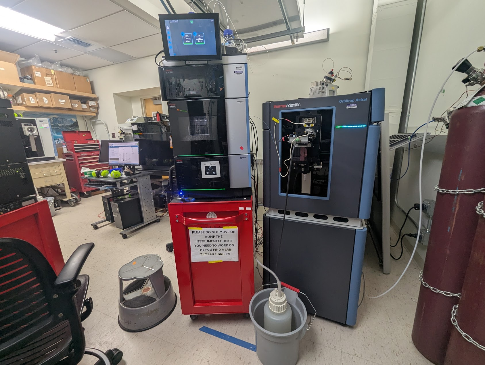  
Example publications from our lab describing the use of the Orbitrap Astral and Astral Zoom for quantitative proteomics.
- [Hsu et al., Evaluation of a prototype Orbitrap Astral Zoom mass spectrometer for quantitative proteomics - Beyond identification lists *bioRxiv* 2025](https://doi.org/10.1101/2025.05.30.657132)
- [Heil et al, Evaluating the Performance of the Astral Mass Analyzer for Quantitative Proteomics Using Data-Independent Acquisition *J. Proteome Res.* 2023](https://doi.org/10.1021/acs.jproteome.3c00357)

 **Thermo Fisher Stellar Mass Spectrometer**  
*Hybrid Quadrupole Mass Filter-Radial Ejection Linear Ion Trap*
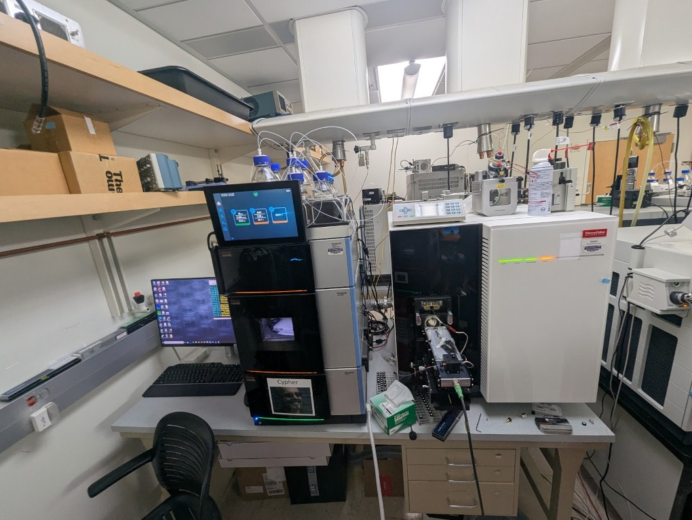  
Example publications describing the Stellar from the MacCoss lab include:
- [Plubell et al., Development of highly multiplex targeted proteomics assays in biofluids using the Stellar mass spectrometer *bioRxiv* 2024](https://pubmed.ncbi.nlm.nih.gov/38895256/)
- [Remes et al., Hybrid Quadrupole Mass Filter - Radial Ejection Linear Ion Trap and Intelligent Data Acquisition Enable Highly Multiplex Targeted Proteomics *J. Proteome Res.* 2024](https://doi.org/10.1021/acs.jproteome.4c00599)

**Thermo Fisher Orbitrap Eclipse Tribrid**
*Advanced tribrid mass spectrometer combining quadrupole, ion trap, and Orbitrap technologies*  
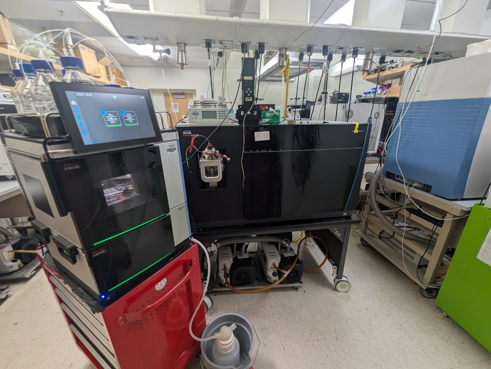  

 **Thermo Fisher Orbitrap Exploris 480**
*High-performance Orbitrap mass spectrometer for comprehensive proteomics workflows*  
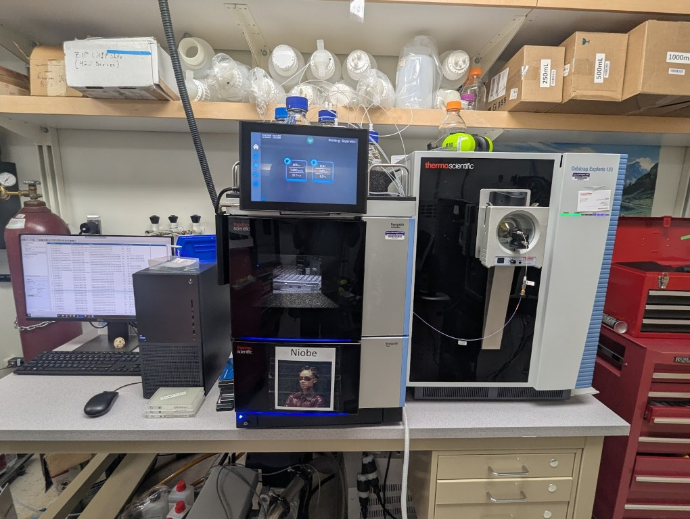  

**Thermo Fisher Orbitrap Fusion Lumos Mass Spectrometers x2**  
*We operate two Fusion Lumos tribrid mass spectrometers for advanced proteomics. These instruments combine quadrupole, ion trap, and Orbitrap technologies and are a workhorse for proteomics technology development.*

  

    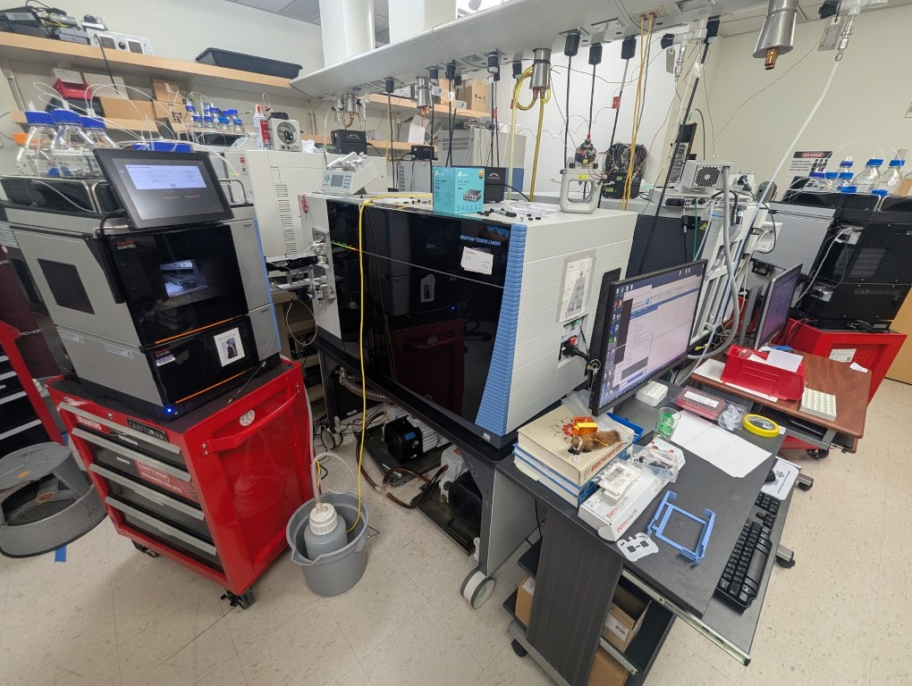
  

  

    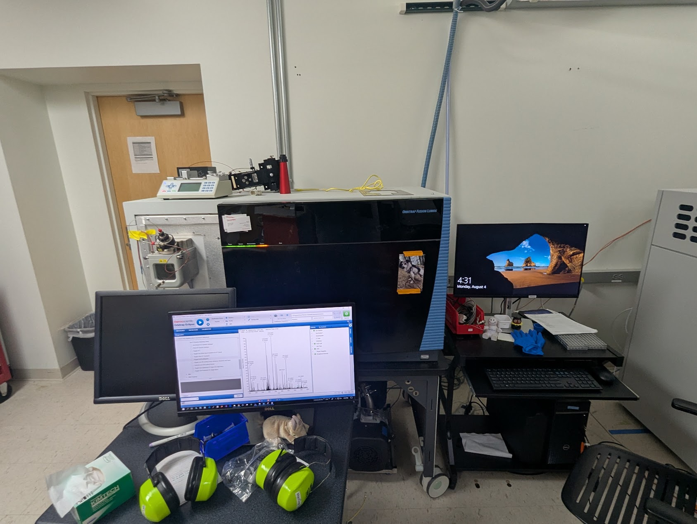
  

**Thermo Fisher Q Exactive HF**  
*High-field Orbitrap mass spectrometer for quantitative proteomics*  
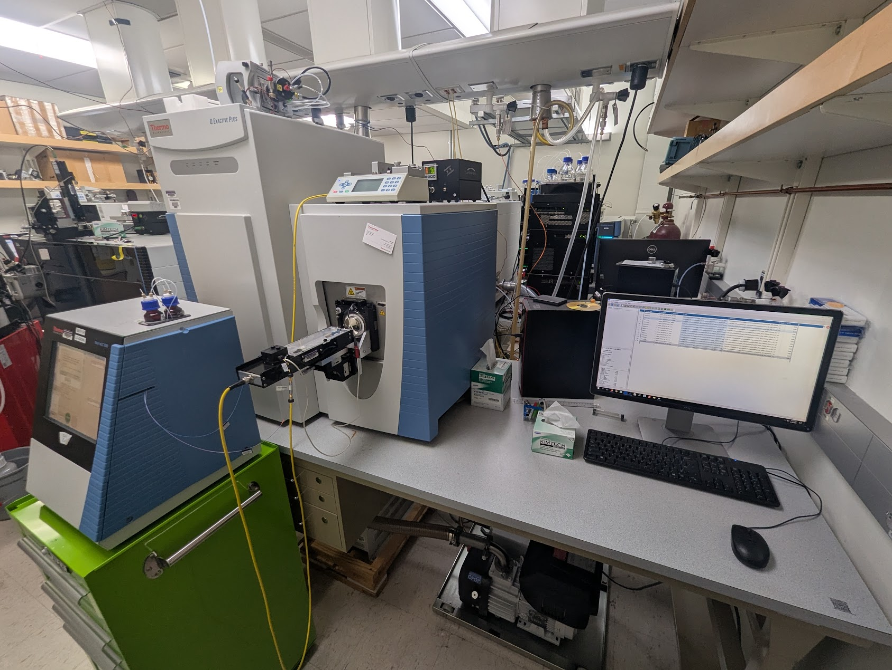  

**Thermo Fisher TSQ Altis**  
*High-performance triple quadrupole mass spectrometer for targeted quantitative analysis*  
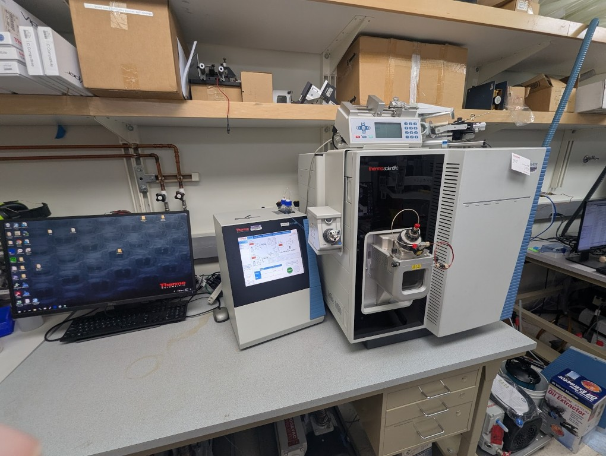 

  

    

## MacCoss Lab Software Tools

### 
**Windows Client Tool for the visualization, analysis, and development of methods for quantitative mass spectrometry**
- **Free, open-source quantitative mass spectrometry software.** Skyline is a freely-available, open-source Windows client application for building Selected Reaction Monitoring (SRM) / Multiple Reaction Monitoring (MRM), Parallel Reaction Monitoring (PRM), Data Independent Acquisition (DIA/SWATH) and DDA with MS1 quantitative methods and analyzing the resulting mass spectrometer data. Its flexible configuration supports All Molecules. Skyline uses state-of-the-art technologies for creating and iteratively refining targeted methods for large-scale quantitative mass spectrometry studies in life sciences.
- **Supports proteomics, metabolomics, and small molecule workflows.**
- **Vendor agnostic.** Can analyze data and generate methods for all major instrument vendors. Including Agilent, Bruker, Shimadzu, ThermoFisher, and Waters.
- **Download at**: [skyline.ms](https://skyline.ms/skyline.url)
- **External Tools**: Skyline has an external tool framework. We have a [tool store](http://skyline.ms/tools.url) with 20 tools currently available.
- **Source Code** is available as part of the [Proteowizard project](https://github.com/ProteoWizard/pwiz).
- **Original Publication** MacLean et al, [Skyline: an open source document editor for creating and analyzing targeted proteomics experiments](https://academic.oup.com/bioinformatics/article/26/7/966/212410), *Bioinformatics* 2010
- **Cited:** 5,279 times

### 
**Widely used software tools and libraries for mass spectrometry data analysis.**
- ProteoWizard provides a set of open-source, cross-platform software libraries and tools (e.g. msconvert, Skyline, IDPicker, SeeMS) that facilitate proteomics data analysis. The libraries enable rapid tool creation by providing a robust, pluggable development framework that simplifies and unifies data file access, and performs standard chemistry and LCMS dataset computations.
- **Download and Documentation:** [https://proteowizard.sourceforge.io/](https://proteowizard.sourceforge.io/)
- **Source Code:** Available on [Github](https://github.com/ProteoWizard/pwiz) and licensed under Apache 2.0.
- **Original Publication:** Chambers et al, [A cross-platform toolkit for mass spectrometry and proteomics](https://www.nature.com/articles/nbt.2377), *Nature Biotechnology* 2012
- **Cited:** 4,412 times

### 
**Web-based repository for Skyline documents and colaboration**
- Panorama is a freely-available, open-source webserver for sharing experiments and validated assays that integrates into a Skyline proteomics workflow. Panorama can be installed on a local server, or you can request a project on the PanoramaWeb.org server, hosted by the MacCoss Lab at the University of Washington. Access privileges within a project may be customized, allowing you to control fully who has access to data you publish to Panorama.
- **Access**: [panoramaweb.org](https://panoramaweb.org)
- **Panorama Public**: One of six of the [ProteomeXchange](https://www.proteomexchange.org/) servers used by the proteomics community. Panorama Public simplifies the process of sharing datasets analyzed by [Skyline](https://skyline.ms/skyline.url).
- **Requirements**: Can be accessed within Skyline and from any modern browser (Chrome, Firefox, Safari, Edge)
- **Features**: Unique tools for data sharing, collaboration, quality control
- **API**: Programmatic access for automated workflows

### 
**Open Source Server for the Analysis and Sharing of Data Dependent Acquisition Mass Spectrometry Results**
- Limelight is designed to provide you with the full-stack of proteomics results, regardless of which processing pipeline you used to search your data. Full-stack means that you have access to the global views of your data (such as statistically comparing conditions), to viewing lists of proteins and peptides, to individual PSMs and spectra–all showing the native scores from whichever pipeline you used. Additionally, all native scores from your pipeline are available to you for filtering–even when contrasting multiple searches that each used different pipelines.
- [Limelight](https://limelight.yeastrc.org/limelight/) can be installed locally or you can request an account on a server hosted at the University of Washington.
- Detailed documentation for using Limelight is available [here](https://limelight-ms.readthedocs.io/en/latest/#).
- **Source Code** is available on [GitHub](https://github.com/yeastrc/limelight-core).

### 
**Open source tool for peptide-centric analysis of data independent acquisition-mass spectrometry data**
- EncyclopeDIA is library search engine comprised of several algorithms for DIA data analysis and can search for peptides using either DDA-based spectrum libraries or DIA-based chromatogram libraries. Check out our manuscript describing EncyclopeDIA at Nature Communications ([Searle et al, 2018](https://www.nature.com/articles/s41467-018-07454-w)) for more information. EncyclopeDIA contains Walnut, an implementation of the PECAN ([Ting et al, 2017](https://www.nature.com/articles/nmeth.4390)) scoring system, to enable chromatogram library generation from FASTA protein sequence databases when spectrum libraries are unavailable. EncyclopeDIA also supports Prosit, a deep learning tool for generating peptide fragmentation spectra, as described in ([Searle et al, 2020](https://www.nature.com/articles/s41467-020-15346-1)). EncyclopeDIA also contains Thesaurus for localizing and quantifying PTMS with DIA experiments ([Searle et al, 2019]((https://www.nature.com/articles/s41592-019-0498-4)))
- **Suport** -- EncyclopeDIA is maintained and supported by the [Searle lab](https://www.searlelab.org/) at the Mayo Clinic.
- **Downloads and Documentation** -- Details can be found on the [EncyclopeDIA Bitbucket](https://bitbucket.org/searleb/encyclopedia/wiki/Home) page.
- **Source Code** is also available on the [Bitbucket](https://bitbucket.org/searleb/encyclopedia/src/master/) page under an Apache 2.0 license.

### 
**Comet is an open source fork of the original SEQUEST database tool for proteomics**
- Searching uninterpreted tandem mass spectra of peptides against sequence databases is the most common method used to identify peptides and proteins. Since this method was first developed in 1993, many commercial, free, and open source tools have been created over the years that accomplish this task. Although its history goes back two decades, the Comet search engine was first made publicly available in August 2012 on SourceForge under the Apache License, version 2.0. The repository was migrated to GitHub in September 2021. Comet is maintained by **Jimmy Eng** at the [UW Proteomics Resource](https://proteomicsresource.washington.edu/).
- **Download and Documentation** are available on the UW Proteomics Resource [Github](https://uwpr.github.io/Comet/).
- **Support** is available via a [Google Groups](https://groups.google.com/g/comet-ms).
- **Source Code** is available on [GitHub](https://github.com/UWPR/Comet) under an Apache 2.0 license

### 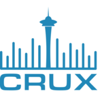
**The Crux mass spectrometry analysis toolkit is an open source project maintained by the [Noble lab](https://noble.gs.washington.edu/) that aims to provide users with a cross-platform suite of analysis tools for interpreting peptide MS/MS data.**
- The toolkit includes several search engines for both standard and cross-linked database search, as well as a variety of pre- and post-processing engines for assigning high-resolution precursor masses to spectra, assigning statistical confidence estimates to spectra, peptides and proteins, and performing label free quantification. Crux comes pre-complied for the Linux, Windows and MacOS operating systems. It is implemented as a single program that offers a wide variety of commands.
- **Support** is available via a [Google Groups](https://groups.google.com/g/crux-users).
- **Download and Documentation** are available on the [Crux website](https://crux.ms/).
- **Source Code** is available on [GitHub](https://github.com/crux-toolkit/crux-toolkit) under an Apache 2.0 license

### 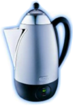 **Percolator**
**Percolator: semi-supervised learning for peptide identification from shotgun proteomics datasets**
- Percolator has become the gold standard for post-processing and FDR control for bottom-up proteomics. Our software is incorporated as part of Proteome Discoverer, FragPipe, Mascot, Crux, and many more. Percolator is actively maintained by the [Käll lab](https://kaell.se/).
- **Original Publication** Lukas Käll et al, [Semi-supervised learning for peptide indentification from shotgun proteomics datasets](https://www.nature.com/articles/nmeth1113) *Nature Methods* 2007
- **Download and Documentation** are available on the [Percolator website](http://percolator.ms/). Percolator is also part of the [Crux project](https://crux.ms/).
- **Source Code** is available on [GitHub](https://github.com/crux-toolkit/crux-toolkit) under an Apache 2.0 license.

## Public Datasets on [Panorama Public](http://panoramaweb.org/public.url)

**We have made available a number of mass spectrometry datasets on Panorama Public**

**[Browse all MacCoss Lab datasets on Panorama Public →](https://panoramaweb.org/project/Panorama%20Public/begin.view#searchTab:expSearchPanel?Targeted%20MS%20Experiment%20List.authors~containsoneof=MacCoss&)**

*Last updated: February 26, 2026 — 58 datasets available*

### 2026

<table class="invisible-table">
<tr><td><a href="https://panoramaweb.org/Panorama Public/2026/MacCoss - Is Protein Quantification and Physical Normalization Always Necessary in Proteomics/project-begin.view">Is Protein Quantification and Physical Normalization Always Necessary in Proteomics?</a></td><td></td></tr>
</table>

### 2025

<table class="invisible-table">
<tr><td><a href="https://panoramaweb.org/Panorama Public/2025/MacCoss - Prototype Orbitrap Astral manuscript/project-begin.view">Evaluation of a modified Orbitrap Astral Zoom prototype for quantitative proteomics - Beyond identification lists</a></td><td><a href="http://proteomecentral.proteomexchange.org/cgi/GetDataset?ID=PXD064536">PXD064536</a></td></tr>
<tr><td><a href="https://panoramaweb.org/Panorama Public/2025/MacCoss - DIA Analysis of Microvasculature in Alzheimers Disease/project-begin.view">DIA Analysis of Microvasculature in Alzheimers Disease</a></td><td></td></tr>
<tr><td><a href="https://panoramaweb.org/Panorama Public/2025/Thermo Fisher Research and Development - PRM Conductor/project-begin.view">Tutorials on How to Use PRM Conductor, a Skyline External Tool</a></td><td></td></tr>
<tr><td><a href="https://panoramaweb.org/Panorama Public/2025/MacCoss - Stellar highly multiplex fluid assays/project-begin.view">Development of highly multiplex targeted proteomics assays in biofluids using a nominal mass ion trap mass spectrometer</a></td><td><a href="http://proteomecentral.proteomexchange.org/cgi/GetDataset?ID=PXD065471">PXD065471</a></td></tr>
<tr><td><a href="https://panoramaweb.org/Panorama Public/2025/MacCoss - DIA to SRM Assays/project-begin.view">DIA to inform Triple Quad Assay development</a></td><td><a href="http://proteomecentral.proteomexchange.org/cgi/GetDataset?ID=PXD059611">PXD059611</a></td></tr>
</table>

### 2024

<table class="invisible-table">
<tr><td><a href="https://panoramaweb.org/Panorama Public/2024/TAMADOR - Glucagon and Oxyntomodulin/project-begin.view">Evaluation of Linearity, Lower Limit of Measurement Interval and Imprecision</a></td><td><a href="http://proteomecentral.proteomexchange.org/cgi/GetDataset?ID=PXD041410">PXD041410</a></td></tr>
<tr><td><a href="https://panoramaweb.org/Panorama Public/2024/MacCoss - Carafe/project-begin.view">Carafe enables high quality in silico spectral library generation for data-independent acquisition proteomics</a></td><td><a href="http://proteomecentral.proteomexchange.org/cgi/GetDataset?ID=PXD056793">PXD056793</a></td></tr>
<tr><td><a href="https://panoramaweb.org/Panorama Public/2024/MacCoss - Sample QC and System Suitability/project-begin.view">A framework for quality control in quantitative proteomics</a></td><td><a href="http://proteomecentral.proteomexchange.org/cgi/GetDataset?ID=PXD051318">PXD051318</a></td></tr>
<tr><td><a href="https://panoramaweb.org/Panorama Public/2024/UW Isoherranen Lab - 2024 Drug-Protein Adducts Raloxifene Paper/project-begin.view">Detection and Quantification of Drug-Protein Adducts in Human Liver</a></td><td><a href="http://proteomecentral.proteomexchange.org/cgi/GetDataset?ID=PXD054246">PXD054246</a></td></tr>
<tr><td><a href="https://panoramaweb.org/Panorama Public/2024/MacCoss - 2024-6 Cascadia/project-begin.view">A transformer model for de novo sequencing of data-independent acquisition mass spectrometry data</a></td><td><a href="http://proteomecentral.proteomexchange.org/cgi/GetDataset?ID=PXD053291">PXD053291</a></td></tr>
<tr><td><a href="https://panoramaweb.org/Panorama Public/2024/Thermo Fisher Research and Development - 2024_Stellar_Instrument_Platform/project-begin.view">Characterization of Stellar MS</a></td><td><a href="http://proteomecentral.proteomexchange.org/cgi/GetDataset?ID=PXD052734">PXD052734</a></td></tr>
<tr><td><a href="https://panoramaweb.org/Panorama Public/2024/MacCoss - AD-BXD Mouse PreFrontal Cortex Proteomics/project-begin.view">AD-BXD Mouse PreFrontal Cortex Proteomics</a></td><td><a href="http://proteomecentral.proteomexchange.org/cgi/GetDataset?ID=PXD045403">PXD045403</a></td></tr>
<tr><td><a href="https://panoramaweb.org/Panorama Public/2024/MacCoss - Mouse X-Chromosome Resilience to Cognitive Aging/project-begin.view">Mouse X-Chromosome Resilience to Cognitive Aging</a></td><td><a href="http://proteomecentral.proteomexchange.org/cgi/GetDataset?ID=PXD049347">PXD049347</a></td></tr>
<tr><td><a href="https://panoramaweb.org/Panorama Public/2024/MacCoss - Mouse Skeletal Muscle Sarcopenia/project-begin.view">Mouse Skeletal Muscle Sarcopenia</a></td><td><a href="http://proteomecentral.proteomexchange.org/cgi/GetDataset?ID=PXD048723">PXD048723</a></td></tr>
</table>

### 2023

<table class="invisible-table">
<tr><td><a href="https://panoramaweb.org/Panorama Public/2023/MacCoss - CCS Library/project-begin.view">METLIN-CCS: an ion mobility spectrometry
collision cross-section database</a></td><td></td></tr>
<tr><td><a href="https://panoramaweb.org/Panorama Public/2023/MacCoss - AD-BXD Mouse Hippocampus Proteomics/project-begin.view">AD-BXD Mouse Hippocampus Proteomics</a></td><td><a href="http://proteomecentral.proteomexchange.org/cgi/GetDataset?ID=PXD045425">PXD045425</a></td></tr>
<tr><td><a href="https://panoramaweb.org/Panorama Public/2023/MacCoss - Skeletal Muscle TFEB Signaling/project-begin.view">Skeletal Muscle TFEB Signaling Promotes Central Nervous System Function and Reduces Neuroinflammation during Aging and Neurodegenerative Disease</a></td><td><a href="http://proteomecentral.proteomexchange.org/cgi/GetDataset?ID=PXD045241">PXD045241</a></td></tr>
<tr><td><a href="https://panoramaweb.org/Panorama Public/2023/MacCoss - FAIMS_vs_QuadGPF_Manuscript/project-begin.view">Comparing peptide identifications by FAIMS versus quadrupole gas phase fractionation</a></td><td><a href="http://proteomecentral.proteomexchange.org/cgi/GetDataset?ID=PXD043458">PXD043458</a></td></tr>
<tr><td><a href="https://panoramaweb.org/Panorama Public/2023/MacCoss - Mag-Net Method/project-begin.view">Mag-Net: Rapid enrichment of membrane-bound particles enables high coverage quantitative analysis of the plasma proteome</a></td><td><a href="http://proteomecentral.proteomexchange.org/cgi/GetDataset?ID=PXD042947">PXD042947</a></td></tr>
<tr><td><a href="https://panoramaweb.org/Panorama Public/2023/MacCoss - AstralBenchmarking/project-begin.view">Evaluating the Performance of the Astral Mass Analyzer for Quantitative Proteomics Using Data Independent Acquisition</a></td><td><a href="http://proteomecentral.proteomexchange.org/cgi/GetDataset?ID=PXD042704">PXD042704</a></td></tr>
<tr><td><a href="https://panoramaweb.org/Panorama Public/2023/MacCoss - Pig Lens PTM Paper/project-begin.view">Spatiotemporal Mapping of Posttranslational Modifications in the Pig Lens</a></td><td><a href="http://proteomecentral.proteomexchange.org/cgi/GetDataset?ID=PXD040507">PXD040507</a></td></tr>
<tr><td><a href="https://panoramaweb.org/Panorama Public/2023/TPAD2.0 - ApoE Assay Paper/project-begin.view">Metrologically traceable quantification of three apolipoprotein E isoforms in cerebrospinal fluid</a></td><td><a href="http://proteomecentral.proteomexchange.org/cgi/GetDataset?ID=PXD038803">PXD038803</a></td></tr>
</table>

### 2022

<table class="invisible-table">
<tr><td><a href="https://panoramaweb.org/Panorama Public/2022/MacCoss - Dynamic DIA Results/project-begin.view">Dynamic Data Independent Acquisition Mass Spectrometry with Real-Time Retrospective Alignment</a></td><td><a href="http://proteomecentral.proteomexchange.org/cgi/GetDataset?ID=PXD038508">PXD038508</a></td></tr>
<tr><td><a href="https://panoramaweb.org/Panorama Public/2022/MacCoss - Single_Molecule_Counting_Perspective/project-begin.view">Sampling the proteome by emerging single-molecule and mass-spectrometry based methods</a></td><td><a href="http://proteomecentral.proteomexchange.org/cgi/GetDataset?ID=PXD035637">PXD035637</a></td></tr>
<tr><td><a href="https://panoramaweb.org/Panorama Public/2022/MacCoss - Human AD Clean Diagnosis DIA Data/project-begin.view">A Peptide-Centric Quantitative Proteomics Dataset for the Phenotypic Assessment of Alzheimer’s Disease</a></td><td><a href="http://proteomecentral.proteomexchange.org/cgi/GetDataset?ID=PXD034525">PXD034525</a></td></tr>
<tr><td><a href="https://panoramaweb.org/Panorama Public/2022/MacCoss - Cross-linking analysis of HHARI/project-begin.view">Quantitative XL-MS Analysis of HHARI in the presence or absence of 4EHP</a></td><td><a href="http://proteomecentral.proteomexchange.org/cgi/GetDataset?ID=PXD030871">PXD030871</a></td></tr>
</table>

### 2021

<table class="invisible-table">
<tr><td><a href="https://panoramaweb.org/Panorama Public/2021/MacCoss - 2015-Selevsek/project-begin.view">Skyline Batch: An Intuitive User Interface for Batch Processing with Skyline</a></td><td><a href="http://proteomecentral.proteomexchange.org/cgi/GetDataset?ID=PXD029665">PXD029665</a></td></tr>
<tr><td><a href="https://panoramaweb.org/Panorama Public/2021/MacCoss - 2015-Bruderer/project-begin.view">Skyline Batch: An Intuitive User Interface for Batch Processing with Skyline</a></td><td><a href="http://proteomecentral.proteomexchange.org/cgi/GetDataset?ID=PXD029663">PXD029663</a></td></tr>
<tr><td><a href="https://panoramaweb.org/Panorama Public/2021/NCSU Baker Lab - Smoke Inhalation and SRM 1950/project-begin.view">Development and Application of Multidimensional Lipid Libraries to Investigate Lipidomic Dysregulation Related to Smoke Inhalation Injury Severity</a></td><td></td></tr>
<tr><td><a href="https://panoramaweb.org/Panorama Public/2021/MacCoss - MitoPPX Paper/project-begin.view">Mitochondrial inorganic polyphosphate (polyP) is a contributor towards maintaining cellular bioenergetics in SH-SY5Y cells: a proteomics and metabolomics approach</a></td><td><a href="http://proteomecentral.proteomexchange.org/cgi/GetDataset?ID=PXD028185">PXD028185</a></td></tr>
<tr><td><a href="https://panoramaweb.org/Panorama Public/2021/MacCoss - Age-Related Disruption of the Proteome and Acetylome in Mouse Hearts Correlates with Differential Loss of Function that is Attenuated by SS-31 and NMN/project-begin.view">Age-Related Disruption of the Proteome and Acetylome in Mouse Hearts Correlates with Differential Loss of Function that is Attenuated by SS-31 and NMN</a></td><td><a href="http://proteomecentral.proteomexchange.org/cgi/GetDataset?ID=PXD027458">PXD027458</a></td></tr>
<tr><td><a href="https://panoramaweb.org/Panorama Public/2021/MacCoss - SRM_Data-The metabolome as a biomarker of aging in Drosophila melanogaster/project-begin.view">The metabolome as a biomarker of aging in Drosophila melanogaster</a></td><td></td></tr>
<tr><td><a href="https://panoramaweb.org/Panorama Public/2021/MacCoss - Q-OT vs Q-LIT submission/project-begin.view">Comparison of unit resolution versus high-resolution accurate mass for parallel reaction monitoring</a></td><td><a href="http://proteomecentral.proteomexchange.org/cgi/GetDataset?ID=PXD023334">PXD023334</a></td></tr>
<tr><td><a href="https://panoramaweb.org/Panorama Public/2021/MacCoss - AD Isomer Paper/project-begin.view">Alzheimer's Disease Isomerization</a></td><td><a href="http://proteomecentral.proteomexchange.org/cgi/GetDataset?ID=PXD025668">PXD025668</a></td></tr>
<tr><td><a href="https://panoramaweb.org/Panorama Public/2021/MacCoss - CYP3A4 Raloxifene/project-begin.view">Quantification of Raloxifene Specific 471 Da Adducts in CYP3A4 and P450-Reductase</a></td><td><a href="http://proteomecentral.proteomexchange.org/cgi/GetDataset?ID=PXD024932">PXD024932</a></td></tr>
<tr><td><a href="https://panoramaweb.org/Panorama Public/2021/LINCS PCCSE P100 2020/project-begin.view">Phospho-proteomic Profiling Dataset of Chemical Perturbations in Multiple Biological Backgrounds</a></td><td><a href="http://proteomecentral.proteomexchange.org/cgi/GetDataset?ID=PXD017458">PXD017458</a></td></tr>
<tr><td><a href="https://panoramaweb.org/Panorama Public/2021/NCSU Baker Lab - Lipid Libraries/project-begin.view">Utilizing Skyline to Analyze Lipidomics Data Containing Liquid Chromatography, Ion Mobility Spectrometry and Mass Spectrometry Dimensions</a></td><td></td></tr>
<tr><td><a href="https://panoramaweb.org/Panorama Public/2021/MacCoss - SS31-PTM/project-begin.view">Mouse Heart SS31 Targeted Proteomics</a></td><td><a href="http://proteomecentral.proteomexchange.org/cgi/GetDataset?ID=PXD024247">PXD024247</a></td></tr>
<tr><td><a href="https://panoramaweb.org/Panorama Public/2021/MacCoss - Grizzly Bear Serum DIA Proteomics/project-begin.view">Grizzly Bear Serum DIA Proteomics</a></td><td><a href="http://proteomecentral.proteomexchange.org/cgi/GetDataset?ID=PXD023555">PXD023555</a></td></tr>
</table>

### 2020

<table class="invisible-table">
<tr><td><a href="https://panoramaweb.org/Panorama Public/2020/MacCoss - Lysosome and Liver DIA Quant/project-begin.view">Lysosomal targetomics in ghrKO mice reveals a role for chaperone-mediated autophagy in shaping the nucleocytosolic acetyl-coA production pathway</a></td><td><a href="http://proteomecentral.proteomexchange.org/cgi/GetDataset?ID=PXD023309">PXD023309</a></td></tr>
<tr><td><a href="https://panoramaweb.org/Panorama Public/2020/MacCoss - Real-Time Chromatogram Alignment/project-begin.view">Highly Multiplex Targeted Proteomics Enabled by Real-Time Chromatographic Alignment</a></td><td><a href="http://proteomecentral.proteomexchange.org/cgi/GetDataset?ID=PXD018675">PXD018675</a></td></tr>
<tr><td><a href="https://panoramaweb.org/Panorama Public/2020/MacCoss - Acarbose Paper/project-begin.view">Acarbose improves late-life physical function in mice of both sexes, but rejuvenates cardiac structure and lipid profile in males only</a></td><td><a href="http://proteomecentral.proteomexchange.org/cgi/GetDataset?ID=PXD017706">PXD017706</a></td></tr>
<tr><td><a href="https://panoramaweb.org/Panorama Public/2020/LINCS PCCSE GCP 2020/project-begin.view">Global Chromatin Profiling Dataset of Chemical Perturbations in Multiple Biological Backgrounds</a></td><td><a href="http://proteomecentral.proteomexchange.org/cgi/GetDataset?ID=PXD017459">PXD017459</a></td></tr>
</table>

### 2019

<table class="invisible-table">
<tr><td><a href="https://panoramaweb.org/Panorama Public/2019/UCSD Rifkin Lab - Pheromone_RNAProtein/project-begin.view">A simple mass-action model predicts protein timecourses from mRNA trajectories during a dynamic response in two strains of S. cerevisiae</a></td><td><a href="http://proteomecentral.proteomexchange.org/cgi/GetDataset?ID=PXD015745">PXD015745</a></td></tr>
<tr><td><a href="https://panoramaweb.org/Panorama Public/2019/Duke Proteomics Core - Skyline for Small Molecules/project-begin.view">Skyline for Small Molecules: A Unifying Software Package for Quantitative Metabolomics</a></td><td></td></tr>
<tr><td><a href="https://panoramaweb.org/Panorama Public/2019/MacCoss - matched matrix cal curves/project-begin.view">Matrix-matched calibration curves</a></td><td><a href="http://proteomecentral.proteomexchange.org/cgi/GetDataset?ID=PXD014815">PXD014815</a></td></tr>
</table>

### 2018

<table class="invisible-table">
<tr><td><a href="https://panoramaweb.org/Panorama Public/2018/MacCoss - Improving Precursor Selectivity in Data Independent Acquisition Using Overlapping Windows/project-begin.view">Improving Precursor Selectivity in Data Independent Acquisition Using Overlapping Windows</a></td><td><a href="http://proteomecentral.proteomexchange.org/cgi/GetDataset?ID=PXD011910">PXD011910</a></td></tr>
<tr><td><a href="https://panoramaweb.org/Panorama Public/2018/MacCoss - Single-point Calibration/project-begin.view">Single-point Calibration</a></td><td><a href="http://proteomecentral.proteomexchange.org/cgi/GetDataset?ID=PXD011297">PXD011297</a></td></tr>
<tr><td><a href="https://panoramaweb.org/Panorama Public/2018/NantOmics - Data-independent acquisition mass spectrometry to quantify protein levels in FFPE tumor biopsies for molecular diagnostics/project-begin.view">Data-independent acquisition mass spectrometry to quantify protein levels in FFPE tumor biopsies for molecular diagnostics</a></td><td><a href="http://proteomecentral.proteomexchange.org/cgi/GetDataset?ID=PXD010934">PXD010934</a></td></tr>
<tr><td><a href="https://panoramaweb.org/Panorama Public/2018/MacLean - Baker IMS/project-begin.view">Using Skyline to Analyze Data-Containing Liquid Chromatography, Ion Mobility Spectrometry, and Mass Spectrometry Dimensions. Journal of The American Society for Mass Spectrometry</a></td><td><a href="http://proteomecentral.proteomexchange.org/cgi/GetDataset?ID=PXD010650">PXD010650</a></td></tr>
<tr><td><a href="https://panoramaweb.org/Panorama Public/2018/Study_9S/project-begin.view">Design, Implementation and Multisite Evaluation of a System Suitability Protocol for the Quantitative Assessment of Instrument Performance in Liquid Chromatography-Multiple Reaction Monitoring-MS (LC-MRM-MS)</a></td><td><a href="http://proteomecentral.proteomexchange.org/cgi/GetDataset?ID=PXD010535">PXD010535</a></td></tr>
</table>

### 2017

<table class="invisible-table">
<tr><td><a href="https://panoramaweb.org/Panorama Public/2017/MacCoss - Homer2 Interactome/project-begin.view">A mass spectrometry-based proteomic analysis of Homer2-interacting proteins in the mouse brain</a></td><td></td></tr>
<tr><td><a href="https://panoramaweb.org/Panorama Public/2017/Berg - Skyline_Analysis_Idgfs/project-begin.view">Proteomics analysis identifies orthologs of human chitinase-like proteins as inducers of tube-morphogenesis defects in Drosophila</a></td><td></td></tr>
</table>

### 2015

<table class="invisible-table">
<tr><td><a href="https://panoramaweb.org/Panorama Public/2015/Schilling - MRM_HR_TripleTOF_MS2_FullScanFiltering/project-begin.view">Multiplexed, scheduled high resolution (sMRM-HR) acquisition on a full scan QqTOF instrument with integrated data-dependent and targeted mass spectrometric workflows.</a></td><td></td></tr>
<tr><td><a href="https://panoramaweb.org/Panorama Public/2015/Schilling - MS1_MS2_SWATH/project-begin.view">MS1 Peptide Ion Intensity Chromatograms in MS2 (SWATH) Data Independent Acquisitions. Improving Post Acquisition Analysis of Proteomic Experiments</a></td><td></td></tr>
<tr><td><a href="https://panoramaweb.org/Panorama Public/2015/Searle_PREGO_manuscript/project-begin.view">Analytical protein standards</a></td><td></td></tr>
<tr><td><a href="https://panoramaweb.org/Panorama Public/2015/Schilling - main_Study_9/project-begin.view">Large-scale inter-laboratory study to develop, analytically validate and apply highly multiplexed, quantitative peptide assays to measure cancer-relevant proteins in plasma</a></td><td></td></tr>
</table>

*All datasets include processed results as Skyline documents and raw datafiles. Many datasets are paired with published manuscripts.*

  

    

## Educational Materials

*Last updated: February 26, 2026 — 28 Skyline tutorials available*

### UWPR Mass Spectrometry Resources

- **[UWPR LC-MS Tips and Tricks](https://proteomicsresource.washington.edu/protocols05/)** — Protocols, tips, and resources for LC-MS analyses. *Definitely bookmark this page.*
- **[UWPR Data Analysis Tools](https://proteomicsresource.washington.edu/protocols06/)** — Online calculators, database search tools, and computational resources.

#### UWPR Online Calculators
- [MS/MS fragmentation calculator](https://proteomicsresource.washington.edu/cgi-bin/fragment.cgi)
- [Protein sequence digestion calculator](https://proteomicsresource.washington.edu/cgi-bin/digest.cgi)
- [Isotope distribution calculator](https://proteomicsresource.washington.edu/cgi-bin/calcisotopes.cgi)
- [Elemental mass calculator](https://proteomicsresource.washington.edu/cgi-bin/element.cgi)
- [Lorikeet Spectrum viewer](https://proteomicsresource.washington.edu/lorikeet/)
- [Koina (Prosit, ms2pip, AlphaPeptDeep) spectrum prediction viewer](https://proteomicsresource.washington.edu/lorikeet/html/specview-koina.html)
- [Table of relevant masses (amino acids, elements)](https://proteomicsresource.washington.edu/protocols06/masses.php)

### Skyline Tutorials
*Hands-on tutorials with real data and step-by-step instructions*

#### Introductory
- **[Targeted Method Editing](https://skyline.ms/tutorial_method_edit.url)** (26 pages)
- **[Targeted Method Refinement](https://skyline.ms/tutorial_method_refine.url)** (28 pages)
- **[Grouped Study Data Processing](https://skyline.ms/tutorial_grouped.url)** (70 pages)
- **[Existing & Quantitative Experiments](https://skyline.ms/tutorial_existing_quant.url)** (43 pages)

#### Introduction to Full-Scan Acquisition Data
- **[Comparing PRM, DIA, and DDA](https://skyline.ms/tutorial_comp_acq.url)** (38 pages)
- **[PRM With an Orbitrap](https://skyline.ms/tutorial_prm_orbi.url)** (44 pages)
- **[Basic Data Independent Acquisition](https://skyline.ms/tutorial_dia.url)** (40 pages)

#### Full-Scan Acquisition Data
- **[MS1 Full-Scan Filtering](https://skyline.ms/tutorial_ms1_filtering.url)** (41 pages)
- **[DDA Search for MS1 Filtering](https://skyline.ms/tutorial_dda_search.url)** (19 pages)
- **[Parallel Reaction Monitoring (PRM)](https://skyline.ms/tutorial_prm.url)** (40 pages)
- **[Analysis of DIA/SWATH Data](https://skyline.ms/tutorial_dia_swath.url)** (32 pages)
- **[Analysis of diaPASEF Data](https://skyline.ms/tutorial_dia_pasef.url)** (36 pages)
- **[Library-Free DIA/SWATH](https://skyline.ms/tutorial_dia_umpire_ttof.url)** (26 pages)
- **[Peak Boundary Imputation for DIA](https://skyline.ms/tutorial_peak_impute_dia.url)** (16 pages)

#### Small Molecules
- **[Small Molecule Targets](https://skyline.ms/tutorial_small_molecule.url)** (10 pages)
- **[Small Molecule Method Development](https://skyline.ms/tutorial_small_method_ce.url)** (37 pages)
- **[Small Mol. Multidimension Spec. Lib.](https://skyline.ms/tutorial_small_ims.url)** (23 pages)
- **[Small Molecule Quantification](https://skyline.ms/tutorial_small_quant.url)** (27 pages)
- **[Hi-Res Metabolomics](https://skyline.ms/tutorial_hi_res_metabolomics.url)** (17 pages)

#### Reports
- **[Custom Reports](https://skyline.ms/tutorial_custom_reports.url)** (33 pages)
- **[Live Reports](https://skyline.ms/tutorial_live_reports.url)** (48 pages)

#### Advanced Topics
- **[Absolute Quantification](https://skyline.ms/tutorial_absolute_quant.url)** (19 pages)
- **[Advanced Peak Picking Models](https://skyline.ms/tutorial_peak_picking.url)** (28 pages)
- **[iRT Retention Time Prediction](https://skyline.ms/tutorial_irt.url)** (36 pages)
- **[Collision Energy Optimization](https://skyline.ms/tutorial_optimize_ce.url)** (12 pages)
- **[Ion Mobility Spectrum Filtering](https://skyline.ms/tutorial_ims.url)** (26 pages)
- **[Spectral Library Explorer](https://skyline.ms/tutorial_library_explorer.url)** (22 pages)
- **[Audit Logging](https://skyline.ms/tutorial_audit_log.url)** (23 pages)

[**View all tutorials**](https://skyline.ms/wiki/home/software/Skyline/page.view?name=tutorials)

### Skyline Documentation
*Advanced reference documentation and developer resources*

- **[Skyline Custom Reports](https://skyline.ms/wiki/home/software/Skyline/page.view?name=custom_reports)** — Learn about the vast array of values you can show in the Document Grid or export
- **[Skyline Command-Line Interface](https://skyline.ms/wiki/home/software/Skyline/page.view?name=SkylineCmd)** — Use SkylineRunner.exe and SkylineCmd.exe for command-line operations
- **[Skyline Keyboard Shortcuts](https://skyline.ms/wiki/home/software/Skyline/page.view?name=keyboard_shortcuts)** — Quick access to commands without leaving the keyboard
- **[External Tools Documentation](https://skyline.ms/labkey/_webdav/home/software/Skyline/@files/docs/Skyline%20External%20Tools-2_1.pdf)** — Integrate statistical and bioinformatics tools with Skyline
- **[Interactive Tools Documentation](https://skyline.ms/labkey/_webdav/home/software/Skyline/@files/docs/Skyline%20Interactive%20Tool%20Support-3_1.pdf)** — Develop .NET tools that interact with Skyline in real-time

[**View all documentation**](https://skyline.ms/wiki/home/software/Skyline/page.view?name=documentation)

### Skyline Videos
*Quick instructional videos for getting started*

- **[Video Demo 1: Creating SRM/MRM Methods](https://skyline.ms/labkey/wiki/home/software/Skyline/page.view?name=video_0-2)** (28 minutes)
- **[Video Demo 2: Results Analysis and Method Refinement](https://skyline.ms/labkey/wiki/home/software/Skyline/page.view?name=video_0-5)** (25 minutes)
- **[Video Demo 3: Importing Existing Experiments](https://skyline.ms/labkey/wiki/home/software/Skyline/page.view?name=video_0-5b)** (27 minutes)
- **[Skyline Trailer Video](https://skyline.ms/labkey/wiki/home/software/Skyline/page.view?name=video_trailer)**

[**View all videos**](https://skyline.ms/wiki/home/software/Skyline/page.view?name=videos)

### YouTube Channels
*Course content and instructional videos*

- **[Skyline Course at UW](https://www.youtube.com/channel/UCOdJj3Spesm_U_2-N_FT7wg)** — University of Washington course materials
- **[May Institute at Northeastern University](https://www.youtube.com/channel/UCnbUMFlIRLaY7fwfSintWuQ)** — Comprehensive proteomics course content
- **[Targeted Proteomics Course at ETH, Zurich](https://www.youtube.com/channel/UCLLENascNxL22j3pntI7jVA/playlists)** — International course materials

[**View YouTube resources**](https://skyline.ms/wiki/home/software/Skyline/page.view?name=youtube)

### LC-MS Tips and Protocols
*Selected resources from the UWPR LC-MS Tips page*

- [DIA Overview](https://proteomicsresource.washington.edu/protocols05/DIA.php)
- [PRM Overview](https://proteomicsresource.washington.edu/protocols05/PRM.php)
- [MRM/SRM Overview](https://proteomicsresource.washington.edu/protocols05/MRM.php)
- [Common Mass Spec Background Ions](https://proteomicsresource.washington.edu/protocols05/esi_background_ions.php)
- [Avoid Contaminations Guide](https://proteomicsresource.washington.edu/docs/protocols05/Avoid%20Contaminations.pdf)
- [Packing Capillary Columns](https://proteomicsresource.washington.edu/docs/protocols05/Packing_Capillary_Columns.pdf)

[**View all LC-MS tips**](https://proteomicsresource.washington.edu/protocols05/)

  

  

    

## Support & Training

*Last updated: February 26, 2026 — 4 upcoming events, 101 past events, 27 webinars*

### Forums and Discussion
- [Skyline Support Board](https://skyline.ms/forum)
- [Panorama Support Board](https://panoramaweb.org/forum)
- **[University of Washington Proteomics Listserv](https://mailman23.u.washington.edu/mailman/listinfo/proteomics)** - If you are at UW and doing proteomics you should join this list.

### Upcoming Events

- **[2026 ISAS Dortmund Skyline Training Course](https://www.isas.de/en/events/skyline-kurs-2026)** (March 2-5, 2026)
- **[May Institute - Computation and statistics for mass spectrometry and proteomics](https://computationalproteomics.khoury.northeastern.edu/)**
- **[Frontiers in Proteomics: Advanced Skyline Applications](https://skyline.ms/../../../../2026-uw-course.url)** (July 6-10, 2026)
- **[Cascadia Proteomics Symposium](https://cascadiaproteomics.org/)** (July 16-17, 2026)

### Skyline Webinar Series

The Skyline Team presents tutorial webinars designed to help you get the most out of Skyline targeted proteomics software. Each ~90 minute webinar includes Q&A, presentations, and tutorial data.

**Recent Webinars (2025):**
- [#27: Peak Boundary Imputation for DIA Data](https://skyline.ms/project/home/software/Skyline/events/2025%20Webinars/Webinar%2027/begin.view?) (Dec 2025)
- [#26: DIA with FragPipe, DIA-NN and Skyline](https://skyline.ms/project/home/software/Skyline/events/2025%20Webinars/Webinar%2026/begin.view?) (Sept 2025)
- [#25: Comparing Acquisition Methods](https://skyline.ms/project/home/software/Skyline/events/2025%20Webinars/Webinar%2025/begin.view?) (Jan 2025)

*[View all 27 webinars](https://skyline.ms/home/software/Skyline/wiki-page.view?name=webinars)*

### Past Events by Year

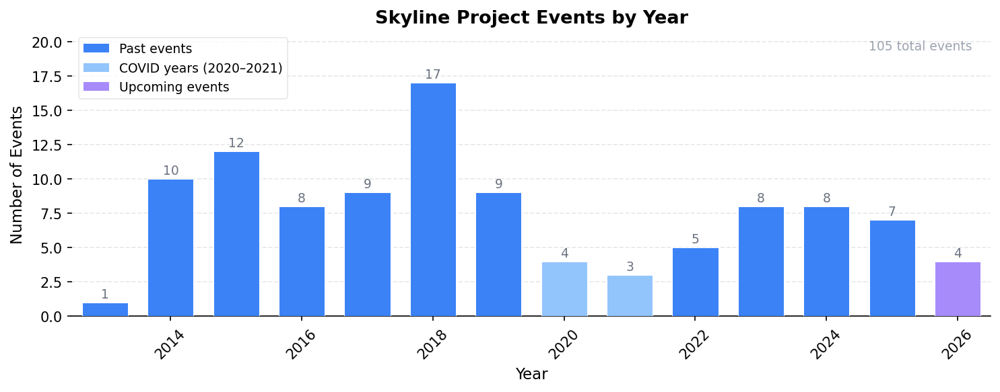

<button class="active" onclick="showEventYear(2025)">2025 (7)</button>
<button onclick="showEventYear(2024)">2024 (8)</button>
<button onclick="showEventYear(2023)">2023 (8)</button>
<button onclick="showEventYear(2022)">2022 (5)</button>
<button onclick="showEventYear(2021)">2021 (3)</button>
<button onclick="showEventYear(2020)">2020 (4)</button>
<button onclick="showEventYear(2019)">2019 (9)</button>
<button onclick="showEventYear(2018)">2018 (17)</button>
<button onclick="showEventYear(2017)">2017 (9)</button>
<button onclick="showEventYear(2016)">2016 (8)</button>
<button onclick="showEventYear(2015)">2015 (12)</button>
<button onclick="showEventYear(2014)">2014 (10)</button>
<button onclick="showEventYear(2013)">2013 (1)</button>

<h4>2025 Events</h4>
<ul>
<li><a href="https://skyline.ms/2025-10%20Skyline%20Online/project-begin.view">Skyline Online 2025</a> (October 7-17, 2025)</li>
<li><a href="https://meetings.embo.org/event/25-targeted-proteomics">Practical Course on Targeted Proteomics</a> - Barcelona, Spain (October 5-10, 2025)</li>
<li><a href="https://skyline.ms/2025%20UW%20Course/project-begin.view">Skyline Course at the University of Washington</a> - Seattle, WA (July 7 - 11, 2025)</li>
<li><a href="https://www.asms.org/conferences/annual-conference/short-courses">Two-day Short Course: 08 Quantitative Proteomics: Case Studies</a> - Baltimore, MD</li>
<li><a href="https://skyline.ms/../../../../2025-ugm.url">Skyline User Group Meeting</a> - Baltimore, MD (June 1, 2025)</li>
<li><a href="https://computationalproteomics.khoury.northeastern.edu/">May Institute - Computation and statistics for mass spectrometry and proteomics</a> - Northeastern University</li>
<li><a href="https://www.isas.de/en/events/skyline-course-2025">2025 ISAS Dortmund Skyline Training Course</a> - Dortmund (April 7-10, 2025)</li>
</ul>

<h4>2024 Events</h4>
<ul>
<li><a href="https://courses.crg.eu/events/targetedproteomics">Practical Course on Targeted Proteomics</a> - Barcelona, Spain (November 17-22, 2024)</li>
<li><a href="https://skyline.ms/2024-10%20Skyline%20Online/project-begin.view">2024 Skyline Online</a></li>
<li><a href="https://skyline.ms/2024%20UW%20Course/project-begin.view">UW Targeted Mass Spectrometry Course</a> - Seattle, WA (July 8 - 12, 2024)</li>
<li><a href="https://www.asms.org/conferences/annual-conference/short-courses/two-day-courses%0A">Two-day Short Course: 08 Quantitative Proteomics: Case Studies</a> - Anaheim, CA (June 1 - 2, 2024)</li>
<li><a href="https://skyline.ms/2024%20User%20Group%20Meeting%20at%20ASMS/project-begin.view">Skyline User Group Meeting</a> - Anaheim, CA (June 2, 2024)</li>
<li><a href="https://computationalproteomics.khoury.northeastern.edu/">May Institute - Computation and statistics for mass spectrometry and proteomics</a> - Northeastern University</li>
<li><a href="https://www.isas.de/en/events/skyline2024">2024 ISAS Dortmund Skyline Training Course</a> - Dortmund (March 4-7, 2024)</li>
<li><a href="https://portal.iitb.ac.in/ceqipapp/courseDetails.jsp?c_id=5476">2024 Advances in Proteomics Technologies Hands-on Workshop</a> - IIT, Bombay (February 17-18, 2024)</li>
</ul>

<h4>2023 Events</h4>
<ul>
<li><a href="https://meetings.embo.org/event/23-targeted-proteomics">Targeted Proteomics Course</a> (November 12 - 17, 2023)</li>
<li><a href="https://www.ctosymposium.org/workshop">Option 2: Clinical and Translational Omics Symposium</a> (November 3, 2023)</li>
<li><a href="https://skyline.ms/2023-10%20Skyline%20Online/project-begin.view">2023-10 Skyline Online</a></li>
<li><a href="https://skyline.ms/2023%20UW%20Course/project-begin.view">UW Targeted Mass Spectrometry Course</a> - Seattle, WA</li>
<li><a href="https://skyline.ms/../../../../2023-ugm.url">Skyline User Group Meeting at ASMS</a> - Houston, TX (June 4, 2023)</li>
<li><a href="https://www.asms.org/conferences/annual-conference/short-courses/two-day-courses">Short Course at ASMS</a> - Houston, TX (June 3-4, 2023)</li>
<li><a href="https://www.isas.de/en/compact/skyline-course-2023-register-now">2023 ISAS Dortmund Skyline Training Course</a> - Dortmund (March 20-23, 2023)</li>
<li><a href="https://mrmproteomics.com/product/workshop-registration/">MRM Proteomics Virtual MRM Targeted Quantitation Workshop</a> (January 21-22, 2023)</li>
</ul>

<h4>2022 Events</h4>
<ul>
<li><a href="https://skyline.ms/2022-10%20Skyline%20Online/page.view?name=all-sessions">2022-10 Skyline Online</a> (October 10 - 21, 2022)</li>
<li><a href="https://skyline.ms/../../../../2022-uw-course.url">UW Targeted Mass Spectrometry Course</a> - Seattle, WA</li>
<li><a href="https://skyline.ms/../../../../2022-ugm.url">Skyline User Group Meeting at ASMS (in-person)</a> - Minneapolis, MN (June 5, 2022)</li>
<li><a href="https://computationalproteomics.khoury.northeastern.edu/">May Institute - Computation and statistics for mass spectrometry and proteomics</a> - Northeastern University (May 9 - 20, 2022)</li>
<li><a href="https://skyline.ms/2022%20Skyline%20Online/project-begin.view">2022 Skyline Online</a> (February 7 - 18, 2022)</li>
</ul>

<h4>2021 Events</h4>
<ul>
<li><a href="https://skyline.ms/../../../../2021-ugm.url">Skyline User Group Meeting at ASMS online</a> (October 27 - 28, 2021)</li>
<li><a href="https://computationalproteomics.khoury.northeastern.edu/">May Institute - Computation and statistics for mass spectrometry and proteomics</a> - Northeastern University (May 3 - 14, 2021)</li>
<li><a href="https://skyline.ms/2021%20Skyline%20Online/project-begin.view">2021 Skyline Online</a> (April 12- 24, 2021)</li>
</ul>

<h4>2020 Events</h4>
<ul>
<li><a href="https://skyline.ms/2020%20Skyline%20Online/project-begin.view">2020 Skyline Online</a></li>
<li><a href="https://skyline.ms/../../../../2020-ugm.url">Skyline User Group Meeting at ASMS online</a> (May 27 - 28, 2020)</li>
<li><a href="https://computationalproteomics.ccis.northeastern.edu/">May Institute for computation and statistics for mass spectrometry and proteomics</a> - Boston MA</li>
<li><a href="https://skyline.ms/../../../../2020-buck-course.url">Targeted Proteomics Course</a> (April 13 - 17, 2020)</li>
</ul>

<h4>2019 Events</h4>
<ul>
<li><a href="https://web.archive.orghttp//meetings.embo.org/event/19-proteomics">Targeted Proteomics Course</a> (November 11 - 15, 2019)</li>
<li><a href="https://www.qut.edu.au/institute-for-future-environments/about/events/carf-skyline-workshop">Pre-HUPO Targeted Proteomics Course</a> (September 9 - 13, 2019)</li>
<li><a href="https://skyline.ms/2019%20UW%20Course/project-begin.view">Skyline@UW: Targeted Quantitiative Mass Spec Course</a> - Seattle WA</li>
<li><a href="https://computationalproteomics.ccis.northeastern.edu/">May Institute for computation and statistics for mass spectrometry and proteomics</a> - Boston MA</li>
<li><a href="https://www.msacl.org/index.php?header=MSACL_2019_US&tab=Details&subtab=Short_Courses#skyline">Practical Proteomics with Skyline Short Course</a></li>
<li><a href="https://www.msacl.org/index.php?header=MSACL_2019_US&tab=Details&subtab=Description">MSACL</a></li>
<li><a href="https://skyline.ms/../../../../2019-buck-reg.url">Targeted Proteomics Course</a> (March 18 - 22, 2019)</li>
<li><a href="https://web.archive.orghttp//www.ushupo.org/Conference/ShortCourses/tabid/68/Default.aspx#Design">Design and Analysis of Quantitative Proteomic Experiments</a> (March 2 - 3, 2019)</li>
<li><a href="https://www.ushupo.org/Home/tabid/36/Default.aspx">US HUPO</a> (March 2 - 3, 2019)</li>
</ul>

<h4>2018 Events</h4>
<ul>
<li><a href="https://skyline.ms/../../../../2018-duke-course.url">Skyline@Duke Short Course</a> (December 10 - 14, 2018)</li>
<li><a href="https://web.archive.orghttp//meetings.embo.org/event/18-proteomics">Targeted Proteomics Course</a> (November 12-16, 2018)</li>
<li><a href="https://web.archive.orghttp//iwtp2018.scievent.com/">International Targeted Proteomics Course</a> (October 22 - 23, 2018)</li>
<li><a href="https://skyline.ms/2018%20UW%20Course/project-begin.view">Targeted Proteomics Course</a> - Seattle WA</li>
<li><a href="https://web.archive.orghttp//dia-swath-course.ethz.ch/">SWATH/DIA Course</a> - Zurich (July 2 - 6, 2018)</li>
<li><a href="https://skyline.ms/../../../../users-2018.url">Skyline User Group Meeting at ASMS</a> (June 3, 2018)</li>
<li><a href="https://web.archive.orghttp//www.asms.org/conferences/annual-conference/short-courses/two-day-courses">Case Studies in Quantitative Proteomics Workshop</a> (June 2 -3, 2018)</li>
<li><a href="https://web.archive.orghttp//www.asms.org/conferences/annual-conference">ASMS</a> (June 2 -3, 2018)</li>
<li><a href="https://web.archive.orghttp//www.asms.org/docs/default-source/conference-short-course-descriptions/14-quantitative-proteomics-case-studies.pdf?sfvrsn=2">Description</a> (June 2 -3, 2018)</li>
<li><a href="https://web.archive.orghttp//computationalproteomics.ccis.northeastern.edu/">Computation & Statistics for Mass Spec & Proteomics Course</a> - Boston, MA</li>
<li><a href="https://skyline.ms/2018%20Buck%20Institute%20Course/project-begin.view">Targeted Proteomics Course</a> (April 2 - 6, 2018)</li>
<li><a href="https://skyline.ms/2018%20Buck%20Institute%20Course/project-begin.view">Targeted Proteomics Course</a> (April 2 - 6, 2018)</li>
<li><a href="https://web.archive.orghttp//www.bio.iitb.ac.in/~sanjeeva/massfiitb/index.php/targeted-proteomics/">Targeted Proteomics Workshop</a> - IIT Bombay (February 24 - 27, 2018)</li>
<li><a href="https://web.archive.orghttp//www.bio.iitb.ac.in/~sanjeeva/massfiitb/">IIT Bombay</a> - IIT Bombay (February 24 - 27, 2018)</li>
<li><a href="https://web.archive.orghttp//www.australasianproteomics.org/pre-lorne-workshop-2018/">Pre-Lorne Workshop</a> (January 29-31, 2018)</li>
<li><a href="https://www.msacl.org/index.php?header=MSACL_2018_US&tab=Details&subtab=Short_Courses#skyline">Practical Proteomics with Skyline Short Course</a> (January 21-23, 2018)</li>
<li><a href="https://www.msacl.org/index.php?header=MSACL_2018_US&tab=Details&subtab=Description">MSACL</a> (January 21-23, 2018)</li>
</ul>

<h4>2017 Events</h4>
<ul>
<li><a href="https://web.archive.orghttp//meetings.embo.org/event/17-proteomics">Targeted Proteomics Course</a> (November 13-17, 2017)</li>
<li><a href="https://web.archive.orghttp//hupo2017.ie/pre-hupo-workshop-on-targeted-proteomics/">Quantitative Proteomic Workshop</a> (Sept 16-17, 2017)</li>
<li><a href="https://skyline.ms/2017%20UW%20Course/project-begin.view">Targeted Proteomics Course</a> - Seattle WA (July 24-28, 2017)</li>
<li><a href="https://web.archive.orghttp//dia-swath-course.ethz.ch/">DIA/SWATH Proteomics Course</a> - Zurich (June 26-30, 2017)</li>
<li><a href="https://skyline.ms/2017%20User%20Group%20Meeting%20at%20ASMS/project-begin.view">Skyline User Group Meeting</a> (June 4, 2017)</li>
<li><a href="https://web.archive.orghttp//www.asms.org/conferences/annual-conference/short-courses/two-day-courses">Short Course #21: Case Studies in Quantitative Proteomics</a> (June 3-4, 2017)</li>
<li><a href="https://web.archive.orghttp//computationalproteomics.ccis.northeastern.edu/">Computation Statistics for Targeted Proteomics Course</a> - Boston, MA (May 1-3, 2017)</li>
<li><a href="https://skyline.ms/2017%20Buck%20Institute%20Course/project-begin.view">Targeted Proteomics Course</a></li>
<li><a href="https://www.ushupo.org/Conference/ShortCourses/tabid/68/Default.aspx#Design">Design and Analysis of Quantitative Proteomic Experiments</a> - San Diego, CA (March 18-19, 2017)</li>
</ul>

<h4>2016 Events</h4>
<ul>
<li><a href="https://web.archive.orghttp//www.acgt.co.za/">2016 ACGT Proteomics Symposium and Skyline Workshop</a> (December 5-8, 2016)</li>
<li><a href="https://web.archive.orghttp//events.embo.org/16-targeted-proteomics/">Targeted Proteomics Course</a> (November 14-18, 2016)</li>
<li><a href="https://web.archive.orghttp//events.embo.org/16-proteomics/">European Summer School on: Advanced Proteomics</a></li>
<li><a href="https://skyline.ms/2016%20UW%20Course/project-begin.view">Targeted Proteomics Course</a> - Seattle WA (July 18-22, 2016)</li>
<li><a href="https://web.archive.orghttp//olga-vitek-lab.org/neu-short-course/">Computation & Statistics for Targeted Proteomics Course</a> - Boston, MA (May 2-6, 2016)</li>
<li><a href="https://www.hupo.org/events/us-hupo-annual-conference-2016/">Short Course</a> (March 13, 2016)</li>
<li><a href="https://skyline.ms/2016%20Buck%20Institute%20Course/project-begin.view">Targeted Proteomics Course</a></li>
<li><a href="https://web.archive.orghttp//targetedproteomics.ethz.ch/">Targeted Proteomics Course</a> - Zurich (February 8-12, 2016)</li>
</ul>

<h4>2015 Events</h4>
<ul>
<li><a href="https://web.archive.orghttp//www.bio.iitb.ac.in/~sanjeeva/itpws/targeted/">Targeted Proteomics Course</a> (December 10-14, 2015)</li>
<li><a href="https://web.archive.orghttp//events.embo.org/15-targeted-proteomics/index.html">EMBO Practical Course: Targeted Proteomics</a> (November 15-20, 2015)</li>
<li><a href="https://web.archive.orghttp//www.smp.org.mx/insmp/index.html">Skyline Pre-Symposium Short Course</a> (November 8-9, 2015)</li>
<li><a href="https://skyline.ms/download.view?entityId=35c8929e-4003-102f-a8bb-da20258202b3&name=1st_jPOST%20workshop_v2.pdf">Short Course</a> (October 12, 2015)</li>
<li><a href="https://web.archive.orghttp//www.fiocruz.br/ioc/cgi/cgilua.exe/sys/start.htm?infoid=2394&sid=32">Targeted Proteomics Workshop</a></li>
<li><a href="https://web.archive.orghttp//targetedproteomics.ethz.ch/">Targeted Proteomics Course</a> - Zurich (June 22-26, 2015)</li>
<li><a href="https://skyline.ms/2015%20User%20Group%20Meeting%20at%20ASMS/project-begin.view">Skyline User Group Meeting</a> (May 31, 2015)</li>
<li><a href="https://web.archive.orghttp//www.asms.org/conferences/annual-conference/short-courses/two-day-courses">ASMS Short Course - Case Studies in Quantitative Proteome Bioinformatics</a></li>
<li><a href="https://web.archive.orghttp//www.asms.org/docs/default-source/conference-short-course-descriptions/14---case-studies-quantitative.pdf?sfvrsn=2">description</a></li>
<li><a href="https://web.archive.orghttp//olga-vitek-lab.org/neu-short-course/">Computation and Statistics for Discovery and Targeted Proteomics</a> (May 18-22, 2015)</li>
<li><a href="https://skyline.ms/2015%20UW%20Course/project-begin.view">Targeted Quantitative Proteomics Course</a> (March 23-27, 2015)</li>
<li><a href="https://web.archive.orghttp//www.ushupo.org/Conference/ShortCourses/tabid/68/Default.aspx">Short Course</a> (March 15, 2015)</li>
</ul>

<h4>2014 Events</h4>
<ul>
<li><a href="https://web.archive.orghttp//www.bio.iitb.ac.in/~sanjeeva/psi2014/?page_id=2935">Targeted Proteomics Workshop</a> - IIT Bombay (Dec 10-11, 2014)</li>
<li><a href="https://web.archive.orghttp//goo.gl/AYZcSm">Targeted Proteomics Workshop</a> (Nov 26, 2014)</li>
<li><a href="https://web.archive.orghttp//events.embo.org/14-targeted-proteomics/index.html">Targeted Proteomics Course</a></li>
<li><a href="https://skyline.ms/2014%20EMBO%20Course%20-%20Targeted%20Proteomics/project-begin.view">watch presentations</a></li>
<li><a href="https://web.archive.orghttp//www.proteomic-basics.eu/">EU Proteomics Summer School Workshops</a> (August 3-9, 2014)</li>
<li><a href="https://web.archive.orghttp//www.asms.org/conferences/annual-conference/short-courses/two-day-courses">ASMS 2-Day Courses</a> - Baltimore, MD</li>
<li><a href="https://web.archive.orghttp//www.ushupo.org/Conference/ShortCourses/tabid/68/Default.aspx">US HUPO Short Course</a> - Seattle, WA (April 6, 2014)</li>
<li><a href="https://skyline.ms/2014%20UW%20Course/project-begin.view">Targeted Quantitative Proteomics Course</a></li>
<li><a href="https://web.archive.orghttp//conf.abrf.org/sw2">ABRF Workshop</a> (March 22, 2014)</li>
<li><a href="https://web.archive.orghttp//www.srmcourse.ch/">SRM Course</a> - Zurich (Feb 10-14, 2014)</li>
</ul>

<h4>2013 Events</h4>
<ul>
<li><a href="https://web.archive.orghttp//www.srmcourse.ch/">SRM Course</a> - Zurich (July 15-19, 2013)</li>
</ul>

  

    

## Proteomics Services

The MacCoss Lab offers mass spectrometry-based proteomics services to researchers at the University of Washington and external collaborators. Our services leverage our state-of-the-art instrumentation and decades of expertise in quantitative proteomics.

### Available Services

- **Biofluid Proteomics**: Analysis of plasma, serum, CSF, and other biofluids
- **Targeted Assay Development**: Custom SRM/MRM and PRM method development for specific proteins of interest
- **Data-Independent Acquisition (DIA)**: Comprehensive proteome profiling using our latest instruments
- **Method Consultation**: Expert guidance on experimental design and sample preparation

### Getting Started

For detailed information about our services, pricing, and to submit a project request, please visit our services portal:

  <a href="https://panoramaweb.org/Services/" class="button" style="display: inline-block; padding: 12px 24px; background-color: #4b2e83; color: white; text-decoration: none; border-radius: 4px; font-weight: bold;">View Services Portal →</a>

### Contact

For questions about our proteomics services, please contact us at **services[at]maccosslab[dot]org**

  

