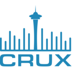
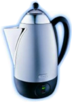

# Resources

  

    <button class="tab-button active" onclick="openTab(event, 'instrumentation')">Instrumentation</button>
    <button class="tab-button" onclick="openTab(event, 'software')">Software</button>
    <button class="tab-button" onclick="openTab(event, 'datasets')">Datasets</button>
    <button class="tab-button" onclick="openTab(event, 'educational')">Educational Materials</button>
    <button class="tab-button" onclick="openTab(event, 'support')">Support & Training</button>
  

  

    

## MacCoss Lab Mass Spectrometry Instrumentation

The MacCoss Lab maintains a state-of-the-art mass spectrometry facility equipped with cutting-edge instrumentation for both untargeted and targeted quantitative proteomics. Our instruments support a wide range of acquisition modes including targeted selected reaction monitoring (SRM), parallel reaction monitoring (PRM), data-independent acquisition (DIA), and data-dependent acquisition (DDA).

####  **Thermo Fisher Orbitrap Astral**
*State-of-the-art mass spectrometer optimized for untargeted data independent acquisition-mass spectrometry*  
Example publications from our lab describing the use of the Orbitrap Astral and Astral Zoom for quantitative proteomics.
- [Hsu et al., Evaluation of a prototype Orbitrap Astral Zoom mass spectrometer for quantitative proteomics - Beyond identification lists *bioRxiv* 2025](https://doi.org/10.1101/2025.05.30.657132)
- [Heil et al, Evaluating the Performance of the Astral Mass Analyzer for Quantitative Proteomics Using Data-Independent Acquisition *J. Proteome Res.* 2023](https://doi.org/10.1021/acs.jproteome.3c00357)

####  **Thermo Fisher Stellar Mass Spectrometer**
*Hybrid Quadrupole Mass Filter-Radial Ejection Linear Ion Trap*  
Example publications describing the Stellar from the MacCoss lab include:
- [Plubell et al., Development of highly multiplex targeted proteomics assays in biofluids using the Stellar mass spectrometer *bioRxiv* 2024](https://pubmed.ncbi.nlm.nih.gov/38895256/)
- [Remes et al., Hybrid Quadrupole Mass Filter - Radial Ejection Linear Ion Trap and Intelligent Data Acquisition Enable Highly Multiplex Targeted Proteomics *J. Proteome Res.* 2024](https://doi.org/10.1021/acs.jproteome.4c00599)

####  **Thermo Fisher Orbitrap Eclipse Tribrid**
*Advanced tribrid mass spectrometer combining quadrupole, ion trap, and Orbitrap technologies*

####  **Thermo Fisher Orbitrap Exploris 480**
*High-performance Orbitrap mass spectrometer for comprehensive proteomics workflows*

  

    <h4> <strong>Thermo Fisher Orbitrap Fusion Lumos #1</strong></h4>
    
<em>Ultra-high field Orbitrap-based tribrid mass spectrometer for advanced proteomics</em>

  

  

    <h4> <strong>Thermo Fisher Orbitrap Fusion Lumos #2</strong></h4>
    
<em>Second Orbitrap Fusion Lumos for high-throughput proteomics applications</em>

  

####  **Thermo Fisher Q Exactive HF**
*High-field Orbitrap mass spectrometer for quantitative proteomics*

####  **Thermo Fisher TSQ Altis**
*High-performance triple quadrupole mass spectrometer for targeted quantitative analysis*

### Capabilities

Our instrumentation suite enables:
- **Targeted Proteomics**: SRM/MRM and PRM workflows for precise quantification
- **Discovery Proteomics**: DDA and DIA methods for comprehensive protein identification
- **Clinical Applications**: Robust, reproducible assays for biomarker validation
- **Method Development**: Optimization of acquisition parameters and workflows
- **High-Throughput Analysis**: Automated sample processing and data acquisition

  

    

## MacCoss Lab Software Tools

### 
**Windows Client Tool for the visualization, analysis, and development of methods for quantitative mass spectrometry**
- **Free, open-source quantitative mass spectrometry software.** Skyline is a freely-available, open-source Windows client application for building Selected Reaction Monitoring (SRM) / Multiple Reaction Monitoring (MRM), Parallel Reaction Monitoring (PRM), Data Independent Acquisition (DIA/SWATH) and DDA with MS1 quantitative methods and analyzing the resulting mass spectrometer data. Its flexible configuration supports All Molecules. It aims to employ cutting-edge technologies for creating and iteratively refining targeted methods for large-scale quantitative mass spectrometry studies in life sciences.
- **Supports proteomics, metabolomics, and small molecule workflows.**
- **Vendor agnostic.** Can analyze data and generate methods for all major instrument vendors. Including Agilent, Bruker, Shimadzu, ThermoFisher, and Waters.
- **Download at**: [skyline.ms](https://skyline.ms/skyline.url)
- **External Tools**: Skyline has an external tool framework. We have a [tool store](http://skyline.ms/tools.url) with 20 tools currently available.
- **Source Code** is available as part of the [Proteowizard project](https://github.com/ProteoWizard/pwiz).
- **Original Publication** MacLean et al, [Skyline: an open source document editor for creating and analyzing targeted proteomics experiments](https://academic.oup.com/bioinformatics/article/26/7/966/212410), *Bioinformatics* 2010
- **Cited:** >5064 times

### 
**Widely used software tools and libraries for mass spectrometry data analysis.**
- ProteoWizard provides a set of open-source, cross-platform software libraries and tools (e.g. msconvert, Skyline, IDPicker, SeeMS) that facilitate proteomics data analysis. The libraries enable rapid tool creation by providing a robust, pluggable development framework that simplifies and unifies data file access, and performs standard chemistry and LCMS dataset computations.
- **Download and Documentation:** [https://proteowizard.sourceforge.io/](https://proteowizard.sourceforge.io/)
- **Source Code:** Available on [Github](https://github.com/ProteoWizard/pwiz) and licensed under Apache 2.0.
- **Original Publication:** Chambers et al, [A cross-platform toolkit for mass spectrometry and proteomics](https://www.nature.com/articles/nbt.2377), *Nature Biotechnology* 2012
- **Cited:** >3997 times

### 
**Web-based repository for Skyline documents and colaboration**
- Panorama is a freely-available, open-source webserver for sharing experiments and validated assays that integrates into a Skyline proteomics workflow. Panorama can be installed on a local server, or you can request a project on the PanoramaWeb.org server, hosted by the MacCoss Lab at the University of Washington. Access privileges within a project may be customized, allowing you to control fully who has access to data you publish to Panorama.
- **Access**: [panoramaweb.org](https://panoramaweb.org)
- **Panorama Public**: One of six of the [ProteomeXchange](https://www.proteomexchange.org/) servers used by the proteomics community. Panorama Public simplifies the process of sharing datasets analyzed by [Skyline](https://skyline.ms/skyline.url).
- **Requirements**: Can be accessed within Skyline and from any modern browser (Chrome, Firefox, Safari, Edge)
- **Features**: Unique tools for data sharing, collaboration, quality control
- **API**: Programmatic access for automated workflows

### 
**Open Source Server for the Analysis and Sharing of Data Dependent Acquisition Mass Spectrometry Results**
- Limelight is designed to provide you with the full-stack of proteomics results, regardless of which processing pipeline you used to search your data. Full-stack means that you have access to the global views of your data (such as statistically comparing conditions), to viewing lists of proteins and peptides, to individual PSMs and spectra–all showing the native scores from whichever pipeline you used. Additionally, all native scores from your pipeline are available to you for filtering–even when contrasting multiple searches that each used different pipelines.
- [Limelight](https://limelight.yeastrc.org/limelight/) can be installed locally or you can request an account on a server hosted at the University of Washington.
- Detailed documentation for using Limelight is available [here](https://limelight-ms.readthedocs.io/en/latest/#).
- **Source Code** is available on [GitHub](https://github.com/yeastrc/limelight-core).

### 
**Open source tool for peptide-centric analysis of data independent acquisition-mass spectrometry data**
- EncyclopeDIA is library search engine comprised of several algorithms for DIA data analysis and can search for peptides using either DDA-based spectrum libraries or DIA-based chromatogram libraries. Check out our manuscript describing EncyclopeDIA at Nature Communications ([Searle et al, 2018](https://www.nature.com/articles/s41467-018-07454-w)) for more information. EncyclopeDIA contains Walnut, an implementation of the PECAN ([Ting et al, 2017](https://www.nature.com/articles/nmeth.4390)) scoring system, to enable chromatogram library generation from FASTA protein sequence databases when spectrum libraries are unavailable. EncyclopeDIA also supports Prosit, a deep learning tool for generating peptide fragmentation spectra, as described in ([Searle et al, 2020](https://www.nature.com/articles/s41467-020-15346-1)). EncyclopeDIA also contains Thesaurus for localizing and quantifying PTMS with DIA experiments ([Searle et al, 2019]((https://www.nature.com/articles/s41592-019-0498-4)))
- **Suport** -- EncyclopeDIA is maintained and supported by the [Searle lab](https://www.searlelab.org/) at the Mayo Clinic.
- **Downloads and Documentation** -- Details can be found on the [EncyclopeDIA Bitbucket](https://bitbucket.org/searleb/encyclopedia/wiki/Home) page.
- **Source Code** is also available on the [Bitbucket](https://bitbucket.org/searleb/encyclopedia/src/master/) page under an Apache 2.0 license.

### 
**Comet is an open source fork of the original SEQUEST database tool for proteomics**
- Searching uninterpreted tandem mass spectra of peptides against sequence databases is the most common method used to identify peptides and proteins. Since this method was first developed in 1993, many commercial, free, and open source tools have been created over the years that accomplish this task. Although its history goes back two decades, the Comet search engine was first made publicly available in August 2012 on SourceForge under the Apache License, version 2.0. The repository was migrated to GitHub in September 2021.
- **Download and Documentation** are available on the UW Proteomics Resource [Github](https://uwpr.github.io/Comet/).
- **Support** is available via a [Google Groups](https://groups.google.com/g/comet-ms).
- **Source Code** is available on [GitHub](https://github.com/UWPR/Comet) under an Apache 2.0 license

### 
**The Crux mass spectrometry analysis toolkit is an open source project maintained by the [Noble lab](https://noble.gs.washington.edu/) that aims to provide users with a cross-platform suite of analysis tools for interpreting peptide MS/MS data.**
- The toolkit includes several search engines for both standard and cross-linked database search, as well as a variety of pre- and post-processing engines for assigning high-resolution precursor masses to spectra, assigning statistical confidence estimates to spectra, peptides and proteins, and performing label free quantification. Crux comes pre-complied for the Linux, Windows and MacOS operating systems. It is implemented as a single program that offers a wide variety of commands.
- **Support** is available via a [Google Groups](https://groups.google.com/g/crux-users).
- **Download and Documentation** are available on the [Crux website](https://crux.ms/).
- **Source Code** is available on [GitHub](https://github.com/crux-toolkit/crux-toolkit) under an Apache 2.0 license

###  **Percolator**
**Percolator: semi-supervised learning for peptide identification from shotgun proteomics datasets**
- Percolator has become the gold standard for post-processing and FDR control for bottom-up proteomics. Our software is incorporated as part of Proteome Discoverer, FragPipe, Mascot, Crux, and many more. Percolator is actively maintained by the [Käll lab](https://kaell.se/).
- **Original Publication** Lukas Käll et al, [Semi-supervised learning for peptide indentification from shotgun proteomics datasets](https://www.nature.com/articles/nmeth1113) *Nature Methods* 2007
- **Download and Documentation** are available on the [Percolator website](http://percolator.ms/). Percolator is also part of the [Crux project](https://crux.ms/).
- **Source Code** is available on [GitHub](https://github.com/crux-toolkit/crux-toolkit) under an Apache 2.0 license.

  

    

## Public Datasets on [Panorama Public](http://panoramaweb.org/public.url)

**We have made available a number of mass spectrometry datasets on Panorama Public**

**[Browse all MacCoss Lab datasets on Panorama Public →](https://panoramaweb.org/project/Panorama%20Public/begin.view#searchTab:expSearchPanel?Targeted%20MS%20Experiment%20List.authors~containsoneof=MacCoss&)**

*The following are highlighted datasets organized by research area:*

#### Recent Method Development & Instrumentation (2024-2025)

- **[Development of highly multiplex targeted proteomics assays in biofluids using a nominal mass ion trap mass spectrometer](http://proteomecentral.proteomexchange.org/cgi/GetDataset?ID=PXD065471)** - Development of novel targeted proteomics methods for biofluids analysis (PXD065471)
- **[Evaluation of a modified Orbitrap Astral Zoom prototype for quantitative proteomics - Beyond identification lists](http://proteomecentral.proteomexchange.org/cgi/GetDataset?ID=PXD064536)** - Comprehensive evaluation of next-generation mass spectrometry instrumentation for quantitative proteomics (PXD064536)
- **Tutorials on How to Use PRM Conductor, a Skyline External Tool** - Educational materials and workflows for parallel reaction monitoring using Skyline external tools
- **[Carafe enables high quality in silico spectral library generation for data-independent acquisition proteomics](http://proteomecentral.proteomexchange.org/cgi/GetDataset?ID=PXD056793)** - Deep learning approach for high-quality in silico spectral libraries for DIA proteomics (PXD056793)
- **[Characterization of Stellar MS](http://proteomecentral.proteomexchange.org/cgi/GetDataset?ID=PXD052734)** - Complete characterization and benchmarking of the Stellar mass spectrometer platform (PXD052734)

#### Data Analysis & Computational Methods
- **[DIA to inform Triple Quad Assay development](http://proteomecentral.proteomexchange.org/cgi/GetDataset?ID=PXD059611)** - Workflow for using data-independent acquisition to inform targeted assay development (PXD059611)
- **[A transformer model for de novo sequencing of data-independent acquisition mass spectrometry data](http://proteomecentral.proteomexchange.org/cgi/GetDataset?ID=PXD053291)** - AI-powered peptide sequencing from data-independent acquisition data (PXD053291)
- **[A framework for quality control in quantitative proteomics](http://proteomecentral.proteomexchange.org/cgi/GetDataset?ID=PXD051318)** - Comprehensive guidelines and datasets for proteomics quality control (PXD051318)
- **[Dynamic DIA with real-time alignment](http://proteomecentral.proteomexchange.org/cgi/GetDataset?ID=PXD038508)** - Advanced data acquisition strategies for improved proteomics workflows (PXD038508)

#### Clinical & Biomedical Applications
- **[Detection and Quantification of Drug-Protein Adducts in Human Liver](http://proteomecentral.proteomexchange.org/cgi/GetDataset?ID=PXD054246)** - Novel methods for identifying covalent protein modifications from drug metabolism (PXD054246)
- **Alzheimer's disease proteomics datasets** - Multiple studies including peptide-centric quantitative proteomics for AD assessment (PXD034525, PXD025668)
- **[Apolipoprotein E isoform quantification](http://proteomecentral.proteomexchange.org/cgi/GetDataset?ID=PXD038803)** - Metrologically traceable measurements in cerebrospinal fluid (PXD038803)
- **[Mag-Net plasma proteome enrichment](http://proteomecentral.proteomexchange.org/cgi/GetDataset?ID=PXD042947)** - Extracellular vesicle enrichment for enhanced plasma proteomics coverage (PXD042947)

#### Aging & Disease Research
- **[AD-BXD Mouse Hippocampus Proteomics](http://proteomecentral.proteomexchange.org/cgi/GetDataset?ID=PXD045425)** - Comprehensive proteomics datasets from AD-BXD mouse models investigating hippocampus (PXD045425)
- **[AD-BXD Mouse PreFrontal Cortex Proteomics](http://proteomecentral.proteomexchange.org/cgi/GetDataset?ID=PXD045403)** - Comprehensive proteomics datasets from AD-BXD mouse models investigating prefrontal cortex (PXD045403)
- **[Mouse Skeletal Muscle Sarcopenia](http://proteomecentral.proteomexchange.org/cgi/GetDataset?ID=PXD048723)** - Proteomics analysis of age-related muscle changes in mouse models (PXD048723)
- **Mouse heart aging studies** - Age-related proteome and acetylome changes with therapeutic interventions (PXD027458, PXD024247)
- **Drosophila aging metabolomics** - Metabolome changes as biomarkers of aging in fruit fly models

#### Analytical Method Validation
- **[Evaluation of Linearity, Lower Limit of Measurement Interval and Imprecision](http://proteomecentral.proteomexchange.org/cgi/GetDataset?ID=PXD041410)** - LC-MS/MS method validation for peptide hormone analysis (PXD041410)
- **[FAIMS vs. quadrupole gas phase fractionation](http://proteomecentral.proteomexchange.org/cgi/GetDataset?ID=PXD043458)** - Comparative analysis of peptide separation techniques (PXD043458)
- **[Astral mass analyzer evaluation](http://proteomecentral.proteomexchange.org/cgi/GetDataset?ID=PXD042704)** - Performance assessment for data-independent acquisition proteomics (PXD042704)
- **[Matrix-matched calibration curves](http://proteomecentral.proteomexchange.org/cgi/GetDataset?ID=PXD014815)** - Standardization approaches for quantitative proteomics (PXD014815)

#### Large-Scale Community Resources
- **[LINCS phospho-proteomics datasets](http://proteomecentral.proteomexchange.org/cgi/GetDataset?ID=PXD017458)** - Chemical perturbation studies across multiple cell lines and conditions (PXD017458, PXD017459)
- **Cancer proteomics inter-laboratory study** - Large-scale validation of multiplexed peptide assays for cancer biomarkers (>54 datasets)
- **[System suitability protocols](http://proteomecentral.proteomexchange.org/cgi/GetDataset?ID=PXD010535)** - Multi-site evaluation of LC-MRM-MS instrument performance standards (PXD010535)

#### Software & Workflow Development
- **[Skyline Batch processing](http://proteomecentral.proteomexchange.org/cgi/GetDataset?ID=PXD029665)** - User-friendly interfaces for high-throughput proteomics analysis (PXD029665, PXD029663)
- **Limelight data sharing** - Open-source platforms for mass spectrometry data visualization and collaboration
- **Small molecule analysis with Skyline** - Metabolomics and lipidomics workflows using Skyline software

#### Specialized Applications
- **[Cross-linking mass spectrometry](http://proteomecentral.proteomexchange.org/cgi/GetDataset?ID=PXD030871)** - Protein-protein interaction studies using chemical cross-linking (PXD030871)
- **[Ion mobility spectrometry integration](http://proteomecentral.proteomexchange.org/cgi/GetDataset?ID=PXD010650)** - Multi-dimensional separation techniques for enhanced analysis (PXD010650)
- **Post-translational modification analysis** - Comprehensive PTM characterization in various biological systems
- **[Grizzly bear serum proteomics](https://panoramaweb.org/project/Panorama%20Public/2021/MacCoss_GrizzlyBearSerum/begin.view?)** - Wildlife proteomics applications demonstrating method versatility (PXD023555)

*All datasets include processed results as Skyline documents and raw datafiles. Many datasets are paired with published manuscripts.*

  

    

## Educational Materials
### Useful Mass Spectrometry Information
- **[UWPR LC-MS Tips and Tricks](https://proteomicsresource.washington.edu/protocols05/)** -- A collection of URLs with LC-MS tricks, instrument setup, etc... *Definitely bookmark this page.* 
- **[UWPR Analysis Tools](https://proteomicsresource.washington.edu/protocols06/)** -- A collection of websites and tools for proteomics and mass spectrometry. 

### Skyline Webinars
**Interactive 90-minute tutorial webinars with Q&A sessions**

#### 2025
- **[#25: Comparing Acquisition Methods](https://skyline.ms/project/home/software/Skyline/events/2025%20Webinars/Webinar%2025/begin.view?)** (Jan 2025)

#### 2024
- **[#24: Skyline for Lipidomics](https://skyline.ms/project/home/software/Skyline/events/2024%20Webinars/Webinar%2024/begin.view?)** (Nov 2024)
- **[#23: Using Skyline Live Reports](https://skyline.ms/project/home/software/Skyline/events/2024%20Webinars/Webinar%2023/begin.view?)** (Sept 2024)

#### 2023 & 2021
- **[#22: Using DIA Data To Create SRM Methods](https://skyline.ms/project/home/software/Skyline/events/2023%20Webinars/Webinar%2022/begin.view?)** (Mar 2023)
- **[#21: Analysis of diaPASEF Data](https://skyline.ms/project/home/software/Skyline/events/2021%20Webinars/Webinar%2021/begin.view?)** (Dec 2021)
- **[#20: Using Skyline Batch for Large-Scale DIA](https://skyline.ms/project/home/software/Skyline/events/2021%20Webinars/Webinar%2020/begin.view?)** (July 2021)

#### 2020 & 2018
- **[#19: Ion Mobility Spectrum Filtering](https://skyline.ms/project/home/software/Skyline/events/2020%20Webinars/Webinar%2019/begin.view?)** (April 2020)
- **[#18: DIA Data Analysis Revisited](https://skyline.ms/project/home/software/Skyline/events/2020%20Webinars/Webinar%2018/begin.view?)** (April 2020)
- **[#17: PRM Method Dev and Data Analysis](https://skyline.ms/project/home/software/Skyline/events/2018%20Webinars/Webinar%2017/begin.view?)** (Jan 2018)

#### 2017 & 2016
- **[#16: Small Molecule Research](https://skyline.ms/project/home/software/Skyline/events/2017%20Webinars/Webinar%2016/begin.view?)** (Nov 2017)
- **[#15: Optimizing Large Scale DIA](https://skyline.ms/project/home/software/Skyline/events/2017%20Webinars/Webinar%2015/begin.view?)** (Apr 2017)
- **[#14: Large Scale DIA](https://skyline.ms/project/home/software/Skyline/events/2017%20Webinars/Webinar%2014/begin.view?)** (Jan 2017)

#### 2015
- **[#12: Isotope Labeled Standards](https://skyline.ms/project/home/software/Skyline/events/2015%20Webinars/Webinar%2012/begin.view?)** (Dec 2015)
- **[#11: Panorama and Panorama Public](https://skyline.ms/project/home/software/Skyline/events/2015%20Webinars/Webinar%2011/begin.view?)** (Oct 2015)
- **[#10: Working with Modifications](https://skyline.ms/project/home/software/Skyline/events/2015%20Webinars/Webinar%2010/begin.view?)** (Sep 2015)
- **[#9: PRM for PTM Studies](https://skyline.ms/project/home/software/Skyline/events/2015%20Webinars/Webinar%209/begin.view?)** (Aug 2015)

#### 2014
- **[#2: Jump Start DIA Analysis with DDA Data](https://skyline.ms/project/home/software/Skyline/events/2014%20Webinars/Webinar%202/begin.view?)** (Dec 2014)
- **[#1: Getting the Most Out of DDA Data](https://skyline.ms/project/home/software/Skyline/events/2014%20Webinars/Webinar%201/begin.view?)** (Nov 2014)

[**View all webinars**](https://skyline.ms/wiki/home/software/Skyline/page.view?name=webinars)

### Skyline Tutorials
**Hands-on tutorials with real data and step-by-step instructions**

#### Introductory
- **[Targeted Method Editing](https://skyline.ms/tutorial_method_edit.url)** (26 pages) - Learn the basics of creating and editing targeted methods
- **[Targeted Method Refinement](https://skyline.ms/tutorial_method_refine.url)** (28 pages) - Optimize your methods for better results
- **[Grouped Study Data Processing](https://skyline.ms/tutorial_grouped.url)** (70 pages) - Analyze grouped experimental data
- **[Existing & Quantitative Experiments](https://skyline.ms/tutorial_existing_quant.url)** (43 pages) - Work with existing data and quantitative analysis

#### Introduction to Full-Scan Acquisition Data
- **[Comparing PRM, DIA, and DDA](https://skyline.ms/tutorial_comp_acq.url)** (38 pages) - Compare different acquisition methods
- **[PRM With an Orbitrap](https://skyline.ms/tutorial_prm_orbi.url)** (44 pages) - Parallel reaction monitoring on Orbitrap instruments
- **[Basic Data Independent Acquisition](https://skyline.ms/tutorial_dia.url)** (40 pages) - Introduction to DIA analysis

#### Full-Scan Acquisition Data
- **[MS1 Full-Scan Filtering](https://skyline.ms/tutorial_ms1_filtering.url)** (41 pages) - Extract quantitative information from MS1 data
- **[DDA Search for MS1 Filtering](https://skyline.ms/tutorial_dda_search.url)** (19 pages) - Use DDA results to enhance MS1 analysis
- **[Parallel Reaction Monitoring (PRM)](https://skyline.ms/tutorial_prm.url)** (40 pages) - Comprehensive PRM workflow
- **[Analysis of DIA/SWATH Data](https://skyline.ms/tutorial_dia_swath.url)** (32 pages) - Process DIA and SWATH-MS data
- **[Analysis of diaPASEF Data](https://skyline.ms/tutorial_dia_pasef.url)** (36 pages) - Work with ion mobility DIA data
- **[Library-Free DIA/SWATH](https://skyline.ms/tutorial_dia_umpire_ttof.url)** (26 pages) - DIA analysis without spectral libraries

#### Small Molecules
- **[Small Molecule Targets](https://skyline.ms/tutorial_small_molecule.url)** (10 pages) - Basic small molecule analysis
- **[Small Molecule Method Development](https://skyline.ms/tutorial_small_method_ce.url)** (37 pages) - Develop targeted small molecule methods
- **[Small Mol. Multidimension Spec. Lib.](https://skyline.ms/tutorial_small_ims.url)** (23 pages) - Use ion mobility for small molecules
- **[Small Molecule Quantification](https://skyline.ms/tutorial_small_quant.url)** (27 pages) - Quantitative small molecule workflows
- **[Hi-Res Metabolomics](https://skyline.ms/tutorial_hi_res_metabolomics.url)** (17 pages) - High-resolution metabolomics analysis

#### Advanced Topics
- **[Absolute Quantification](https://skyline.ms/tutorial_absolute_quant.url)** (19 pages) - Calculate absolute protein concentrations
- **[Custom Reports](https://skyline.ms/tutorial_custom_reports.url)** (33 pages) - Create custom data reports
- **[Advanced Peak Picking Models](https://skyline.ms/tutorial_peak_picking.url)** (28 pages) - Optimize peak detection algorithms
- **[iRT Retention Time Prediction](https://skyline.ms/tutorial_irt.url)** (36 pages) - Use indexed retention times
- **[Collision Energy Optimization](https://skyline.ms/tutorial_optimize_ce.url)** (12 pages) - Optimize fragmentation conditions
- **[Ion Mobility Spectrum Filtering](https://skyline.ms/tutorial_ims.url)** (26 pages) - Advanced ion mobility analysis
- **[Spectral Library Explorer](https://skyline.ms/tutorial_library_explorer.url)** (22 pages) - Explore and manage spectral libraries
- **[Audit Logging](https://skyline.ms/tutorial_audit_log.url)** - Track document changes for compliance

[**View all tutorials**](https://skyline.ms/wiki/home/software/Skyline/page.view?name=tutorials)

### Skyline Videos
**Quick instructional videos for getting started**

- **[Video Demo 1: Creating SRM/MRM Methods](https://skyline.ms/labkey/wiki/home/software/Skyline/page.view?name=video_0-2)** (28 minutes) - Learn to create targeted methods
- **[Video Demo 2: Results Analysis and Method Refinement](https://skyline.ms/labkey/wiki/home/software/Skyline/page.view?name=video_0-5)** (25 minutes) - Analyze results and refine methods
- **[Video Demo 3: Importing Existing Experiments](https://skyline.ms/labkey/wiki/home/software/Skyline/page.view?name=video_0-5b)** (27 minutes) - Work with existing data and isotope standards
- **[Skyline Trailer Video](https://skyline.ms/labkey/wiki/home/software/Skyline/page.view?name=video_trailer)** - Overview of Skyline capabilities

[**View all videos**](https://skyline.ms/wiki/home/software/Skyline/page.view?name=videos)

### YouTube Channels
**Course content and instructional videos**

- **[Skyline Course at UW (2017 & 2018)](https://www.youtube.com/channel/UCOdJj3Spesm_U_2-N_FT7wg)** - University of Washington course materials
- **[May Institute at Northeastern University (2018-2020)](https://www.youtube.com/channel/UCnbUMFlIRLaY7fwfSintWuQ)** - Comprehensive proteomics course content
- **[Targeted Proteomics Course at ETH, Zurich (2016 & 2018)](https://www.youtube.com/channel/UCLLENascNxL22j3pntI7jVA/playlists)** - International course materials

[**View YouTube resources**](https://skyline.ms/wiki/home/software/Skyline/page.view?name=youtube)

### Skyline Tips
**Quick tips and troubleshooting guides**

- **Adduct Descriptions** - Understanding different adduct types
- **Working with Other Quantitative Tools** - Integration with external software
- **How to Display Multiple Peptides** - Visualization techniques
- **Terminology Cheat Sheet** - Key terms and definitions
- **How Skyline Builds Spectral Libraries** - Library construction process
- **ID Annotations Missing with Mascot Search Results** - Troubleshooting search imports
- **DIA Configuration for Thermo Q Exactive Instruments** - Instrument-specific settings
- **How Skyline Calculates Peak Areas and Heights** - Understanding quantification
- **Support for Bruker TOF Instruments** - Vendor-specific guidance
- **Recovering From a Broken Installation** - Troubleshooting installation issues
- **Sharing MS/MS Spectra with Manuscripts** - Publication guidelines
- **Share Skyline Documents in Manuscripts** - Document sharing best practices
- **Export SRM Methods for a Thermo LTQ** - Method export procedures
- **Skyline Lists** - Working with peptide and protein lists
- **Pivot Editor** - Advanced data manipulation
- **Result File Rules** - Managing multiple result files

[**View all tips**](https://skyline.ms/wiki/home/software/Skyline/page.view?name=tips)

### Panorama Documentation
**Comprehensive guides for using Panorama web-based repository**

#### Getting Started
- **Create a Folder in Panorama** - Set up project structure and organization
- **Folder Navigation in Panorama** - Navigate through project hierarchies
- **Adding Users to a Project** - Manage user access and permissions
- **Import Data Into Panorama** - Upload Skyline documents and results
- **Upload Raw Data** - Store mass spectrometry raw files
- **Upload Supplementary Files** - Include additional project materials

#### Data Management
- **Include Subfolders in Panorama Public Submission** - Organize complex datasets
- **Submit Data to Panorama Public** - Share data with the proteomics community
- **Data Validation for ProteomeXchange** - Ensure compliance with repository standards
- **Download Data From Panorama Public** - Access publicly available datasets
- **Finding Unimod matches** - Identify modification annotations

#### Advanced Features
- **Quality Control with AutoQC** - Automated instrument performance monitoring
- **[Document Version Tracking](https://www.labkey.org/Documentation/wiki-page.view?name=panoramaRevisionTrack)** - Track changes and document history
- **Adding Links in Wiki Pages** - Create interconnected documentation
- **Install Panorama** - Set up local Panorama installations

[**View all documentation**](https://panoramaweb.org/home/wiki-page.view?name=documentation) | [**LabKey Panorama Documentation**](https://www.labkey.org/Documentation/wiki-page.view?name=panorama)

### Panorama Tutorials
**Hands-on tutorials for Panorama workflows**

- **[Sharing Skyline Documents](https://panoramaweb.org/home/wiki-page.view?name=tutorials)** - Learn to upload and share Skyline documents in Panorama
- **[Panorama Chromatogram Libraries](https://panoramaweb.org/home/wiki-page.view?name=tutorials)** - Build and manage chromatogram libraries for DIA analysis
- **[Submit Data to Panorama Public](https://panoramaweb.org/home/wiki-page.view?name=tutorials)** - Complete workflow for making data publicly available

[**View all tutorials**](https://panoramaweb.org/home/wiki-page.view?name=tutorials)

### Panorama Webinars
**Educational webinars covering Panorama features and best practices**

#### Recent Webinars (2017-2021)
- **[System Suitability Best Practices with Skyline and Panorama](https://www.labkey.com/webinar/lc-ms-system-suitability-skyline-panorama/)** (June 29, 2021) - LabKey hosted webinar on QC workflows
- **[Introduction to Panorama](https://www.labkey.com/webinar/panorama-targeted-proteomics-research/)** (September 21, 2017) - LabKey hosted overview of Panorama capabilities

#### Skyline/Panorama Joint Webinars
- **[Panorama Public and Panorama AutoQC](https://brendanx-uw1.gs.washington.edu/labkey/project/home/software/Skyline/events/2015%20Webinars/Webinar%2011/begin.view?)** (October 20, 2015) - Skyline Tutorial Webinar #11

#### Historical Webinars (2013-2014)
- **[Panorama: Managing and Analyzing Large Datasets](https://www.youtube.com/watch?v=eZSoBU622Ws)** (August 19, 2014) - YouTube video
- **[Panorama targeted proteomics knowledge base](https://www.youtube.com/watch?v=YyPo0447VUM)** (August 8, 2013) - YouTube video

[**View all webinars**](https://panoramaweb.org/home/wiki-page.view?name=webinars)

  

    

## Support & Training

### Forums and Discussion
- [Skyline Support Board](https://skyline.ms/forum)
- [Panorama Support Board](https://panoramaweb.org/forum)
- **[University of Washington Proteomics Listserv](https://mailman23.u.washington.edu/mailman/listinfo/proteomics)** - If you are at UW and doing proteomics you should join this list.

### Proteomics and Mass Spectrometry Courses

#### Upcoming Events (2025)
- **Fall 2025 Skyline Online** - Dates coming soon
- **[The 15th international symposium on proteomics in the life sciences](https://www.asbmb.org/meetings-events/proteomics-2025)** - Cambridge, MA (August 17-21, 2025)
- **[Skyline Course at the University of Washington](https://skyline.ms/project/home/software/Skyline/events/2025%20UW%20Course/begin.view)** - Seattle, WA (July 7-11, 2025)

#### Recent Past Events (2024-2025)
- **[Two-day Short Course: 08 Quantitative Proteomics: Case Studies](https://www.asms.org/conferences/annual-conference/short-courses)** - ASMS Baltimore, MD (May 31 - June 1, 2025)
- **[Skyline User Group Meeting](https://skyline.ms/2025-ugm.url)** - ASMS Baltimore, MD (June 1, 2025)
- **[May Institute - Computation and statistics for mass spectrometry and proteomics](https://computationalproteomics.khoury.northeastern.edu/)** - Northeastern University, Boston (April 28 - May 11, 2025)
- **[2025 ISAS Dortmund Skyline Training Course](https://www.isas.de/en/events/skyline-course-2025)** - (April 7-10, 2025)
- **[Practical Course on Targeted Proteomics](https://courses.crg.eu/events/targetedproteomics)** - Barcelona, Spain (November 17-22, 2024)
- **[2024 Skyline Online](https://skyline.ms/project/home/software/Skyline/events/2024-10%20Skyline%20Online/begin.view)** - (October 8-9, 10-11, 15-16, 17-18, 2024)
- **[UW Targeted Mass Spectrometry Course](https://skyline.ms/project/home/software/Skyline/events/2024%20UW%20Course/begin.view)** - Seattle, WA (July 8-12, 2024)
- **[Two-day Short Course: 08 Quantitative Proteomics: Case Studies](https://www.asms.org/conferences/annual-conference/short-courses/two-day-courses)** - ASMS Anaheim, CA (June 1-2, 2024)
- **[Skyline User Group Meeting](https://skyline.ms/project/home/software/Skyline/events/2024%20User%20Group%20Meeting%20at%20ASMS/begin.view)** - ASMS Anaheim, CA (June 2, 2024)
- **[May Institute - Computation and statistics for mass spectrometry and proteomics](https://computationalproteomics.khoury.northeastern.edu/)** - Northeastern University, Boston (April 29 - May 10, 2024)
- **[2024 ISAS Dortmund Skyline Training Course](https://www.isas.de/en/events/skyline2024)** - (March 4-7, 2024)
- **[2024 Advances in Proteomics Technologies Hands-on Workshop](https://portal.iitb.ac.in/ceqipapp/courseDetails.jsp?c_id=5476)** - IIT Bombay, India (February 17-18, 2024)

#### Annual and Regular Course Series
- **Skyline Online** - Multi-day virtual training courses (typically October/November)
- **UW Targeted Mass Spectrometry Course** - Annual summer course at University of Washington, Seattle
- **May Institute** - Annual computation and statistics course at Northeastern University, Boston
- **ISAS Dortmund Skyline Training Course** - Annual course in Germany
- **ASMS Short Courses** - Two-day quantitative proteomics courses at ASMS annual conference
- **Skyline User Group Meetings** - Annual meetings at ASMS conferences
- **Targeted Proteomics Course at PRBB, Barcelona** - Biennial EMBO course
- **ETH Zurich DIA/SWATH Courses** - Periodic specialized courses in Switzerland

#### International Workshop Series (2018-2023)
- **Targeted Proteomics Course** - EMBO course at PRBB, Barcelona
- **Pre-HUPO Targeted Proteomics Courses** - International locations
- **Proteomics Informatics Short Courses** - Various international venues
- **Cape Town Quantitative Proteomics Course** - South Africa
- **IIT Bombay Workshops** - Mumbai, India (multiple years)

#### Historical Course Highlights (2012-2023)
- **Pre-Lorne Workshops** - University of Melbourne, Australia
- **MSACL Practical Proteomics Short Courses** - Palm Springs, CA
- **Buck Institute Targeted Proteomics Courses** - Northern San Francisco Bay Area, CA
- **US HUPO Short Courses** - Various US locations
- **Duke University Short Courses** - Durham, NC
- **International Targeted Proteomics Courses** - Shanghai, China
- **MRM Proteomics Virtual Workshops** - Online targeted quantitation training
- **European Summer School Workshops** - Brixen/Bressanone, Italy
- **J-HUPO Workshops** - Tokyo, Japan
- **Fiocruz Workshops** - Brazil
- **ACGT Proteomics Symposiums** - Johannesburg, South Africa

*For current course schedules and registration, visit [Skyline Events](https://skyline.ms/project/home/software/Skyline/events/begin.view)*

